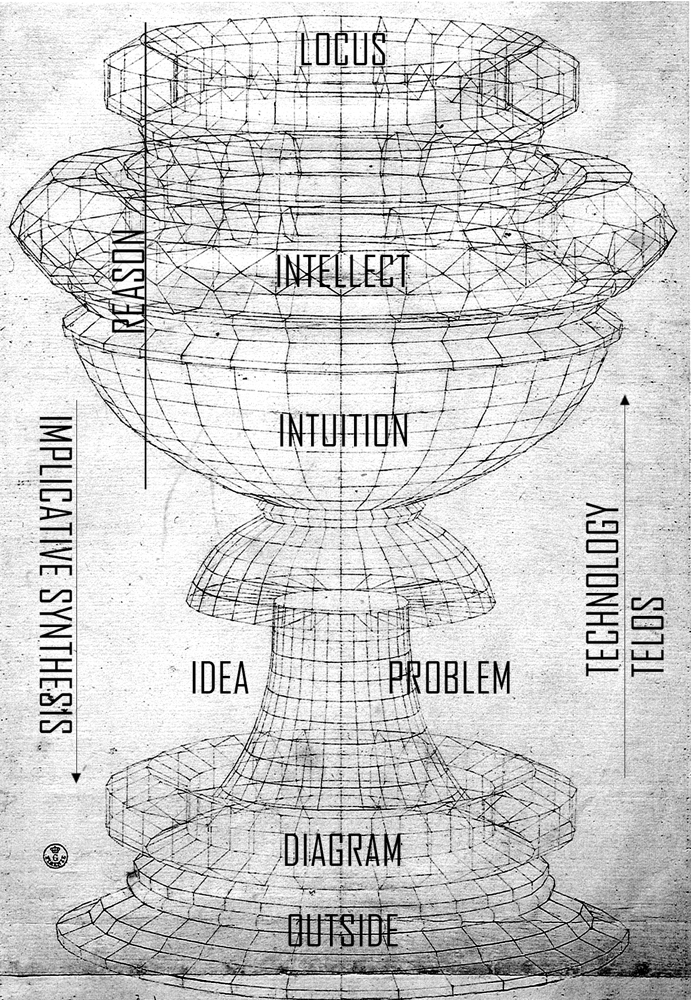

image: Paolo Uccello, *Saint George and the Dragon*

 

Extended and modified paper from the *Przeploty polifonii perspektyw II* conference in Toruń

 

( )

I titled my paper "Against Flatness" because I believe the paradigm of flat ontology highlights well a specific blind alley that today's continental philosophy strolls. Flatness is an alley that takes us through a particular landscape in contemporary humanities, shaped by, among other things, the postulates of networkedness, affirmation, imagination, and the possible. So, I will present here a critique of the assumptions and consequences of flat ontology, and then outline an alternative approach to topic of theinking the outside, one that includes a technological take on transcendental structures, a Deleuzo-Kantian conception of regulative ideas, and a return to the somewhat dusty categories of teleology and autonomy. (At the conference I delivered only the first, critical part, because while preparing the paper I realized that discussing the whole thing in 20 minutes was not feasible).

Flat ontology is a position associated with new materialism, OOO, speculative realism and posthumanism, held, at least implicitly, by Levi Bryant, Graham Harman, Jane Bennett, Timothy Morton, Bruno Latour, Manuel Delanda, Karen Barad, Rosi Braidotti, to name a few. The ground for the development and popularity of this position in the late 20th and early 21st centuries was prepared by two simultaneous processes in philosophy and science. As far as science is concerned, basically, since the stabilization of Darwinian evolution as a paradigmatic theory, the narcissism of the human subject has been continuously and progressively breached, afflicting successive bastions of anthropocentrism and humanism (for example, by granting animals yet another higher cognitive-social capacity, or by the theory of autopoiesis). Meanwhile, in philosophy, since the Enlightenment, the gesture of criticism of categories attributing two opposite meanings to being (e.g., thought-action, mind-body, form-matter, nature-culture, man-machine/animal) has been radicalized with each new generation of thinkers. This particularly gained momentum with poststructuralism, rooted in Nietzsche's assault on metaphysics, and Marxist critical theory - both exposed the inherent relationship of structures of reason with the dominant discourses of modernity: capitalism, patriarchy, colonialism. This multilateral critique of the metaphysics of man, supported by scientific research, unlocked the possibility for philosophy to speculate about matter not mediated by reason, or - more precisely: to construct a theory that takes into account the agency of matter (or various non-human actors) without having to address the question of correlation, in the minimum variant recognizing the human as an undistinguished subject of thought, in the maximum - deconstructing the validity of the category of the human in general (biologically, socially, etc.).

 

I

I will begin with Ray Brassier's critique of four basic thesis of flat ontology as presented by Levi Bryant in *The Democracy of Objects*. These are the following:

1) Flat ontology discards the existence of any transcendent or eternally present entity that would be the source of all other entities. So there is no place here for forms, species, types, laws, or any other abstractions, for all entities must belong to one ontogenetic field.[^1]

2) There is no super-object that gathers all others into a harmonious and closed unity, like *the* universe, totality, Oneness.

3) The subject-object relation, or any other relation founded on the transcendental or a spiritual substance, is neither superior to other relations nor necessarily included in all relations. Flat ontology does not proceed from the recognition of subjective conditions and epistemic access to reality, but from the classification and description of being.

4) All entities are ontologically equal. This may be a reference to the metaphysics of the hierarchy of being, though it is also about the negation of representation-being dualism, or dialectics, i.e. an assertion of the univocity of being, or immanence.

Flat ontology, then, does not start by negotiating the conditions of epistemic access to or formatting of the world. Instead, it begins by recognizing the human-world relationship, i.e., our epistemic relation to things, as simply another thing in the world: an object-to-object relation. It rejects the claim that this epistemic relation is inherent in all objectifications, i.e. the claim that everything we say or do with objects reflects or encodes some kind of conceptual or practical as cognitive mediation. However, the complete rejection of the subject-object relation, along with the proclamation of the independence of things from thought, while ignoring the procedures by which such independence can be thought, leads to serious epistemological complications.

Take Graham Harman, according to whom there are only individual objects - everything we can think of as an object is one, e.g. a toaster, the Andromeda galaxy, a colony of microbes, the ether. Each object reveals different sensuous properties when it comes into contact with another object, but no contact or relation with another object can exhaust its real essence, which "withdraws" beyond any possible relations it can enter into. For instance, grass interacts with the soil, with me, with the air, each interaction brings out different dynamics, but the essence of the grass withdraws from each and all of them. Harman actually broadens the Husserlian notion of intention over all possible objects, each has intentions, bringing out different qualities of other objects, but they can never reach the real cores of objects. As Brassier argues, this feature collapses the theory into a dramatic inability to distinguish objects from each other. For if we split the object into a real object and a sensual object, and at the same time dismiss an epistemological instance capable of distinguishing between the qualitative properties of the object and its real essence, which would be consciousness (or more precisely, the transcendental self) in Husserl's case, how can we say anything about the withdrawn object? We could draw on a scientific description, but that's not Harman's point, since for him, such a description is just barely one of many and doesn't give us any special insight into reality (nota bene, this is an argument echoed by many posthumanists). And this leads to the impossibility of predicating anything really about anything, because how do we know that there is not a one single real river behind the sensual properties of two rivers? And if we have no criteria for discriminating between what is a sensual property and what is a real essence, how can we individuate objects?[^2]

From myself I would add that there is also an issue of cognitive faculty and the ontological status of the noema: what is it that you cognise from an object, if it is not cognised and synthesised either in experience or through a chain of techno-scientific mediations, and yet is not a creation of the mind (a noumenon or a concept)? Neither is it an analysis of semantic games; Harman also discards the theory of intuition (which neither in Deleuze nor Bergson is related to objectivity but to duration (the opposite pole to matter) and problematic ideas anyway)? It's not even a question of access - in the sense of how some faculty creates and/or overcomes mediation - but a question of identifying a cognitive faculty capable of this operation, of ontological discourse and speculation about a withdrawn object?

The second flat ontology criticised by Brassier is the one developed by Manuel Delanda, who, instead of an object-oriented ontology, executes a kind of anti-representational naturalism based on a set of scientific and mathematical theories - theories of complexity, chaos, and dynamical systems - capable of capturing pre-individualized virtual intensities, that is, of operationalising real immanence without the mediation of representation. In short, Delanda want to overcome the model of knowledge based on representation, because representation is concerned with propositional judgments about states of affairs consisting of individuated objects. It means that remaining at the level of concepts of what is actual, already completed and fixed, representation can never reach the plane of immanence with its virtual, pre-individualised tendencies of individuation. That is: in order to know and understand a phenomenon, such as the development of intelligence through the growth of information complexity in the military,[^3] we need to study how certain individual entities, such as a particular type of fortification, emerge from the coupling of various processes of individuation, such as the transformation in the functioning of Renaissance cities, the improvement of control over the explosion of gunpowder, and so on. According to Brassier, the rejection of representation on the part of Delanda (and, more broadly, on the part of any post-deleuzian variety of flat ontology) leads to the problem of selection. Without addressing the conditions of representation, i.e., how thought relates to being on epistemological grounds, Delanda is unable to explain how he recognises and selects the virtual problem to which the actual state of affairs, represented in our experience, is a solution; why exactly these sciences, and not others, describe the non-representational virtual intensities from which individuals only emerge. Neither the appeal to mathematical models nor the practical-technical elaboration of materials helps here at all - the problem of addressing the being-thought relationship via mimetic model, which anti-representational immanence was supposed to bypass, keeps recurring. Brassier thus demonstrates how flat ontology, through the back door, restores the supposedly once and for all defeated idealism and dogmatism.

If we want to avoid collapsing the study of being into a (correlationist) interpretation of meaning, we must have a sound understanding of what being is independent of our apprehension, understanding and interpretation of being. However, we will only attain this if we understand the origin, scope and limits of our ability to comprehend, understand and interpret what things are. Although the only way to preserve immanence[^4] is to restore the primary role of epistemology, I do not agree that this also implies the necessity of restoring the category of the human as self-knowledge that integrates the sense of being, a stance neorationalists like Brassier, Negarestani, Wolfendale are willing to defend.

 

II

Flat ontology gets caught up in yet another conceptual mud, not discussed by Brassier, which is a consequence of the rejection of grand narratives (note that almost every time the Anthropocene is mentioned, it gets immediately deconstructed because, it is said, it presupposes an overarching human agency; also the writing of new materialism & co. is impressionistic, often drawing on a litany of objects, biographical anecdotes, fictions). This rejection of grand narratives is to blame for the inflation of texts pursuing ever purer fabulations and speculations about the possible, about possible worlds, about communities that might come - meant to provide the means for a crisis of imagination. Yet, to my mind, it is not because we have a more acute difficulty with “imagining the end of capitalism than the end of the world” (to invoke that catchiest of clichés once again) that we have a problem with imagination per se, but rather that we have insufficiently grounded concepts that can serve as armaments for imagination, intuition and techniques of desire; not enough analyses that burn the meanings of the net of concepts in the acid of a real problem emerging in a system in which thought operates. In a way, we have too much imagination, but we walk it through the corridors of the same metaphysical and epistemological palaces inherited from poststructuralism, so we keep reaching the same results with ever more faded conviction.

That's why I think it's much more important today to return to notions like idea, teleology, or the autonomy of reason, rather than another speculation about vibrant matter or linguistic deconstruction of the differences, e.g., between a female body and a body of water. One of the characteristic gestures for flat ontology is to take an abstracted common feature of different types of entities - such as being a medium for material flows, or being a body of water, of which aquatic bodies and women are cases - and then intersect their semantic fields, as a result expecting to undermine a patriarchal metaphysics based on solid bodies. The gesture is meant to be more than a language game, it is meant to intervene in matter itself. I refer here to Astrida Neimanis' recently popular theory of hydrofeminism. Take the notion of “Hypersea,”[^5] adapted by Neimanis from the Earth sciences. Hypersea refers to the fact that terrestrial life, in order to survive on land, carries with it the aquatic environment it originated from. Without the portable Hypersea in the cells, life could not spread and develop further forms of existence: “life nests within other life” (*Bodies of Water*, 123). With Hypersea, “we come into contact with all of our companion species” (*Hydrofeminism*, 86), to which Neimanis counts everything that carries water or is liquid: cabbage, clams, moths. Everything is water, we are water, we are affiliated with all things aquatic - this condition demands challenging reasoning based on solidity. We see here, among other things, a flat-ontological rejection of distinctions into types or species, for the very assertion of wateriness over entities allows us to “think sex and reproduction differently” (*Bodies of Water*, 125). Because science presents us with the notion of Hypersea, as “an example of a kind of lateral process evolution that disturbs teleological views of evolution by filial descent” (*Bodies of Water*, 124), by imagining a “posthuman gestation” and "acknowledging this corporeally connected aqueous community, distinctions between human and nonhuman start to blur. We live in watery commons..." (*Hydrofeminism*, 92).

The thing is, similarly to so many posthumanisms embedded in flat ontology, Neimanis stops at “think differently,” for which “differently” is substituted an imagined aqueous community that has some relation to some scientific theory, here Hypersea, but how this notion would apply to the social field, primarily to the improvement of the situation of women in the patriarchal system, remains completely passed over. I'm not saying that bringing out aesthetic tropes absent or suppressed by the dominant discourse, such as the metaphors of fluid bodies and movements vs. the overarching signifiers of solid bodies is worthless (however, at the intersection of media, self-care spirituality and corporate work culture isn't the metaphor of fluidity obtrusively present in the 21st century?) Sure, it is an important component of philosophy. But by appealing to the “agency of matter” on the grounds of imagination, or thinking in general, while neglecting epistemological and pragmatic issues[^7], Neimanis runs into a series of difficulties. For example: so what if by drinking water we restore the community of bodies of water? Why should we care about that? How is this community real, and not just a poetic imagination affirming the mysticism of the universe without considering the method of applying one's speculation/fabulation to the systemic restrictions on the creation of community, on thinking, and on freedom? I can just as well imagine an oppressive social system seeking to maximize the liquefaction of solids, a “community” reducing solids - this could be capitalism in the accelerationist description. If at least Neimanis addressed what sense does this community of bodies of water bring to the unconscious? Have there been any technological transformations that allow the community of bodies of water to gain political subjectivity? Why is “water a planetary archive of meaning and matter?”[^6]

Neimanis only articulates the idea of a certain possibility, but never yet has a possible concept demonstrated the existence of something real - instead of expressing the real genesis of a posthumanist community of bodies of water, she end up at its abstracted idea. (Give me a metaphor and I will move phallogocentrism). This abstracted idea presupposes a certain community of taste necessary to be persuaded by this image, a community based on the cultural capital of mutually recognizing subjects. Neimanis essentially echoes Heidegger's critique of modern technology - only rather than in a post-idealist conceptual analysis, she situates it in a more decolonial contemporary intellectual ecology - as if pre-modern water is not also captured as an abstraction[^8]. As if water spirits were not abstractions rendered in magical thinking[^9]. Neimanis adheres to vitalist empiricism/pluralism, which believes we can theoretically disperse the question of abstraction through the infinitely fine granularity of “lived materiality/experience,” and politically deal with all the material flows set in motion by capitalism by leaving them to local practices. Both of these views are related and wrong, as the climate crisis and global capital reinforce each other, forcing coordination on a planetary scale. Disappointingly, this isn't even a pre-critical philosophy, but a presocratic linguistic deconstruction.

We need normativity, not more possibility. We need the risk of expressing what *should* be done, not the constant reference to what *can* be: an empty placeholder of infinite potentiality. Yes, water can be almost anything, so what? The lesson of post-structuralism is not that we are a potentiality, period, but that no normativity is naturally inherent to a particular system, so other norms can produce better social practices. That's it. But for that we need the study of transcendental structures, technological infrastructures and teleological architectures. That's what autonomy is - discovering by what idea and for what purpose we live, think and experience, to where we recursively return, what is our inevitable iteration, what is constraint, what is destination, what is fate, and what are the techniques and practices of organization that perhaps enable us to reconstruct the teleological scheme of reason or system. This is the site where politics and ethics converge with epistemological discipline.

These aporias of flat ontology - without having to adopt Brassier's position ( a critique of it some other time) - can be resolved, or at least a new perspective can be cast on them, by reintroducing the antiquated notion of teleology....

 

III

The reason why grand narratives in 20th century theories were discarded was that they were grounded in teleology, or the concept of purposefulness of nature, culture or history. Since flat ontology repeats this decision, let us briefly recap the history of this notion. In the classical account of Aristotle, the final cause is considered, on the one hand, the idealized purpose of the natural development of an organism, e.g., an apple tree is a final cause for a seed, or, on the other hand, the intention to make a stool from an apple tree. In antiquity also appears the view that reason naturally pursues its full realization, its goal is the highest good or cosmic harmony. Then, leaping a dozen centuries into modernity, due to the discoveries of the mechanisms of nature, such as Newton's law of gravitation or Kepler's laws of planetary motion, natural final causes were abandoned in favour of efficient causes, which alone should suffice for the scientific description of nature. But the idea of finality, of purposive causation, almost immediately rose from the dead, as the functioning of living organisms persistently failed to be explained completely in mechanical terms. The seemingly unscientific need to indicate the purpose of this functioning recurs over and over again - the heart beats to circulate blood to keep the organism alive, the behaviour of animal and plant populations shapes a given ecosystem, which at the same time is the condition of their existence.

This is well argued by Kant in *The Critique of the Power of Judgment*: we do not find teleology in objective and natural reality, but in the transcendental activity of reason itself, which necessarily imposes it on nature to explain its functioning. Another purposive activity of reason developed by Kant is the production of ideas that organize both the concepts of the intellect (/understanding) and the forms of experience from beyond the experience. The third sense of finality that we come across in Kant is related to the mode of operation of a work of art, which, by being designed but having no determined use, displays a kind of purposiveness without purpose. Kant thus marks an important transition from purpose as a complete form of substance to purpose as a functional scheme (a system of integrated functions). It is no longer a pre-determined path of development of being into a purposefully defined substance, but a concrete schema understood as a diagram that organizes the relations between inside and outside, a recursion that generates a certain tendency of an organism or a system organized by this schema/diagram. The next transformation of the notion of teleology comes from twentieth-century concepts of technical systems, which over time have become interchangeable with social systems. If we dismiss a utilitarian or instrumentalist understanding of technology, a technical system also proves to be somwhat a purposiveness without purpose, drawing culture into vectors determined by its individuation (Simondon, D&G, Land). What is important here is that, being inside such a system, realizing the inevitibility of its scheme, one becomes a field of regulation of the system's interior in relation to its exterior. This is our *telos*: each of us is a consumer in capitalism, and there is no escape from adding fuel to this metabolizing machinery - the recursive scheme of capitalism's functioning establishes a constellation of logical and libidinal constraints on political exit plans.

Brassier aptly exposes the weaknesses of flat ontologies and posthumanist materialisms that stem from the discarding of epistemology, but he argues for the return of the category of rational representation founded in the human subject of consciousness instead, which I consider to be a troubling move. In order for this return - founded on an alliance between the Marxism of the Frankfurt School and the neopragmatism of the Pittsburgh School - to stand up, Brassier must confront the question of the social desire for enslavement and the role of the unconscious in the operation of reason. How can one think what cannot be reduced to the conscious dialectic of giving and asking for reasons? So far, he has only critically/negatively touched on the machine unconscious and deleuzoguattarian transcendental materialism, but a positive take on this problem is stubbornly awaiting. Otherwise, neorationalist conceptual analysis will be concerned only with reason as an idealized image of social practices. For reason not to float in a vacuum, we should see it as a system of conceptualizations assembled around ideas and problems generated by material techno-social processes. Reason, by means of conceptual analysis, would determine the ideas and problems imposed on it from the technical outside, setting virtual trajectories for thinking - it depends on them how we can move beyond known solutions, how experience and concepts make sense to us. In other words: ideas and problems are implied to reason by the techno-social outside, and by elaborating them reason refines our understanding of ourselves (the ideas we have to live by) and prepares the ground for intuition of future problems.

 

Image by @electric.fur based on a sketch by Paolo Uccello

 
Therefore, I propose to reinterpret Deleuze's conception of the problem from *Difference and Repetition* through teleology understood functionally, problematically, diagrammatically and polarly. There Deleuze draws on Kant's often overlooked concept of regulative ideas from *The Critique of Pure Reason*. According to Kant, the propensity of reason to go beyond the scope of experience is responsible for metaphysics' wandering into areas of unjustified speculation. As a result of this propensity, reason produces ideas that can neither be proven nor denied - these are the antinomies of reason, e.g. God exists or God does not exist; the world has a beginning in time or the world has no beginning. The antinomies cannot be resolved by determining the truth of either judgment, but they govern the practical and moral realm, leading Kant to conclude that it is better for morality to acknowledge that God exists, man is free, and so on. Deleuze deflects this concept in a slightly different direction. If we notice that an antinomy is a problem, i.e. a situation in which reason at least tentatively assumes two opposing and equally (un)justified propositions, then, Deleuze concludes, reason is indeed the power of posing problems in general. Why does reason, as the power of ideas, pose problems? Because it seeks to unite the operations of the intellect and its objects into a totality, but understanding the organization of this totality is problematic, since its terms can never be brought to a completion (Cantor, Gödel, Turing, Tarski etc.). But paradoxically, if this rational power of speculation about the purposeful functioning of the totality did not exist, the intellect would be engaged only in partial empirical investigations, arranging endless series of inductions, never being able to formulate a hypothesis about the overall problem, and thus incapable of proposing any solution (for which hypothesis is the criterion). Deleuze here makes a series of important interpretive moves: he extends the prevalence of regulative ideas to the entire activity of thinking, conscious and unconscious, and not just selected metaphysical antinomies; he insists on their problematic nature; and as a result of the assumption of pure difference as foundational to metaphysics - in every determination of being the difference of thinking and matter is repeated, i.e. wherever we deal with the sensuous there is also an idea. Thus, there is no access to matter without mediation by an idea, although matter is different from idea (they are two mutually informing series of one process).

While flat ontologies locate thinking within unmediated matter or objects, and Brassier in representations of socio-semantic linguistic rules, here the ultimate *loci* of thinking are problematic ideas generated by *techne* of technologies and social practices. Two moments of Kant-Deleuze's doctrine of Ideas are key for me. First, “or every solution presupposes a problem - in other words, the constitution of a unitary and systematic field which orientates and subsumes the researches or investigations in such a manner that the answers, in turn, form precisely cases of solution” (*Difference and Repetition*, 168). Thus, problems serve a teleonomic role, i.e., they are regulative ideas (*nomos*) and focal points or horizons of thinking beyond experience (*telos*), lending sense to concrete experience and thought (*Difference and Repetition*, 169). Second, in the *Critique of Pure Reason*, Kant states that ideas “are not arbitrarily invented, but given as problems by the nature of reason itself” (CPR, A 327/B 384). Replace “nature” with “technology” and a wormhole from the 18th to the 21st century opens up. The multifaceted critique of nature as a concept constructed by modern rationality does not mean that one should now relegate the source of ideas and their meaning to the interior field of the intellect's categories, but instead should abductively postulate another outside instance from where ideas enter and become necessary for thinking. An outside, which we discover inside reason and test like a black box, pushing thinking beyond the designed framework of thought. The unconscious dark precursor of this idea that technology is an outside of reason - that ideas are installed by the technologies of reason - was already seeping through Kant's mind:
	"This schematism of our understanding, in its application to appearances and their mere form, is *an art* concealed in the depths of the human soul, whose real modes of activity nature is hardly likely ever to allow us to discover, and to have open to our gaze" (A141/B181).

The technological process supplies problems (such as modern science, Artificial Intelligence, labor automation, bioengineering, post-truth) that are embedded in experience as regulative ideas (practical reference to these problems), around which solutions are produced, on the one hand in the form of social organizations, desire formations and power institutions, and on the other as a consequence of scientific research, aesthetic experiments and conceptual analysis. For example, regulative ideas as problems can serve as the transcendental model of intelligence selection that is valid in a given place or at a given scale of abstraction - which is why the theory of reason requires semiotics as the study of signs left by the activity of the alien intelligence that determines reason. Hence, *against flatness*. In a general perspective, the role of reason is to navigate between fate from the Outside, ideal problems, semiotic diagrams, transcendental structures, and technological infrastructures in the name of fidelity to the Good and the Excellent. What specifically the logical architecture of that relationship between the various listed elements would look like - for now I cannot tell.

The development of this project - let's call it *transcendental finalism* - requires the technologization of the doctrine of ideas, i.e. the study of the technological and semiotic genesis of ideas (e.g., what technological transformations enable the postulation of post-truth semiotics or the community of bodies of water), but also the identification of how such an articulated schema/diagram/abstract machine produces the normative space determined in the procedures of reason. Another axis of this project will be the development of *implicative synthesis*[^10] (“if you are in this *locus*, then you realise this *telos*, within this *diagram*, no matter what you do”) in relation to CCRU's notion of hyperstition and Nick Land's teleonomy/teleoplexy. In this way, it will be possible to construct theories of ideas and problems that condition current socially generated abstractions.

   
  
Texts:

R. Brassier, *Deleveling: Against ‘Flat Ontologies’*

Gilles Deleuze, *Difference and Repetition*

I. Kant, *Critique of Pure Reason*, tr. N. K. Smith

A. Neimanis, *Hydrofeminism: Or, On Becoming a Body of Water*

A. Neimanis, *Bodies of Water. Posthuman Feminist Phenomenology*.

   

---
[^1]: It should be noted that Bryant and Brassier differ in their interpretation of abstractions: Bryant, at least explicitly, speaks of different types and kinds of objects, but Brassier means something else when he puts forward his critique. In Bryant's case, sentences like “man is a species among many others” are related to his rejection of subject-object relations, so they mean that we can sort entities into different clusters according to their abilities and powers. Bryant considers epistemology as a question of various epistemologies as forms of knowledge, but from an ontic perspective. Each epistemology is indeed essentially an object for him. Whereas, as I understand it, Brassier's take would be that by making some sort of division into epistemologies as objects we engage in some process (or perhaps logical constitution) that conditions the ontic model of epistemology, such that already at the level of epistemic structure (not to say transcendental, because probably Brassier is more Hegelian-naturalistic here) there is something going on, the study of which will have us make certain divisions, categorizations and abstractions to explain how knowledge, or even this particular ontic model of epistemological types or systems of power, comes into being.

[^2]: That is, what do we adopt as the criterion for distinguishing one individuum from another? In general, a separate problem is to start with the individuum rather than the process of individuation (of which a fantastic critique can be found in *Individuation in light of Notions of Form and Information* by Gilbert Simondon).

[^3]: Example from *War in the Age of Intelligent Machines* by Delanda.

[^4]: The argument for preserving immanence: we want concepts and experience, speculation and sense, social norms and principles of reason to mutually support and constrain in practice, i.e., ultimately the transcendent concept will not organize cognition about the world and ways of experience, but it will produce certain social effects only as a semiotic token. In a way, the next part of the text deals with this.

[^5]: The concept of Hypersea is meaningful in scientific description, because it refers to the ontogeny of the abstract plane of organic life development. However, it becomes a completely different concept when metaphysical, political and ethical judgments are derived from this naturalistic fact.

[^6]: New materialism has gone from “we must absorb the latest groundbreaking scientific theories to understand matter” by Manuel Delanda to “matter is unknowable and abstraction is discrimination” by Astrida Neimanis.

[^7]: A good counter-example is concept of *abstract sex* of Luciana Parisi, who makes a similar move to Neimanis in that she reaches out to the notion of “hypersex,” i.e. at various levels of complexity of organic life there is a permanently recurring symbiogenesis originating in bacterial reproduction. The notion challenges the dominance of meiotic reproduction - tied by Parisi to the patriarchal model of sexuality. The difference, however, is that Parisi demonstrates at the same time how the development of modern digital and computer technologies makes it possible to reincorporate non-meiotic methods of reproduction, on a shared plane of information exchange, and thus to perform a cyberfeminist deterritorialisation of the modern discipline of gender. See, *Abstract Sex* by L. Parisi.

[^8]: Neimanis highlights how modernity has led to the existence of an abstract “modern water” / “global water” that is measurable, quantifiable, instrumentalised and deterritorialised by modern technologies, disconnected from its source myths and places. It is unclear how the maintenance of water's locality, rejecting all abstractions, can be reconciled with the belief in the community of bodies of water - surely some kind of conceptual and technical abstraction is necessary to tie these disparate places together?

[^9]: The role of water as an inhuman force in the struggle for survival, the persistence of Palestine's identity, its resistance to colonial violence and genocide was poignantly narrated by a Palestinian artist Bint Mbareh during a performance for the Unsound festival in 2024. The difference of this vision to Neimanis' lies in the fact that the “community of bodies of water,” if one could use that in the context of Palestine, is formed around a specific place and a specific situation, which create an interface for real practices of alliance between the inhuman water and the people. And from this interface and alliance between different types of beings emerges the purposeful abstraction of a universal struggle against imperialism and racial capitalism. The artist's website: https://bintmbareh.today/.

[^10]: Implicative synthesis: if we think an idea, pay attention to it and seek to define it, it immediately makes thinking about it problematic and enveloped by constellations of vertical and horizontal, diachronic and synchronic conditions. Implication here synthesizes two planes: the concrete social arrangement (the locus of the implicated idea) and the abstract machine or diagram (sense of the implication) implied by this arrangement. If something iterates, it has a finality diagram. Cf. *implexes* in the chapter “Asymmetrical Synthesis of the Sensible” in *Difference and Repetition*, p. 244.