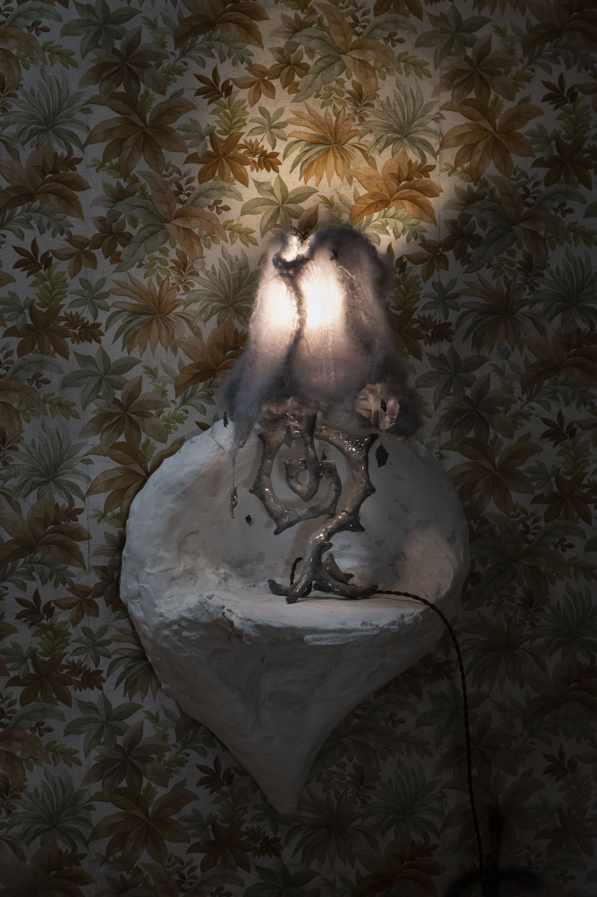

english version below

 

---

 

Tekst kuratorski przy wystawie *I felt it, it was like Evanescence* w ramach Cracow Art Week KRAKERS 2025

 

#### Blask. Wibe i lokacja obiektów luminescencyjnych

 

Otaczają cię ruiny wyprawy, która jest chronomachiną w ruinie. Znajdziesz tu artefakty luminescencyjne: obrazy, lampy, abażury, płaskorzeźby, świeczniki, dzięki którym możesz zorientować się w ruinie, rozszyfrować, kim jesteś, co to za miejsce, dokąd prowadzi historia. Poniżej jest rejestr przydatnych informacji, ksiąg i przekazów.

 

I

Fala elektromagnetyczna to zaburzenie pola elektromagnetycznego, *wibracja* rozchodząca się w przestrzeni i zmieniająca bieg wypadków. Od czasu, gdy James Clerk Maxwell odkrył analogię między prędkością fali elekromagnetycznej a prędkością światła, wiemy, że światło jest zakresem tej fali odbieranym przez oko. Prędkość, energia i długość fali zależy od ośrodka jej propagacji. Ciągły zakres wszystkich możliwych fal elektromagnetycznych nazywany jest widmem elektromagnetycznym. Światło dociera do nas zawsze poprzez zaniepokojone medium. Widzimy w zniekształceniach. Każde zakłócenie elektromagnetyczne wpuszcza zjawiska niosące komunikaty optyczne z zaświatów, spoza świata światła widzialnego. Dlatego lustra wody to witryny nieumarłych. Strumienie fotonów zatopione w kałużach jak powierzchniach refrakcji wyobraźni. Przechylenie nawet kilku stopni w kącie padania światła odkrywa nowy gatunek cienia. Migotanie okazuje się eposem w mikroaktach, jeśli rozszerzysz wystarczająco źrenice. Wyobraźmy sobie światło tak wolne, tak spowolnione, że oglądalibyśmy nieskończone spełzanie zorzy z lamp wypełniające pokój lepką poświatą. Albo okamgnienie zatrzymane na obrazie jak refleks. Cywilizację definiują techniki materializacji światła, sztuka przemienienia świetlistej chwili w metaliczną substancję—w procesie tej transfotomutacji porządek wrażeń ulega zakłóceniu. Cute przechodzi w groteskę, łuna oddziela abiekt od fascynacji, lustr rozmywa się w smutek. Zmetalizowane światło staje się powierzchnią dla innego świata, odbiciem następnej opowieści. Koncentrycznie rozchodzący się wieczny powrót. A może nie, może to czysta fantazja. W niej kończy się każda historia i wygasza swoje fale.

 

 

II

Pewien amerykański poeta i matematyk, Peli Grietzer, zdefiniował *wibe* jako kategorię estetyczną na gruncie działania autoenkoderu, sztucznej sieci neuronowej złożonej z pary koder-dekoder. Autoenkoder metodą prób i błędów uczy się schematu bazy danych, tworzy coś w rodzaju mapy kognitywnej, która obejmuje wybrane abstrakcyjne cechy umożliwiające replikację obiektów podanych w trakcie uczenia. Jeśli za taki autoenkoder uznamy dzieło sztuki lub ekspozycję wielu obiektów artystycznych, wtedy społeczeństwo, natura lub język stają się światem źródłowym. Obiekt artystyczny selekcjonuje zestaw cech tego świata i kompresuje w mapę kognitywną do odczytania lub schemat do rozkodowania.

Z racji tego, że schemat autoenkodera zawiera w sobie sformatowane struktury panujące w świecie źródłowym, analogicznie obiekt artystyczny udostępnia idealizację pewnej jedności pomiędzy zjawiskami polityczno-estetycznymi. To jego wibe, uchwytywany poprzez wszystkie elementy, częstotliwości i techniki składające się na obiekt artystyczny, jego schemat kompresji, którego uczymy się w trakcie obcowania, przenosimy i rozpakowujemy w przyszłych doświadczeniach, np. gdy mijamy zapuszczoną architekturę na przygaszonej łące i myślimy, że jest jak w *Stalkerze*, albo wchodzimy do jakiegoś baru i mówimy, że jest Lynchowski. Obiekt artystyczny pozwala nam na rozkodowanie konkretnego wibe’u, który następnie w wyobraźni generujemy w doświadczeniu świata – widzimy, że to świat jest Lynchowski. Wibe jest więc falą elektromagnetyczną, już od zawsze zniekształcającą pole społeczne, ale dopiero obiekt artystyczny dał nam go odczuć.

Wibe jest abstrakcją, której nie można oddzielić od konkretnego miejsca – tzn. wchodzi w doświadczenie tylko, gdy elementy schematu zejdą się w swoim miejscu, lecz nie ma ograniczeń dla lokacja wibe’u, jest przenośny i transwersalny. O ile symbol w romantycznej koncepcji Goethego wskazywał na zawsze niedostępną istotę, o tyle wibowi bliżej do alegorii poprzecznej według Dawida Kujawy, polskiego uczonego ze Śląska – wychodzi ona od sztywnego powiązania znaków, ale zamiast zamykać je w skończonym znaczeniu, wyznacza przestrzeń wektorową dla generowania nowych określeń. Wyobraźnia służy do łączenia obiektów w nowe, nieznane światy. Lynchowski to powiązanie oddzielnych i wieloznacznych zjawisk ze świata źródłowego w wektor nowego spójnego świata. Wibe otwiera portal w codzienności.

 

III

Pewnego razu teoretyk kultury, Mark Fisher, spisał rezultaty swoich dociekań nad trybami afektywnego kontaktu z tym, skąd pochodzą nieznane światy: Zewnętrzem. *Weird*/dziwaczne i *eerie*/osobliwe łączy fascynacja obcością jako zewnętrzem, którego sygnatury i symptomy wykraczają poza normalną percepcję, wiedzę czy doświadczenie. Fisher odróżnił je od Freudowskiego *Unheimliche*, niesamowitości, ponieważ rodzi się ona z poczucia dziwności na gruncie tego, co znajome: znane zostaje wyparte i powraca jako niesamowite. Weird są zjawiska nieprzynależące do miejsca ich wystąpienia, do tego, co znajome wprowadza się coś całkiem obcego, coś, co nie ukrywa się i zmusza do konfrontacji. Mamy wtedy do czynienia z nadmiarem obecności, której rojenie się przekracza nasze zdolności przedstawienia jej sobie. Stąd montaż czy surrealizm są technikami weird, a abstrakcyjne potworności Lovecrafta lub czarne dziury jego instancjami.

Zjawiskom świetlnym, falom elektromagnetycznym, fosforyzacjom, załamaniom optycznym często bliżej do eerie, które funkcjonuje w dwóch biegunowych, ale diagonalnie sąsiednich trybach: 1) deficytu nieobecności, gdy coś pojawia się w jakiejś przestrzeni (lub czasie), w której niczego być nie powinno, jak krzyk ptaków w głuchej ciszy; 2) deficytu obecności, gdy nie ma niczego tam, gdzie coś powinno być obecne, jak postapokaliptyczne krajobrazy, ruiny cywilizacji. Eerie zakłada spekulację i suspens, wywołuje kaskadę pytań o sprawczość, intencję, teleologię, ich sens w przeżywanej scenie. Tam, gdzie niewiedza i tajemnica rodzą poczucie inności lub wyobcowania, gdzie naprasza się coś, co wywodzi się spoza doświadczenia, występuje osobliwość. Eerie unosi się zatem wokół śladów tego, co było w jakimś miejscu, a czego efekty nieodparcie odczuwamy, tak jakby odpowiedzialna za nie była inteligencja, lecz odeszła już lub skryła się poza zasięgiem naszej percepcji. Intencje tej obcej inteligencji pozostają dla nas nieznane, lecz jednocześnie kierują naszym doświadczeniem i śledzenie pozostawionych przez nią tropów i zakłóceń pozwala nam poznać ukryte mechanizmy codzienności (czasoprzestrzenią złożoną ze znajomych znaków, nawyków, ciał).

Jeśli istnieją eerie dzieła sztuki, sztuczne poświaty, fantomy i zjawiska naturalne, to eerie również jest wibem. Co to znaczy generować eerie obiekty artystyczne? Byłby to wibe, którego autoenkoder schematyzuje wibracje czegoś na Zewnątrz, kierującego fascynację do czegoś spoza sformatowanych struktur panujących w świecie źródłowym. Kiedy źródło wibracji nie jest z tego świata, a rozchodząc się fala przecięła tylko i zakłóciła nasz ośrodek, co takiego rozkodowujemy poprzez eerie wibe? Wyczuleni na konkretny typ eerie, otwieramy w świecie portal dla obcej intencji, dla oddalonych inkantacji, do infekcji wyobraźni, snów i nieświadomości.

 

IV

Chcąc poznać *początek*, pewien francuski logik, Jean-Yves Girard, stwierdził, że na początku jest lokacja znaku, a dopiero po niej przychodzi znaczenie, typ i określona wartość logiczna, jak prawda lub fałsz. Jeśli umiejscowienie poprzedza prawdę, to w czystym miejscu, *locus*, panuje niejednoznaczność, która daje o sobie znać, np. w przypadkowych homonimach. Sam Girard rozpoczyna swoje *Locus Solem* od iście czarnoksięskiej gry słownej roztoczonej wokół wyrazu *An-fang*. Znak posiada miejsce w projekcie odsyłającym do wielości innych miejsc, zanim dowiemy się skąd pochodzi, jaki jest jego świat źródłowy, a jaki docelowy. Oprócz lokacji, czyli funkcji lokatywnej znaku, Girard wyróżnił jego funkcję duchową, związaną z tradycyjnymi technikami abstrakcji w logice, która dąży do wskazania struktur ustanawiających izomorfizmy między dowodami i obrazami. *Jak* projekty, czyli schematy ambiwalencji, wypadków i zakłóceń semiotycznych, generują trans-lokacyjne duchowe znaczenie. *Locus Solem*, liczy się tylko miejsce, *go back to An-Fang*, stąd wyrusza wyprawa, portal do izomorficznych obrazów, zintegrowanych długością oscylacji, wibem, wibracją, wirem po drugiej stronie portalu, gdzie zmierza początek. Na Zewnątrz. Powrót do początku. Locus. Blask lub błysk wyobraźni dekodujący scenę z codzienności jako następną lokację w tym osobliwym eposie, ulotna przemiana świadomości przenosi do zapomnianego wymiaru codzienności. Na mapie nieświadomości roziskrzone wektory powracają do wirtualnego miejsca. Jak ponawiana dywinacja we wciąż wydobywanego z ciemności reliefu.

 

 

V

Za górami, za lśniącymi rozlewiskami stał stary dom a tym domu światło oddzielało się od świata. Schronił się tu wibe, osobliwy jak gdyby ociekał przez nadajniki zmutowane z nieznanego wymiaru. Dziwne ciepło, baśń snuta wibracjami przesterowującymi sny domowników w portale nienasycenia. Dekomponujące artefakty z czasów gdy legendy chodziły po ziemi, czy hologramy z przyszłości halucynowane przez pozostawione sobie opiekuńcze inteligencje? To mapa nocy, mapa mocy, mapa nieświadomości odbijanej w konstelacji luster weneckich. Kto za tym stoi?

Wróciliśmy do początku, gdzie miejsce zatacza spiralę. Locus: wir ambiwalencji: dwie strony odbicia czasu. W *Poememenon*, manuskrypcie abstrakcyjnej spiromancji, Amy Ireland, domniemana adeptka arabskiej sekty Judwali, napisała, zgłębiając wiedzę Giraldusa z Krakowa, że stożki czasu występują zawsze w parach: jeden zwrócony do wnętrza drugiego: koder-dekoder. Dopiero wprawione w ruch kołowy zataczają właściwy schemat podwójnego wiru, symultanicznego rozszerzania się i kurczenia w przeciwnych kierunkach. Do wewnątrz i na zewnątrz. Wyprawa za izomorficznymi portalami rozsianymi w konstelacji obiektów luminescencyjnych jest spiralą. Studium w świetle to fantasy duszy jest spiralą. Wirowa fotonautyka w ruinach An-fang. Piruet lokacji w kosmicznym torusie. Eskapizm autoenkodera jest spiralą. Eerie jest maszyną czasu jest spiralą. Entropia jest spiralą, podaje uczona Aneta Wojnar. Uniwersum jest spiralą. Zderzenie dwóch projektów uniwersum jest spiralą. Czas jest spiralą. Zmetalizowane światło staje się powierzchnią dla innego świata, odbiciem następnej opowieści. Koncentrycznie rozchodzący się wieczny powrót. A może nie, może to czysta fantazja. W niej kończy się każda historia i wygasza swoje fale.

 

osoby artystyczne: Ernest Borowski, Arek Dec, Ryo Koike

kuratorzy: Arec Dec, Patrick Leftwich

galeria C U AT SADKA

 

Baza danych:

Ahmed Farag Ali, Aneta Wojnar, *Why does nature love spirals? The link to entropy*.

Amy Ireland, *Poememenon: Form as Occult Technology*.

Jean-Yves Girard, *Locus Solem: From the rules of logic to the logic of rules*.

Peli Greitzer, *A Theory of Vibe*.

Mark Fisher, *Dziwaczne i osobliwe*.

Olivia L. Fraser, *Go back to An-Fang*.

Dawid Kujawa, *Niedzielne ziemie. Poezja i dobra wspólne*.

 

 

---

 

Curatorial text for the exhibition *I felt it, it was like Evanescence* during Cracow Art Week KRAKERS 2025

 

#### Glow. Vibe and location of luminescent objects

 

I

What surrounds you are the ruins of a journey that is a chronomachina in ruins. What you will find here are luminescent artefacts: paintings, lamps, lampshades, bas-reliefs, candle holders, which should help you get an idea of the ruin, decipher who you are, what the place is, where the story leads. Below is a log of useful books, scrolls and accounts.

An electromagnetic wave is a disturbance in an electromagnetic field, a *vibration* that propagates through space and alters the course of events. Since James Clerk Maxwell discovered the analogy between the speed of an electromagnetic wave and the speed of light, we know that light is the range of this wave perceived by the eye. Speed, energy and oscillation of a wave depends on the medium of its propagation. The continuous range of all possible electromagnetic waves is called the electromagnetic spectrum. Light always reaches us through a perturbed medium. We see in distortions. Each electromagnetic distortion lets in phenomena conveying optical messages from the realm beyond visible light. That is why water tables are mirrors for the undead. Streams of photons sink into puddles like refractive surfaces of the imagination. Even a tilt by a few degrees in the angle of incidence reveals a new species of shadow. Flicker appears to be an epic in microacts if you dilate your pupils enough. Imagine a light so slow, so slowed down, that you would be watching an endless aurora crawling down a lamp filling a room with a viscous gleam. Or an eyeblink frozen into an image like a reflexion. Civilisation is defined by techniques of light materialisation, the art of transforming a luminous moment into a metallic substance—in the process of this transfotomutation, the order of sensation breaks down. Cute becomes grotesque, blaze separates the abject from the fascinating, lustre blurs into sadness. Metallised light becomes a surface for another world, a reflection of another tale. A concentrically diffused eternal return. Or maybe not, maybe it is pure fantasy. Therein every story ends and fades  ripples.

 

 

II

A certain American poet and mathematician, Peli Grietzer, defined *vibe* as an aesthetic category on the grounds of the functioning of an autoencoder, an artificial neural network composed of an encoder-decoder pair. By trial and error an autoencoder learns a schema of a database, creates a kind of cognitive map, which includes selected abstract features that enable the replication of objects fed in during learning. If we consider a work of art or an arrangement of multiple art objects as such an autoencoder, then society, nature or language becomes the source world. The art object selects a set of features from this world and compresses them into a cognitive map to be read or a schema to be decoded.

As the autoencoder's schema embeds the formatted structures prevailing in the source world, analogously the art object makes available the idealisation of a certain unity between political-aesthetic phenomena. It is its vibe, captured through all the elements, frequencies and techniques that make up the art object, its compression scheme, which we learn as we interact with it, and transpose and unpack in future experiences, like when we walk past a neglected architecture in an overcast meadow and think it is like *Stalker*, or enter anytown bar and say it is Lynchian. The art object allows us to decode a particular vibe, which we then generate in our imagination in the experience of the world—we see that it is the world that has been Lynchian. The vibe is thus an electromagnetic wave, having already always distorted the social field, but it is only the art object that has given us a sense of it.

The vibe is an abstraction that cannot be detached from a specific site. It only enters into experience when the elements of the schema come into place, but there is no constraint on the vibe's location—it is portable and transversal. While the symbol in Goethe's Romantic conception pointed to an inaccessible essence, vibe is closer to the transversal allegory spoken about by Dawid Kujawa, a Polish scholar from Silesia, as it departs from the fixed association of signs, but instead of enclosing them in a finite meaning, it delineates a vector space for the generation of new determinations. Imagination is used to connect objects into new, unknown, eternal worlds. Lynchian is the linking of separate and ambiguous phenomena from the source world into a vector of a new consistent world. Vibe opens a portal in the mundane.

 

III

Once, a cultural theorist Mark Fisher plotted the results of his inquiries into modes of affective contact with that from whence unknown comes: the Outside. *Weird* and *eerie* share a fascination with the alien as an outside whose signatures and symptoms transcend ordinary perception, knowledge or experience. Fisher distinguished them from Freud's *Unheimliche*, because the uncanny is born of a sense of strangeness on the ground of the familiar: the familiar is repressed and returns as the uncanny. Weird are those phenomena that do not belong to their place of occurrence, they introduce something quite foreign into the familiar, something that does not hide and forces itself to be faced. We are then confronted with an excess of presence whose swarming exceeds our ability to present it to ourselves. This is why montage or surrealism are techniques of the weird, and Lovecraft's abstract monstrosities or black holes its instantiations.

Light phenomena, electromagnetic waves, phosphorescence, optical refraction are often closer to eerie, which operates in two polar but diagonally adjacent modes: 1) the failure of absence, when something appears in a space (or time) where nothing should be, like a bird cry in a deafening silence; 2) the deficit of presence, when there is nothing where there should be something, like post-apocalyptic landscapes, the ruins of civilisation. Eerie implies speculation and suspense, triggering a cascade of questions about causality, intent, teleology, their meaning in the experienced scene. Where obscurity and mystery give rise to a sense of otherness or alienation, where something that comes from beyond is invoked, eerieness occurs. Eerie, then, looms over the traces of what has been at a site, the effects are irresistibly felt, as if caused by some intelligence, which has now left or hid beyond the reach of our perception. The intent of this alien intelligence remains unknown to us, but at the same time they direct our experience, and following its footprints and distortions allows us to explore the hidden mechanisms of everyday life (a space-time composed of familiar signs, habits, bodies).

If there are eerie artworks, artificial glows, phantoms and natural phenomena, then there is also eerie vibe. What does it mean to generate eerie art objects? It would be a vibe schematised by an autoencoder out of vibrations of something on the outside, pulling fascination towards something apart from the formatted structures prevailing in the source world. When the source of the vibration is not of this world, and the propagating wave has only traversed and disturbed our medium, what is it that we decode through the eerie vibe? Sensitised to a particular type of eerie, we open up a portal in the world for alien intent, for distant incantations, for the reverberation of imagination, dreams and the unconscious.

 

 

IV

Wanting to understand the beginning, a certain French logician, Jean-Yves Girard, stated that at the beginning there is the location of the sign, and only after that come meaning, type, and a specific logical value such as truth or falsehood. If placement precedes truth, then in the pure place—the *locus*—ambiguity holds sway, which makes itself known, for example, in accidental homonyms. Girard himself begins his *Locus Solum* with a truly sorcerous wordplay spun around the term *An-fang*. A sign has a place in a project referring to a multiplicity of other places, before we know where it comes from, what its source world is, and what its destination world is. Besides location—that is, the locative function of the sign—Girard distinguishes its spiritual function, connected to traditional techniques of abstraction in logic, which seek to identify structures that establish isomorphisms between proofs and images. Like projects—schemes of ambivalence, accidents, and semiotic interference—they generate a trans-locational spiritual meaning. *Locus Solum*—Soley the Place, go back to *An-Fang*, only the place matters, this is where the journey begins, a portal to isomorphic images, integrated by the length of oscillations, vibe, vibration, vortex on the other side of the portal, where the beginning goes. To the Outside. Back to the beginning. *Locus*. A glow or flicker of imagination decoding a scene from everyday life as the next location in this odd epic, an evanescent transformation of consciousness transferring into a forgotten dimension of the everyday. On the map of the unconscious, flared vectors return to a virtual place. Like repeated divination from a relief excavated out of darkness.

 

V

Over the hills, over the glistening floodplains, stood an old house, and in this house light parted from the world. A vibe took refuge here, eerie as if dripping through transmitters outmutated from an unknown dimension. A strange warmth, a fairy tale spun with vibration overdriving the dreams of the dwellers into portals of insatiability. Decomposing artefacts from a time when legends walked the earth, or holograms from the future hallucinated by guardian intellects left behind? It is a map of the night, a map of might, a map of the unconscious reflected in a constellation of Venetian mirrors. Who is behind it all?

We are back at the beginning, where place loops into a spiral. Locus: a vortex of ambivalence: two sides of time endless reflection. In *Poememenon*, a manuscript of abstract spiromancy, Amy Ireland, alleged adept of the Arabic sect of Judwali, wrote, drawing on the knowledge of Giraldus of Krakow, that the cones of time always come in pairs: one turned toward the other: encoder-decoder. Only when set in circular motion do they form the proper scheme of a double gyre, simultaneously expanding and contracting in opposite directions. Inward and outward. The journey beyond isomorphic portals scattered in a constellation of luminescent objects is a spiral. The study in light is a vision of the soul is a spiral. Whirling photonautics in the ruins of An-fang. The pirouette of location in the cosmic torus. The escapism of the autoencoder is a spiral. The eerie is a time machine is a spiral. Entropy is a spiral, speaks the scholar Aneta Wojnar. The universe is a spiral. The collision of two universe projects is a spiral. Time is a spiral. Metallised light becomes a surface for another world, a reflection of another tale. A concentrically diffused eternal return. Or maybe not, maybe it is pure fantasy. Therein every story ends and fades its ripples.

 

artists: Ernest Borowski, Arek Dec, Ryo Koike

curators: Arec Dec, Patrick Leftwich

C U AT SADKA gallery

 

Database:

Ahmed Farag Ali, Aneta Wojnar, *Why does nature love spirals? The link to entropy*.

Amy Ireland, *Poememenon: Form as Occult Technology*.

Jean-Yves Girard, *Locus Solem: From the rules of logic to the logic of rules*.

Peli Greitzer, *A Theory of Vibe*.

Mark Fisher, *The Weird and the Eerie*.

Olivia L. Fraser, *Go back to An-Fang*.

Dawid Kujawa, *Niedzielne ziemie. Poezja i dobra wspólne*.

 

 

 