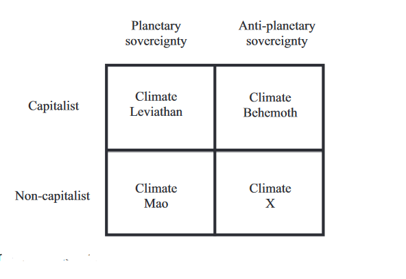
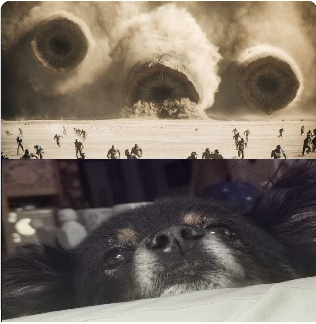
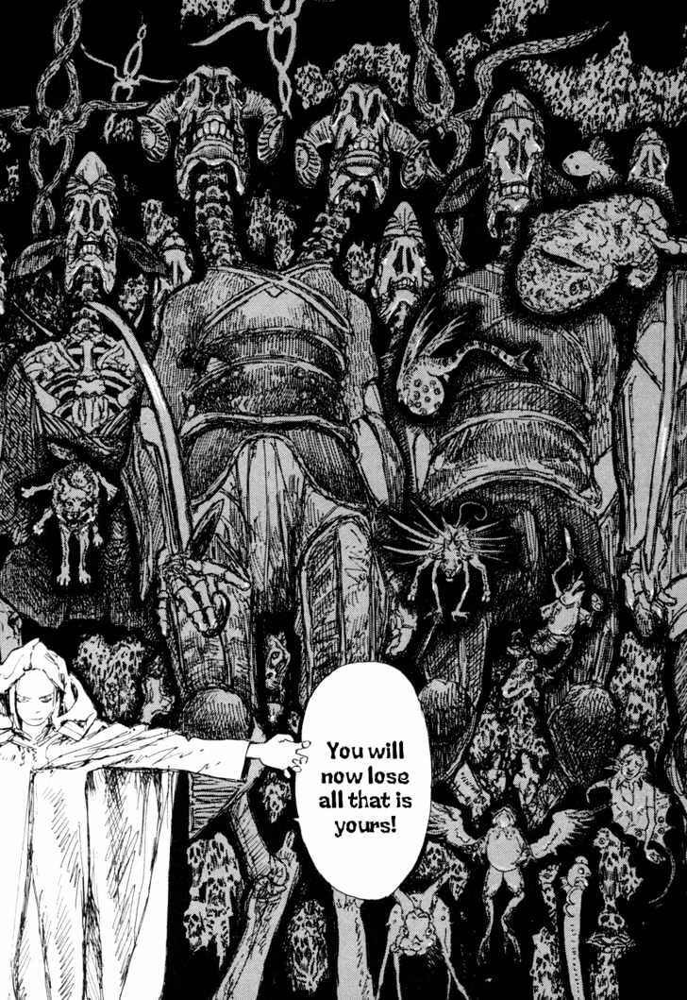
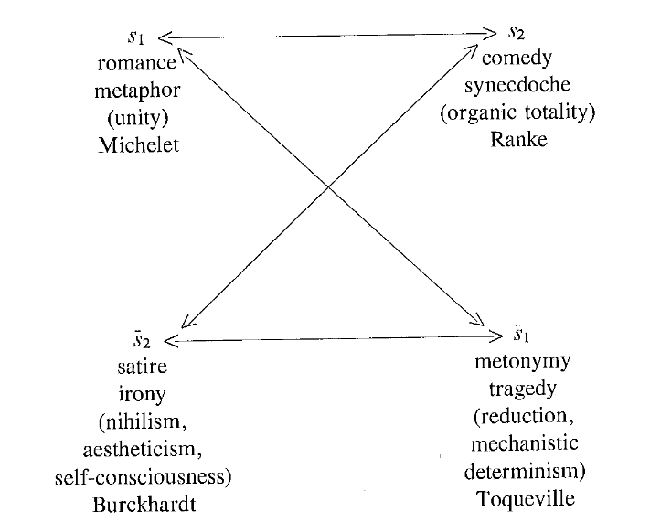

---
tags:
  - Sci-fi
  - Solarpunk
  - Diuna
  - Eko-dżihad
  - Romantyzm
  - Przeznaczenie
coverAlt: description
coverImage: ../../assets/diuna.jpg
pubDate: 16 April 2024
description: Denis Villeneuve w *Blade Runnerze 2049* wykorzystał kultowe kino cyberpunku do symbolicznego przejścia w estetykę solarpunku, która eksponuje zachodzącą już transformację wyobrażeń o polityczności - tego, co jest konieczne i możliwe do wyobrażenia wspólnoty. To poszukiwanie nowej estetyki dla opowieści o władzy i wspólnocie jest wymuszone przez przyspieszającą globalną zmianę klimatu.
isDraft: false
title: Diuna & solarpunk & eko-dżihad
---
UWAGA SPOILERY Z FILMÓW I KSIAŻEK UNIWERSUM DIUNY

 

 *Podczas gdy dla technokapitalizmu pustynia jest źródłem oleistości maszyn wojennych i hiperkonsumpcji kapitalizmu na drodze do osobliwości, dla Dżihadu ropa jest katalizatorem przyspieszającym nadejście Królestwa, pustyni. Tak więc dla Dżihadu pustynia leży na końcu ropociągu* Reza Negarestani, *Cyclonopedia*, s. 35

 

*Stawanie się pustynią samo w sobie jest krańcową platformą komunikacji z Boskością.* Idib., s. 149

 

*Pustynia rośnie: biada, w kim się kryje!* Fryderyk Nietzsche, *Tako rzecze Zaratustra*, *Wśród cór pustyni*

 

0

Poniższy tekst składa się z notatek zredagowanych w formie zajawki większego i nadal rozbudowywanego projektu teoretycznego wokół *Diuny* (jako uniwersum łączącym powieści i ekranizacje), solarpunku, eko-dżihadu, pustyni, mistycyzmu, polskiego romantyzmu i przeznaczeniu.

Spostrzeżenie, że Denis Villeneuve w *Blade Runnerze 2049* wykorzystał kultowe kino cyberpunku do symbolicznego przejścia w estetykę solarpunku, eksponuje zachodzącą już transformację wyobrażeń o polityczności - tego, co jest konieczne i możliwe do wyobrażenia wspólnoty. To poszukiwanie nowej estetyki dla opowieści o władzy i polityczności jest wymuszone przez przyspieszającą globalną zmianę klimatu.

*Diuna* Franka Herberta miała być przede wszystkim krytyką autorytaryzmu; "wzięła się z konceptu <długiej powieści o mesjańskich konwulsjach, które cyklicznie wstrząsają ludzkimi społecznościami> oraz z osobistego przekonania autora, że <superbohaterowie są dla ludzkości czymś katastrofalnym>"[^1]. *Diuna* powraca jednak w 3. dekadzie XXI wieku nie tylko dlatego, że przestrzega przed kultem jednostki i fanatyzmem religijnym w niemal odruchowo zakładanym przez Europejczyka po 2WŚ kontekście faszyzmu i Holokaustu. Jasne, Herbert jako hippis-republikanin wolał, by wolne jednostki mogły zajmować się swoimi sprawami, zagłębiać się w nieznane regiony umysłu, eksperymentować z używkami modyfikującymi świadomość, najlepiej blisko natury, a szczególnie bez ingerencji zbiurokratyzowanego państwa i przemysłu medialnego. 
Mimo to myślę, że *Diuna* wykracza poza horyzont intencji Herberta i podąża za nieświadomymi wektorami, które w tym cyklu arrakijskim rzucają pytanie o władzę na planszę rozłożoną poza zasadami gry oświeceniowej, liberalnej, burżuazyjnej demokracji. Jeśli fabryka wyobraźni Hollywoodu wyczuła dziś szansę na skapitalizowanie *Diuny*, to właśnie dlatego, że mamy obecnie do czynienia z przeciągającą się agonią instytucji i inwencji twórczej liberalizmu. Aktualność *Diuny* tym bardziej nie będzie dziwić, gdy weźmiemy jeszcze pod uwagę, że - obok handlu melanżem - dwoma polami grawitacyjnymi całego uniwersum są wojna przeciw sztucznej inteligencji oraz czynniki klimatyczne. Weszliśmy więc już na planszę innej rozgrywki estetycznej i politycznej, którą zamiast koni i samochodów przemierzają czerwie pustyni wydzielające wodę życia dla nowej duchowości. 

 

1 Diagram polityki solarpunku

W *Climate Leviathan*[^2] z 2018 r. Geoff Mann i Joel Wainwright ustalają na wstępie, że zaprzepaściliśmy szansę na zapobiegnięcie ekstremalnym konsekwencjom antropogenicznej zmiany klimatu (z perspektywy 2024 nie jest to już ani trochę kontrowersyjne). W związku z tym rozważają cztery możliwe formuły, jakie może przybrać planetarna polityka, aby zaadaptować się do taśmociągu katastrof ekologicznych.

 

 

Pierwszym i najbardziej prawdopodobnym wg W&M scenariuszem jest ukonstytuowanie się *Lewiatana klimatycznego*, tj. takiego systemu, którego władza zdolna będzie do podejmowania decyzji zw. z polityką środowiskową na skalę planetarną (jak np. geoinżynieria słoneczna) przy zachowaniu kapitalizmu w zieleńszej wersji. Ten planetarny suweren będzie rozstrzygał o dystrybucji regulacji i wartości w "zielonym kapitalizmie", tj. o tym, gdzie i kiedy należy ogłosić stan wyjątkowy, jak wdrażać projekty infrastrukturalne, kto może emitować gazy cieplarniane. *Mao klimatyczny* to antykapitalistyczny wariant Lewiatana. Rewolucyjną transformacją infrastruktury kierowałby suwerena o globalnym zasięgu, na wzór Chińskiej Republiki Ludowej, lecz jego władza znajdowałaby się ponad kapitałem i rynkiem. Następnie mamy *Behemota klimatycznego*, który również będzie podążał jednocześnie dwoma trajektoriami. W wariancie *reakcyjnego konserwatyzmu* Behemot sprzeciwia się tendencjom do przyjęcia planetarnego suwerena w imię zachowania dominującej struktury państw narodowych. W tym celu, jak już obserwujemy, reakcyjne władze państwowe często będą sięgały po populistyczne ruchy, jak np. denializm klimatyczny czy sentymenty antyimigranckie. Behemot może jednak przybierać formę *klimatycznego X* - w tym przypadku antypaństwowe i anty-lewiatanowe masowe ruchy, zamiast zostać przechwyconymi przez faszystowskie siły, tworzą oddolne instytucje sprawiedliwej polityki środowiskowej. Klimatyczne X spełnia dla Manna i Wainwrighta funkcję utopijnego placeholdera, ponieważ nie tylko musi dążyć do ochrony środowiskowa, ale również forsować postulaty dekolonialne, feministyczne, robotnicze i inne związane z marginalizowanymi grupami lub sposobami życia.

Niezależnie od scenariusza adaptacji, zmiana klimatu jest nieunikniona i uruchamia dziś nasz planetarny Los. Estetykę i politykę tego losu nazywam solarpunkiem. Solarpunk przekroczył próg hype'u na przełomie 2010/2020-tych, przenikając technofilne, lewicujące i enwironmentalistyczne kręgi. W zamierzeniu solarpunk miał być utopijnym antidotum na mroczny i nihilistyczny cyberpunk, który mniej więcej w tamtym czasie zaczął zyskiwać popularność w mediach głównonurtowych (w TV, grach AAA, memosferze) i sieciówkach odzieżowych. Napisano trochę opowiadań, notek blogowych, manifestów i tekstów kuratorskich, ale przede wszystkim bombardowano infosferę memami przedstawiającymi lepszy, zrównoważony, zieleńszy świat, o którym nie powinniśmy bać się marzyć. Każde mogło włożyć do formatu memu swoje fantazje, te najczystsze, najbardziej równościowe i z najniższym śladem węglowym. Dziś w 2024 roku można już spokojnie powiedzieć, że hype poszedł z dymem i niewiele po nim zostało, na pewno nieporównywalnie z odciskiem, jak na kulturze pozostawił cyberpunk lat 80-90. Z pewnością, jednym z powodów tej przelotności estetyki solarpunku jest logika mediów społecznościowych. Żaden wzorzec informacji - mem, trend estetyczny czy idea - nie uniknie tego cyklu: rodzi się w jakiejś niszy, raptownie eskaluje w wiral, by nagle wygasnąć, bo czas na płaskowyżach uwagi jest skończony, a popularność balansuje na krawędzi cringe'u. Fakt, że z solarpunku nic nie pozostało, wynika z miałkości i powierzchowności tamtego hype'u, który od początku sformatowano jako -core.

Moim zdaniem warto spróbować uratować solarpunk, bo - podobnie jak cyberpunk dla końca XX wieku - pozwala opracować matrycę różnych zintegrowanych procesów na styku estetyki i polityki na początku XXI wieku. Jeśli jednak termin "solarpunk" ma mieć jakikolwiek sens, musi nawiązać do *punku*, a punk jest dystopijnym gatunkiem wywiedzionym z beznadziejności panującego systemu społecznego, nie reklamówką najnowszego UX. Solarpunk nie jako greenwashing przyszłości, a problem, na który składa się przemiana klimatu, katastrofy nią wywołane i konieczność adaptacji form życia do tego, co nadciąga. Polityka solarpunku to przetrwanie na surowej planecie przy pomocy złożonych technik obliczeniowych i biochemicznej modyfikacji ciała (melanż).

Kino Villeneuve’a rzutuje estetykę solarpunku w czasie przyszłym dokonanym. Jesteśmy na Arrakis. Nieludzka/arcyludzka planeta kreśli abstrakcyjny diagram solarpunku, w którym pustynia zajmuje miejsce innych kataklizmów: nagłych skoków temperatur, huraganów, szarańczy, tsunami. Do figury pustyni jeszcze wrócę, najpierw chcę wskazać jeszcze parę wektorów solarpunku, którymi biegną filmy Villeneuve'a.

Cyberpunk tworzył tak silnie pociągającą estetykę i *gatunek myśli*, ponieważ brał społeczny i naglący problem swoich czasów, czyli AI + korporacje + miasto, i nasilał wpływ jednego z komponentów, tj. AI, na pozostałe dwa. To właśnie nadawało mu futurystyczny a jednocześnie współczesny i namacalny klimat; fascynował dzięki projektowaniu przyszłości z tego, co znajdowało się dookoła (w przeciwieństwie do wielu klasycznych scifi, które wymyślały niestworzone światy bezwiednie wykładając ich tekstury tymi samymi nawykami i fantazjami amerykańskiej klasy średniej lat 50.) To też tłumaczy, dlaczego cyberpunk prawie nigdy nie był moralizatorską opowieścią o upadłym świecie, a raczej - za Simonem Sellarsem[^3] - afirmatywną dystopią, której bohaterowie nie oceniają świata przez pryzmat wyidealizowanego zbioru zasad moralnych, ale myślą, pragną i postępują z immanencji cyberpunku. U Williama Gibsona, Davida Cronenberga, Kathy Acker czy Hideakiego Anno, autonomię umożliwia aktualizacja oprogramowania, odkrycie swojego nieludzkiego pochodzenia, trauma mediów cyfrowych, ucieczka przed łowcami androidów lub ucieczka z cyborginią i piratem. By solarpunk działał jak prawdziwa estetyka lub gatunek myśli musi zmierzyć się ze współczesnym sobie problemem, mniej więcej takim: AI + rozpad instytucji[^4] + pustynia. FIlmy Villeneuve'a są maszynami, poruszającymi się po tym diagramie.

Cyberpunk miał coś w sobie z ironii baby boomerów (nie piszę tego z pogardą jbc), tymczasem solarpunk Villeneuve'a jest postironiczny. Być może zatoczyliśmy koło i postironia to po prostu nowa romantyczność[^5] - nieprzypadkowo wracają tematy ekstatyczności i eskapizmu, lecz tym razem każde o silnie nie-indywidualistycznym rysie (nie chcę mówić, że politycznym, bo romantyzm też był w istotny sposób polityczny i przewrotny w stosunku do XVIII/XIX-wiecznego porządku). Już *Arrival* wyświetlało swoją opowieść w wysokiej skali, ale Villeneuve'a jeszcze trzymały ograniczenia typowego dla sprywatyzowanego realizmu Hollywoodu. Dopiero solarpunk pozwala mu tworzyć kinematograficzne wehikuły patosu zdolne do uniesienia problemów, których dotyka Villeneuve. Romantyczna postironia i patos, obecne już w *Blade runnerze 2049* i obu *Diunach*, są warunkami nowej duchowości, którą będą kultywować podmioty solarpunku.

 

2 Behemot: anarchia i autorytaryzm

M&W twierdzili w 2018, że klimatyczny Lewiatan jest najbardziej prawdopodobnym scenariuszem, co argumentowali potrzebą ochrony globalnego kapitału za pomocą m.in. geoinżynierii słonecznej, której nie będzie dało się wprowadzić bez instrumentu prawno-politycznego, jakim są światowe organizacje finansowe. Z perspektywy 2024 coraz bardziej prawdopodobne wydaje się, że obserwujemy koniec ery amerykańskiej globalizacji, czego dowodem są choćby wojny na granicach Zachodu (Ukraina i Izrael), dwubiegunowość rozwoju technologii (AI i Chiny) oraz ruchy klimatyczne i nacjonalistyczne na globalnym Południu. Ponieważ Lewiatan opiera się na zachodnim sekularnym liberalizmie, jego polityczna opozycja znajduje zasoby w religii, zwłaszcza w islamie. "Tam, gdzie Lewiatan wzywa do zarządzania planetą, to, co możemy nazwać *klimatyczną Al-Kaidą*, stanowi atak na pychę liberalnych prób ustanowienia planetarnego suwerena"[^6]. Powolne przejście kapitalizmu z systemu animowanego przez liberalną demokrację w jakąś hybrydową formę feudalizmu lub absolutyzmu z gospodarką rynkową rysuje jeszcze ostrzejsze analogie z uniwersum *Diuny*, w którym arystokratyczne rody, zakony oraz gildie prowadzą jawne i skryte zmagania o zasoby energetyczne.

Fremeni w *Diunie* składają się z wielu powiązanych kulturowo, choć osobnych, ludów zamieszkujących pustynie Arrakis, których organizacja polityczna przypomina relatywnie małe wspólnoty (może syndykaty?) nazywane siczami. Siczą kieruje naib - przewodnik militarny i duchowy Fremenów - którego można w każdej chwili wyzwać na pojedynek na noże i w ten sposób zastąpić złego przywódcę[^7]. To połączenie autorytaryzmu i anarchistycznej bezpośredniości w relacji do władzy Fremenów jest już interesujące w kontekście polityki solarpunku. Zgodnie z przepowiednią - mającą zapewne źródło zarówno w religii Zensunni jak i socjotechnikach Bene Gesserit - Fremeni wyczekują nadejścia mesjasza, Mahdiego, który poprowadzi ich do Zielonego Raju. Do tego momentu walka wyzwoleńcza Fremenów sprowadzała się do gromadzenia zasobów i oporu poza zasięgiem wzroku władzy imperialnej. Paul Atryda nigdy nie miałby okazji przyjąć na siebie los Mahdiego, gdyby nie doszło do odpowiedniego, trochę przypadkowego, a trochę zaprogramowanego przez Bene Gesserit, splotu w polityce Imperium (z jednej strony Padyszach wysyłający Atrydów na Arrakis, przywracający Harkonennów, by zniszczyć Atrydów, a z drugiej wieloletnie projekty ekologiczne Liet-Kynes). Wciągnięcie Fremenów w imperialną politykę jednocześnie pozwoliło wyzwolić wzbierający w nich potencjał do odzyskania planety, której są tubylcami w przeciwieństwie do arystokratycznych zarządców wydobycia przyprawy, i rozpoczęcia utopijnego projektu jej terraformacji. To jednak wystawiło Fremenów na nowe zagrożenie - charakterystyczne dla klimatycznego Behemota - jak wyłonienie się struktury autorytarnej, będącej niemal bliźniaczo współwystępującej z ruchem anarchistycznym (można wskazać wiele powodów: jednym mechanizmem może być niechęć do państwa przy jednoczesnej potrzebie przyjęcia ujednolicającego i bezpośrednio wywiedzionego z ruchu podmiotu władzy). W ten sposób *Diuna* inscenizuje diagram polityki solarpunku: autorytaryzm i/lub anarchia vs liberalna oligarchia i/lub demokracja.

Problem solarpunku nie brzmi, "w jaki sposób ludzkość będzie mogła żyć anarchistycznie", ale "jak nawigować między autorytaryzmem a anarchią - dwoma biegunami nadchodzącej epoki, w której żyjemy?". Postępujące globalne ocieplenie podsyca pragnienie oddania władzy tym, którzy gotowi są podejmować zdecydowane decyzje w kwestiach klimatyczno-ekonomicznych, ponieważ w ostatnich dwóch dekadach polityka parlamentarna i system liberalny, zarówno na Globalnej Północy jak i Południu, nie dają nadziei na realizację programów wychodzących naprzeciw  wyzwaniom ekologicznym. Raczej widzimy miotanie się miedzy symptomami, niż adresowanie przyczyn pogarszających się warunków życia i pogłębiających nierówności społecznych w skali państwowej i globalnej.

To solarpunkowe pytanie wyłania się również z uniwersum *Diuny*, w którym przynajmniej na początku relacja Fremenów do Lisana al-Gaiba oraz Paula Atrydy do Fremenów niesie możliwość wyobrażenia układu autorytaryzmu i anarchii bez brutalnej opresji. Szczególnie w kontekście dyskusji o orientalizacji, wątkach kolonialnych i figurze białego zbawcy w *Diunie* błędem byłoby widzieć we Fremenach nieukształtowaną materię, której to Paul nadał formę[^8]. Uciekając Harkonennom nie miał żadnego planu, niósł ze sobą zestaw instrumentów i dźwigni w imperialnej grze politycznej oraz genetykę i wyszkolenie Bene Gesserit, naprzeciw czemu Fremeni wyszli ze swoim polem potencjalności związanym z wyszkoloną armią, technikami i duchowością zintegrowanymi z pustynią. Dopiero stopniowo zachodząca synteza tych dwóch wektorów (Atrydów i Fremenów) wyzwoliła Behemota, który wstąpił na drogę kosmicznego eko-dżihadu. To właśnie ta synteza sił "wielkiej polityki" i oddolnych ruchów środowiskowych i wolnościowych wprowadza w rezonans Arrakis i Ziemię. Zatem, dramatyzowane przez *Diunę* konsekwencje tej syntezy mogą być rzutowane także w przyszłość Ziemi.

I właśnie dlatego, że nie przedstawia utopii, a dzieje walki o władzę, z niebezpieczeństwami autorytaryzmu i anarchistycznego fanatyzmu, *Diuna* zarysowuje inny model polityczności, niż ten, na który jesteśmy skazani zdaniem komentatorów kapitalizmu na prawo i lewo. Połysk polityki solarpunku w *Diunie* widać w tym, że jej tragedią nie jest upadek sprawnie funkcjonujących demokracji (poza tym, jak dobrze wiemy mieszkając w Europie, każda demokracja bezwzględnie dookreśla, kto i jak może cieszyć się jej legalistycznym równouprawnieniem), a degeneracja instytucji i umysłowości Fremenów wraz z dżihadem przeciwko Imperium. *Diuna* rzuca nas do wnętrza feudalistycznej dystopii solarpunkowego realizmu, w której granicach możemy podążać za iluminacjami lepszej przyszłości: dżihadem + ekologią[^9].

Eko-dżihad z perspektywy europejskiej brzmi ekstremalnie, dudni jak puszka Pandory, ale kiedy po wielu dekadach pokojowych marszy i protestów klimatycznych nadal łamane są kolejne ustalenia ze szczytów klimatycznych, a wydobycie paliw kopalnych, produkcja odzieży czy ilość plastiku w oceanach nie przestaje rośną - znajdujemy się pod ścianą i potrzebujemy innych idei, technik, strategii. Ponad 20 lat nasiąkania zachodnimi mediami zostawia w nas wyraźny obraz dżihadystów, ale nie można zapominać, że terroryzm wymierzony w niewinnych ludzi jest tylko jedną z form, jakie dżihad może przybrać. Dżihad w kulturach arabskich oznacza szeroko rozumiane działania na rzecz tego, by "trafić do lepszego miejsca", to także opieka nad swoim miejscem, tworzenie prawa i walka o przetrwanie. Negarestani dodaje, że dżihad to opór pustyni przed najazdem imperium. We wszystkich tych sensach dżihad wiąże się z ukierunkowaną technicznością, sprytem i sekretnością w imię przetrwania. Teraz, tę ideę na grunt aktywizmu klimatycznego można przenieść poprzez *How to blow up a pipeline* Andreasa Malma. W tej książce z 2018 roku Malm przekonuje, że powodem nieskuteczności strajków klimatycznych jest ich absolutne przywiązanie do pacyfizmu - brak skrzydła bojówkarskiego, które dokonywałoby aktów sabotażu przeciwko własności prywatnej burżuazji, infrastrukturze energetycznej, przemysłowi itd. odbiera skądinąd dużemu ruchowi narzędzie nacisku na władze państwowe. Co kluczowe - i Malm raz za razem to podkreśla - sabotaż nie może celować w zwykłych obywateli, nie może być krwawy z racji zarówno oczywiście etycznych (bo zabijanie niewinnych ludzi jest złe kropka), jak i strategicznych, bo wtedy alienuje się społeczeństwo względem ruchu i sprawy[^10].

Problem projektowany przez diagram solarpunku i *Diunę* można przeformułować jeszcze inaczej: co musimy zrobić, by Behemot morfował w tysiącach otoczonych czcią ikon, buzi, pysków i paszczęk, a nie w służbę kultu jednej twarzy. Wydaje mi się, że konieczna przemiana musi być szersza niż instytucje polityczne i ekonomiczne, czy styl estetyczny - poziomy, na których skupiała się nowoczesna umysłowość - ale jednocześnie o wiele bliższa i głębsza niż zaangażowanie w społeczeństwie obywatelskim. *Diuna* lokuje tę energię Behemota w religii, bo nie znamy innej matrycy, niż religia, która byłaby zdolna do czegoś tak całościowego i radykalnego (łac. *radix* – korzeń, rdzeń). Religia stanowi dawno niepróbowany wehikuł rewolucji społecznej, zdolny do stworzenia nowej ekologii umysłowości lub horyzontu metafizycznego. Pod coraz ostrzejszym słońcem i z coraz głębszymi cieniami jedyną drogą, jaka nam pozostała, naszym Przeznaczeniem, jest radykalna przemiana duchowa - illuminacja zamiast oświecenia.

 

 

3 White boy jihad summer

Zanim przejdę dalej, chcę omówić parę kwestii związanych z kolonializmem, egzotyzacją i orientalizacją w kontekście *Diuny*.

Książki nasycone są złożonymi odniesieniami do kultur arabskich i islamskich (choćby *Lisan al-Ghayb* "głos z Zewnątrz", jak nazywano perskiego poetę Hafeza, czy pojęcia *alam al-mithal*, *sarfa*, *bilal*, *tahaddi* i wiele innych), te tropy językowe i estetyczne w dużej mierze nadają *Diunie* jej wyjątkowego klimatu, ale dzięki temu, że nie tylko one, Herbertowi udało się uniknąć naiwnej orientalizacji. Chociaż środowiska alt-rightowe i republikańskie uwielbiają dopatrywać się w uniwersum *Diuny* potwierdzenia swoich fantazji o micie Wielkiej Indywidualności, potędze białego kolonizatora czy darwinizmie społecznym, a sam Herbert był jakąś formą hippisowskiego republikanina, to nie da się zredukować tej opowieści przez jednoznacznie wskazanie ziemskich odpowiedników Paula Atrydy, Bene Gesserit, Gildii itd.[^11] Jak wspomniałem wcześniej, Herbert odrzucał ambicje imperialistyczne Zachodu, nie zależało mu tylko na przeniesieniu europejsko-kodowanej, arystokratycznej gry o tron w scenografię pustyni, którą potem wypełnił popkulturowymi ornamentami muzułmańskimi. Raczej znalazł w tej dynamice między zachodnio-kodowanymi rodami a arabsko-kodowanymi ludami płaszczyznę do opowiedzenia o oporze pustyni przed kolonizacją oraz zagrożeniami fanatyzmu i prób jego użycia dla celów politycznych. Ale im dalej w cykl arrakijski, tym bardziej ekstatyczna opera kosmiczna wymyka się z panowania tych intencji Herberta...

Pustynia jest tutaj realnym aktorem, środowiskiem, które radyklanie zmienia zasady rozgrywki, co wielokrotnie odkrywały imperia w ziemskiej historii, gdy ich armie grzęzły, komunikacja się urywała, umysł tracił orientacje. Herbert nie wpada też bezwiednie w charakterystyczną kolonialną fantazję o pustyni jako bezludziu i pustkowiu, czystej kartce, pustelni, do której oddala się od cywilizacji, by lepiej usłyszeć głos Boga. Przemiana Paula w Kwisatz Haderacha rzeczywiście dopiero na pustyni, gdy pod wpływem melanżu nasilają się jego wizje, ale to pustynia poprzecinana wielością historii, technik podróżowania, technik przemiany duchowości oraz form życia (szczuroskoczek, dżinn, głosy wiedźm z przeszłości)[^12]. Pustynie Arrakis zamieszkują zróżnicowane społeczności, co dobrze zobrazowały filmy Villeneuve'a, w których zachowana jest spójność estetyczna pomiędzy wszystkimi Fremenami, uzyskana z synkretycznego potraktowania kultur arabskich i islamskich. Jednocześnie, Villeneuve na tyle świadomie podszedł do tego sykretyzmu, że na jego podstawie możliwa była wariacja stylistyczna, dzięki czemu sicze odróżniają się wizualnie (nadal pozostając synkretyczną w stosunku do ziemskich tradycji). Różnice między tymi siczami mogą prowadzić do napięć wewętrznych wśród Fremenów, którzy z zewnątrz, z perspektywy Harkonennów i Imperium, stanowią jednolity podmiot. Nie są bezwolnymi pionkami, potrafią zjednoczyć się, by wywierać wpływ na imperialną politykę - i Paul i Fremeni wciągnięci są w dynamikę kultu jednostki, bo z jednej strony on akceptuje swoją rolę jako przywódcy i Mahdiego, a z drugiej rola ta została na nim wymuszona (btw podobnie do wallfacera w *Problemie trzech ciał*) i staje się instrumentem w realizacji fremeńskiej legendy. 

Pod ciekawym kątem połączył ideę pustyni z kwestiami egzotyzmu i fetyszyzacji Negarestani w *The Draw of the Desert*, tegorocznym seminarium w The New Centre for Research and Practice:
	*Dlaczego egzotyzm pustyni ma taką moc? Dlaczego jest tak, że egzotyzm pewnego rodzaju tropów jest tak pociągający? Nie tylko dla ludzi na Zachodzie, ale dla wszystkich. Egzotyzm musi zostać wyartykułowany, nie musi pozostawać sekretem (occult). Ale wyrażenie egzotyzmu nie oznacza jedynie odczarowania, albo pozbycia się egzotyzacji. Egzotyzm pojawia się nie bez powodu...  wiąże się ze szczególnego rodzaju geograficzną, geologiczną ideą pustyni. Nie, pustynia jest egzotyczna - pogódź się z tym. Ma swój fetyszyzm, ma swoją ideologię, ale to cała idea egzotyzmu, w której widzimy szereg sprzecznych pragnień: wobec Innego, wobec romansu, wobec miłości, uniwersalności, strategii, manipulacji, gaslightingu i tak dalej, i tak dalej.*
Negarestani wskazuje tu na dogłębny związek między pustynią a alienacją - jako fetyszyzmem, jako wyobcowaniem, jako odosobnieniem i jako znajdowaniem się pod wpływem tego, co obce. Tylko tu zostawiam tę myśli dla rozwinięcia przy innej okazji.

 

4 Przemiana duchowa - pustynia jako ekologia umysłowa

Imperium, które doprowadziło do pustynnienia planety, teraz musi panować nad pustynią - terenem, którego ono nigdy nie rozumiało i nie opanowało do końca. Pustynię mogą przecinać imperialne szlaki komunikacyjne, ale pomiędzy nimi rozciąga się przestrzeń szumu, nieludzkich dronów i głosów. Pustynię odgradza się od miasta murami, wizje na pustyni nie mogą zostać ograniczone i poznane przez kategorie rozumu wykształcone na forum miasta/*polis*. Istnieje w tym ryzyko wpadnięcia w orientalizację, bo pustynia w Polsce może być tylko błędowska, a nie geograficznie przepastna. Lecz nawet jeśli nie dojdzie do znaczącego pustynnienia Europy w sensie parametrów geologicznych, pustynia jako idea i fantazja, która fascynuje i wciąga, będzie coraz silniej wdzierała się do naszych wyobraźni. Pustynnienie lądów i oceanów wciągnęło już naszą ekologię umysłową w proces stawania-się-szczuroskoczkiem, stawania-się-dżinem, stawania-się-diuną. Jeśli wielocefaliczny Behemot powstaje z pyłu i odpadków aparatu Lewiatana, to musimy również przejść przemianę duchową, która obejmuje troskę o ekologię umysłową i insurekcję w imię bio-, noo- i technoróżnorodnych ekosystemów[^13].

Mając to na uwadze bądź nie, w wideo o produkcji ścieżki dźwiękowej do pierwszej części Diuny Villeneuve mówił o konieczności wiarygodnego wybrzmienia przemiany duchowej Paula[^13]. Film osiągnął to poprzez *eerie* estetykę - za Fisherem: przestrzeń jest *eerie*, gdy coś wygląda znajomo lub zwyczajnie, lecz wyczuwa się, że coś nie pasuje, jakaś obecność lub nieobecność. Zamiast korzystając z tropów *weird*, jak często robi to sci-fi (choćby *Gwiezdne wojny*) ścieżka dźwiękowa *Diuny* powstała z eksperymentów ze znanymi, analogowymi i organicznymi dźwiękami - Villeneuve chciał by wektorem gatunkowym był tutaj dokument. Zgaduję, że jedną z racji za myśleniem o blockbusterze jako dokumencie jest złożona fabuła i głębia relacji politycznych w *Diunie* (co jest analogiczne do decyzji Jacksona w produkcji trylogii *Władcy pierścieni*). Tworząc *Diunę* wizualnie i dźwiękowo ze znanych elementów Villeneuve pozwala osobie oglądającej od razu złapać kontekst sceny, zamiast koncentrować się na rekwizytach i scenografii by zrozumieć, co się dzieje na ekranie. Przeżywamy immersję w dokument, który dzieje się na Arrakis, a nie w egzotyczny kosmos (to w ogóle metoda docierania do obcości przez przesunięcia i *delaye* w tym, co znane i znajome[^14][^15] W konsekwencji, *Diuna* Villeneuve'a interpretuje czerwie pustyni jako "boskie istoty", *eerie* Stwórców świata, a nie ohydne potwory; nie mają cię wystraszyć, a wywoływać wrażenie kontaktu z czymś sakralnym i transformacyjnym duchowo.

Paul poddaje się przemianie wewnętrznej coraz głębiej zanurzając się w krajobraz/środowisko Arrakis, ale oczywiście ze względu na decyzje o dokumentowości, immersyjności i *eerie* sakralności my także jesteśmy wciągnięci w tę wędrówkę. Przemiana duchowa Paula implikuje przemianę duchową w solarpunku. Jaka ma będzie przemiana duchowa w solarpunku? Biorąc pod uwagę kształt Behemota,  wiąże się ona z długotrwałym wzrostem fanatyzmu na całym globie (albo inaczej: rośnie wpływ fanatyzmu na działanie instytucji demokracji liberalnej). Ale teraz nie może być to reakcyjny fanatyzm ewangeliczny, który jest reakcją na chwianie się Imperium pod kataklizmami ekologicznymi[^16]. Fanatyzm religijny gra również kluczową rolę w rozwoju relacji między Fremenami a Muad-dibem, staje się on katalizatorem wydarzeń dziejowych, zdobycia Arrakis przez indygeniczną ludność oraz rozprzestrzenienie ich dżihadu na inne planety w *tour de force* Paula Atrydy.

Jaka jest różnica między ewangelistami w USA a Fremenami? Pustynia, albo fakt, że - słowami Stilgara - *sicz jest modelem myślenia*. To krajobraz i geografia decyduje o ekologii duchowej, ewangeliści wyrośli na pustyni (Kalifornii) tak samo jak Fremeni czy islamscy dżihadyści, ale wypierają środowisko swojej genezy. To istotne, bo prawa, zasady i zwyczaje Fremenów związane są z "mitem krajobrazu", łączą się w nich techniki przetrwania, ćwiczenia duchowe i rytuały wspólnotowe, przez co bliżej im do mistycyzmu niż zinstytucjonalizowanej religii. Każda reguła jest techniczną manipulacją życia społecznego, a każda technologia wyznacza czas i przestrzeń drogi duchowej.

Uniwersum Diuny mierzy się z dwoma napięciami, które dobrze nakładają się na dwubiegunowość autorytaryzmu-anarchii solarpunku. Pierwsze wiąże się z tym, że fremeńska umysłowość podważa rozróżnienie na prawo i technikę (którym swoją drogą kieruje się obecny dyskurs dot. AI). Jednorodność prawa i techniki wymusza na ludach pustyni właśnie krajobraz ich życia społecznego. Jak zauważa Negarestani, o ile *polis* zawsze dąży do rozróżnień, a następnie oddzielania od siebie przeciwieństw, tak by były jasno i wyraźnie rozpoznawalne. Tymczasem pustynia sprawia, że rozróżnienia i przeciwieństwa się zlewają, łączą i przechodzą jedne w drugie. Pustynia jest ambiwalentna, to *compositum oppositorium*, niczym Bóg religii abrahamowych: ekstremalny patriarchat i ekstremalny matriarchat, autorytaryzm i anarchia. Negarestani: „nie istnieje emancypacja na pustyni”. Villeneuve: "W Diunie chodzi o kontrasty i to samo chcieliśmy zrobić z dźwiękiem" (stąd np. kontrast między eterycznymi dźwiękami związanymi z melanżem, a zaraz potem ostry hurkot ornitopterów i wszechobejmujące drony). Przywołując ucieczki świętych i pustelników z Europy na pustynie Afryki Północnej i Bliskiego Wschodu, Negarestani zauważa, że to prawda, że lepiej słychać głosy na pustyni, ale nie da się odróżnić, czy to głos Boga, złośliwego dżina czy zwyczajna fatamorgana.

Z tego więc wynika drugie napięcie Diuny: między wizjami a dogmatami w ufundowaniu wierzeń religijnych. Jest to kluczowe napięcie, wokół którego Villeneuve komponuje i sekwencjonuje obrazy oraz dźwięk/mowę. Ścieżka Paula przebiega przez przepowiednie, epifanie i wizje nadciągającego eko-dżihadu, zintensyfikowane przez nadmierne wystawienie na duże dawki melanżu, narkotyku zmieniającego świadomość, pod wpływem którego ciągle znajdują się Fremeni. Warto przełożyć to na tropy chrześcijańskie, ponieważ na tym gruncie musimy ze znanych nam elementów skonstruować solarpunkową ekologię umysłową. Paul jest mistykiem i wieszczem, który nie tylko bierze udział w rozgrywce o tron Imperium, ale równocześnie przewodzi walce wyzwoleńczej przeciw Imperium.

Dlatego więc przemiana duchowa I/ być może będzie kierkegaardiańska, ponieważ tylko rycerz wiary, którego umysł jest komnatą bez słońca z oknem wystawionym na absolut, może dochować wierności swojemu przeznaczeniu nie spodziewając się nagrody w postaci tu i teraz mierzalnych rezultatów, ryzykując tym, że jego praca i zaangażowanie na zawsze pozostanie w cieniu[^17]; II/	musi być nietzscheańska, ponieważ *amor fati*[^18] jest jedynym wejście na drogę bez wyjścia ewakuacyjnego - gotowość do poświęcenia wygody, kariery lub nawet życia[^19] oraz wytrwałość w niestabilnych, postapokaliptycznych warunkach życia; III/ musi być darkiańska, ponieważ w Joannie d'Arc mamy ostateczną matrycę zmilitaryzowanej walki politycznej zintegrowanej z mistycznymi wizjami, a - jak przypomina Malm - bez gotowości na selektywną przemoc zmiana systemu ekonomicznego i sprawiedliwa adaptacja do przemian klimatycznych będzie nieosiągalna (historia uczy, że nigdy nie doszło do celowej rewolucji społecznej bez zamieszek, powstań, niszczenia mienia prywatnego i środków produkcji etc.).

Wszystkie te postawy są drogowskazami stawania-się-Fremenem w postapokaliptycznym świecie. Rycerz wiary, nietzscheańskie *amor fati* przewyższania siebie, mistyczna partyzantka to warunki umysłowości mogącej prowadzić eko-dżihad w epoce solarpunku. A przynajmniej taki wydaje mi się zarys niereakcyjnej twarzy Behemota. Nie jest to ostateczna propozycja, bo rozpatrywanie tego problemu wiąże się z wieloma niebezpieczeństwami - powtarzam: nie chcę namawiać do rozlewu krwi niewinnych ludzi - ale coraz więcej nas zaczyna uświadamiać sobie, że stoimy pod ścianą i trzeba zmienić to, jak myślimy i działamy w kontekście umierającej Ziemi.

(Ta NOTKA zaczyna się rozrastać do niepokojących rozmiarów, resztę rzucam w całkowicie zajawkowym formacie.)

 

5 Umysłowość polskiego romantyzmu 

W *Purpurowym płaszczu Mickiewicza* Maria Janion bada ścisły związek między romantyzmem a doświadczeniem imperialnej opresji. Romantyzm na terenach Polski stapiał poetę i konspiracjonistę w jedną postawę, która stworzyła system symboli, figur i praktyk odpowiedzialnych za powstanie nowej umysłowości, gotowej do organizacji powstań i troski o dziedzictwo kulturowe (powiedzmy - do adaptacji i replikacji wzorca ducha). Janion błyskotliwie rozsupłuje tam romantyzm jako matrycę dla pewnego ducha od różnych koncepcji narodu, przy czym należy też pamiętać, że naród w pierwszej połowie XIX wieku miał rewolucyjną siłę przeciwstawienia się ponadnarodowym imperiom, zanim jeszcze zamienił się w późno-XIX i XX-wiecznego molocha. Janion wskazuje pewien kierunek przywrócenia romantyzmu jako mesjanizmu przenoszonego drogą poezji i konspiracji. Konspirację być może także trzeba przemyśleć, bo raz: algorytmiczne architektury platform społecznościowych wytwarzają bańki, które właściwie funkcjonują jak kręgi konspiracyjne (dotyczy to również środowisk poetyckich lub anarchistycznych); a dwa: myślenie konspiracyjne okaże się konieczne do utrzymania eko-dżihadu, gdy imperium będzie próbowało go złamać dla przywracania "normalnego biegu spraw". Poezja jest konspiracją. Jednocześnie Janion zwraca uwagę na zagrożenia i uproszczenia w modelu romantycznego wieszcza i mesjanizmu - DO GŁĘBSZEGO ZBADANIA.

 

6 Przeznaczenie i katastronomiczny dryf

Tematy przeznaczenia i katastrofizmu łączą polski romantyzm z *Diuną*.

Im głębiej Paul wchodzi w pustynię, tym silniej odsłania się jego tożsamość i przeznaczenie (*telos* z przyszłości?).

Villeneuve zawsze robi film o przeznaczeniu, które bohaterowie muszą przyjąć, by przetrwać i móc zobaczyć inne wyjście, niż to widziane przed akceptacją swojego losu.

W *Diunie* przeznaczenie funkcjonuje na paru poziomach, o których można myśleć w bardziej materialny sposób jako o nośnikach, mediach lub "środowiskach losu". Jest przeznaczenie kosmiczne, które powraca w wizjach Paula i wiąże jego los z tragedią (w sensie antycznym) całej ludzkości. Jest konieczność narzucana przez Głos wiedźm Bene Gesserit, w którym konieczność i wolność uzależnione są od posiadanych wiedzy i techniki. Potem, nośnikami przeznaczenia są zarówno wertykalne rody (porywczy dziadek Paula) oraz horyzontalne rodziny (Leto-Jessika-Paul), jak i rywalizacja ekonomiczna i polityczna w ramach imperialnej gry o tron. Ponadto, eugeniczny projekt Bene Gesserit pt. *Kwisatz Haderach* przecina się z obsesyjnym myśleniem wszystkich władców o krzyżowaniu swojego potomstwa, by rosły stawki w probabilistycznie kalkulowanym losie rodu. Eugenika służy tu za obraz dążenia do doskonałości i celowego projektowania przeznaczenia popchniętego do ekstremum.

Od początku, już w pierwszej części *Diuny*, nad Paulem ciągle unosi się widmo katastrofy; gdy przyjmuje swoje przeznaczenie wstępuje w pełne ruchomych piasków pole kataklizmów. W *Diunie Mesjaszu* staje się to jeszcze wyraźniej widocznej. Paul rządzi przez ciągłe unikanie katastrof, a każdy unik oznacza zmianę trajektorii z jednej nadciągającej katastrofy na inną, odleglejszą lub mniejszą, do której trzeba się zaadaptować i wymyślić nową strategię. Unikanie i zarządzanie – nie tylko Paula, ale też Gildii – odbywa się za pomocą przewidywania różnych możliwych ścieżek przyszłości (obliczaniu prawdopodobieństw, przewidywaniu i spekulacji). Gdy Paul traci wzrok, kieruje się już tylko za pomocą *prescience*, czyli tej władzy spekulacji i przewidywania – i porusza się zgodnie z wersją, którą wybiera, a która nieustannie aktualizuje przestrzeń (katastroficznych) możliwości. Sypanie się jednorodnych ziarenek piasku niczym ciągi cyfr ustanawia silny związek między obliczeniami a pustynią, katastrofami a czasem. Przeznaczenie wymaga precyzji.

Odczytanie tragedii greckiej (za Girardem), które prowadzi do anastrofy, właśnie na pustyni, tam, gdzie lew zamienia się w dziecko (Nietzsche). Musimy uśmiercić nasze dawne imiona, musimy umrzeć, by odrodzić się na nowo w przyszłości (Zielonym Raju).

 

7 Feniks, wieczny powrót, anastrofa

Janion w *Romantyzm: studia o ideach i stylu* wyjaśniając miejsce prowidencjonalizmu i postępu w wizji dziejów Zygmunta Krasińskiego przywołuje koncepcje Pierre-Simona Ballanche'a, oświeceniowego mistyka i teologa. Dla Ballanche'a Opatrzność i Fatum (/Przeznaczenie) stanowiły dwa punkty widzenia rozpatrywania historii ludzkości oraz dwie zewnętrzne siły ingerujące w wolność jednostki. „Fatum, w sensie najbardziej rozległym i ogólnym, to nieodwołalność aktu woli dokonanego na zewnątrz. Fatum jest więc bądź rezultatem woli boskiej lub Opatrzności, bądź dziełem człowieka”. Zdaniem Ballanche'a z pewnego punktu widzenia (np. w starożytności) - tj. w POV bez biblijnego objawienia - Opatrzność może przybierać formę Przeznaczenia. Od punktu widzenia zależy, czy jest się człowiekiem Przeznaczenia widzącym w historii tylko zło i trud (jak w greckiej tragedii, czy Byron), czy człowiekiem Opatrzności wierzącym w dobro ostatecznie zwyciężające nad złem.

Jedyne wyjście z Fatum - jako uwarstwionego produktu ludzkiej woli i okoliczności - prowadzi przez Opatrzność, czyli zewnętrzną wolę, która zawsze może zmienić okoliczności przez przyznanie łaski. Problematyczną kwestią w romantyzmie jest jego niepohamowany indywidualizm, ale można tu przekształcić go w postulat walki z Przeznaczeniem jako społecznym rozumem instrumentalnym, czy bądź innymi siłami monokultu. Irydion z dramatu Krasińskiego o tym samym tytule jest narzędziem Przeznaczenia (przeznaczonym do czegoś), ale przez akceptację tragicznego Fatum zyskał łaskę (wkroczył w jej wirtualny tensor) – odpowiedział na coś w rodzaju metafizycznej próby. Opatrzność jest rzutem kością, który przekształca logikę dominującego systemu podporządkowującego procesy jednemu celowi. Skrzydła wolności wyrastają z czynu skazanego na porażkę i w daremnej walce uderzają o wizję nowego porządku. W tym miejscu wkracza symbol Feniksa i koncepcja palingenezy: idea śmierci i powstania z popiołów; „klęska stawała się zapowiedzią rehabilitacji, z upadku wynikało zbawienie”. Krasiński adaptuje koncepcję palingenezy Ballanche'a do kontekstu XIX-wiecznej Polski znajdującej się pod okupacją obcych imperiów. Daremne powstania były dla romantycznych poetów i spiskowców jedynym sposobem na wezwanie boskiej interwencji, która wpisałaby nową logikę w Los.

Ballanche i Krasiński stawiają niżej umysłowość grecką, bo zamknięta jest w fatum – tragedia kończy się porażką wszystkich bohaterów. Czego jednak nie biorą pod uwagę – a o czym pisze Girard – to, że tragedia umożliwia oczyszczenie miasta, zatrzymanie spirali przemocy w studni krwi, a po następuje niej ekspiacja, anastrofa, Feniks. Istnieje jakieś podziemne przejście między starożytnym mitem Feniksa a formułą Nicka Landa i Sadie Plant: to, co jest katastrofą z wnętrza historii, jest anastrofą nieświadomości. Anastrofa nie jest jednak odtworzeniem starego świata, a inną logiką – powtórzeniem z różnicą. „W teorii palingenezy właśnie można było zawrzeć wiedzę o konieczności upadku i cierpienia oraz pewność zbawienia i rehabilitacji; doprowadzić do mistycznej harmonii idee rewolucji i ewolucji jednocześnie”. Nie potrafię na razie zinterpretować tej pewności zbawienia, choć wstępnie powiedziałbym zbawienie = łaska = zmiana logiki, nawet jeśli, paradoksalnie, zmiana ta jest na gorsze (patrz: omawienie wektorializmu przez McKenzie Wark). Warte zachowania z tragicznej umysłowości greckiej - a co znów zbiega się z formułą Land-Plant - jest to, że to nie my jesteśmy celem, nie zachowanie naszego istnienia, lecz wyprodukowanie nowej umysłowości, która przyjdzie po nas i będzie gotowa żyć inaczej. Nasze miejsce jest wewnątrz tragedii.

Możemy teraz zatoczyć spiralę [^20]. Istnieją analogie między polską romantyczną umysłowością a Fremenami lub klimatyczną Al-Qaedą, oczekującymi Lisana al-Gaiba, Głosu spoza świata, by zaprowadził ich do Zielonego Raju na planecie rozdzieranej przez imperialną politykę, wyzyskujący system ekonomiczny i katastrofy ekologiczne. Złota Droga Kwisatz Haderacha przebiega przez diagram solarpunku, który stapia ze sobą Los, Opatrzność i Wolę w jedno pytanie: jak skanalizować planetarne energie anarchii w zintegrowany i wielowektorowy dżihad przeciwko bezwładnemu opadaniu Ziemi ku Arrakis.

 

8 Znaki, media, libido

Kwestia stworzenia ikon jako przekaźników i akceleratorów eko-dżihadu. W ten sposób *Diuna* powraca do kwestii mediów - relacji symboli i ikon do pragnienia - i technologii jako układów technik przekształcania pragnień w określonej logice.

Kult jednostki to pewna forma kultu podobizny czy ikony, który nie zniknie dopóki istnieje twarz.

Możliwe, że *Diuna* (jak i wszystkie te hollywoodzkie, canneńskie i koreańskie produkcje wywołujące przyjemność z krzywdy wyrządzanej bogatym na ekranie), tak jak socrealizm, ma opanować i zneutralizować wybuchowe energie społeczne wytworzone przez przemiany klimatyczne. Nawet jeśli, to zawsze gdy próbuje się coś kontrolować, doprowadza się do proliferacji tego, co system miał kontrolować - w tym wypadku Hollywood rysuje diagram solarpunku[^21].

 

9::0 | 0511

...

[^1]: M. Stachowicz, [*„Diuna”: Kontrasty nie z tego świata*](https://krytykapolityczna.pl/kultura/film/marcin-stachowicz-diuna-villeneuve/)

[^2]: G. Mann & J. Wainwright [*Climate Leviathan*](http://library.lol/main/6C7B6159E8FB4B01F759244556602DA8)

[^3]: S. Sellars, [*“Extreme Possibilities”: Mapping “the sea of time and space” in J G Ballard’s Pacific fictions*](https://www.monash.edu/__data/assets/pdf_file/0005/1763654/sellars.pdf)

[^4]: Mówi się o tym, że tworzy się system neofeudalizmu (o czym świadczy zarówno system wektorialistycznego władcy z pańszczyzną danych, jak i zainteresowanie dobrami wspólnymi na lewicy), lecz wydaje mi się, że dzisiejsi magnaci technologiczni nawiązują bardziej do monarchii absolutnej. Niezależnie od ostatecznych form, będzie to jakaś forma autorytaryzmu, którego celem będzie poskramianie oddolnych ruchów anarchiczno-autonomistycznych.

[^5]: Fredrick Jameson w przedmowie do *On Meaning. Selected Writings in Semiotic Theory* (s. XIX) wykorzystuje kwadrat semiotyczny A.J. Greimas do pokazania relacji między epokami stylistycznymi w XIX wieku. Kwadrat, który tak naprawdę jest spiralą - po czasie ironii, który w XX wieku nazwano postmodernizmem, przychodzi czas post-ironii, romantyczności i jedności (choć już inaczej rozumianej niż w sto lub dwieście lat temu, oczywiście). 
[^6]: Z artykułu syntetyzującegi książkę: G. Mann & J. Wainwright [*Climate Leviathan*](https://cpb-us-w2.wpmucdn.com/u.osu.edu/dist/4/45440/files/2017/04/Wainwright-Mann-2013-Climate-Leviathan-oqsypw.pdf)

[^7]: Reguła *amtal*, na którą powołuje się Dżamis, gdy nie zgadza się ze Stilgarem, by przyjmować Jessikę i Paula.

[^8]: A forma w tym quasi-hylemorficznym modelu = przemoc.

[^9]: *...rozprzestrzeniać pustynię to poszerzać ścieżkę Dżihadu* - R. Negarestani, *Cyclonopedia*, s. 151.

[^10]: W *The Subversive Seventies* Michael Hardt analizuje aktywizm lewicowy lat 70. i zauważa tam, że właśnie ze względu na brutalne ataki terrorystyczne oddolne organizacje lewicowe o radykalnych programach politycznych straciły poparcie społeczeństwa. Z tego płyną dwa wnioski: jeden, nie można powtórzyć tego błędu, a dwa, być może brak bojówek gotowych do niszczenia własności prywatnej jest - obok neoliberalnego postmodernistycznego konsumpcjonizmu - istotnym powodem bezsilności lewicy w ciągu ostatnich dekad.

[^11]: Świetną analizę tych wątków znalazłem w artykule **[Haris A. Durrani](https://newlinesmag.com/writers/haris-a-durrani/)**: "Collapsing Herbert’s ideas of American and non-Western traditions, particularly Islam, is discombobulating. If the Fremen are savage adherents to qadi justice, it’s unclear who the savages are supposed to be in relation to their supposed savior, Paul. Is Paul the T.E. Lawrence to the Fremen Bedouin? Or is he the Prophet Muhammad to the Quraish whom he reformed — or to later conflicts about his successors? The historical Mahdi to the Berbers, Sudanese or Caucasians — or the eschatological Mahdi (or Dajjal) to their descendants in the distant future? Jesus to the Romans? A colonial bureaucrat or rival chief to the Mura, Arawak, Navajo, Quileute, Kalahari, Indonesian or Malay peoples? Paul is all of this and more. But he is also John F. Kennedy, and the Fremen are the American people. How does one square the claim that Paul is a white savior, a reformer of stagnant Fremen custom, with the fact that Herbert disliked Americans’ unabashed adoration for JFK, to whom he frequently compared Paul? How could Herbert be a conservative critic of American liberals if his portrayal of the Atreides family, the saga’s liberals par excellence, is too sympathetic? If the Bene Gesserit breeding programs are extensions of Herbert’s eugenicist ideology, then how do they also mirror the missionary work of the Fatimid Caliphate that proselytized Abdullah ibn al-Husayn as the Mahdi, the 12th Imam in Shiism, across the Middle East and North Africa? Put simply, if reform was the problem, what was the tradition Herbert sought to recover?"

[^12]: Poezja jest pustynią. Wyjaśnia to dlaczego Rimbaud porzucił poezję w formie mieszczańskiej wirtuozerii i został przedstawicielem handlowym w Jemenie i Abisynii. Porzucił swoje dawne życie, ponieważ odnalazł na pustyni te tabuny duchów, tę złą krew, którą wcześniej przelewał przez swoje wiersze. Pustynia to wektor pragnienia, kolejny etap w rozwoju ducha, a nie dezercja z żywota poety wyklętego.

[^13]: Pustynia = "Desert (AQ = 125). The Xerodrome (or the dry-singutarity of the Earth) as both the all-erasing monopoly of the monotheistic Cod and the Tellurian Omega or the plane of base-participation with the cosmic pandemonium (Dust. Sun and the Tellurian Insider). Desert signifies a militant horizontality o a treacherous plane of consistency — in a Deleuze-Guattarian sense — between monotheistic apocalypticism and Tellurian Insurgency against the Sun (god). As a dry-singulanty, desert is usually linked to unheard-of wet elements and thus brings about the possibility of revolutionary but anomalous (and perhaps weird) cosmogenesis or world-building processes". Reza Negarestani, *Cyclonopedia*, s. 238.

[^14]: O czym piszę w tekście [o eerie postprawdzie, Fisherze i *Annihilacji*](https://www.minasmongrel.xyz/blog/eerie-postprawda/).

[^15]: Nb pod tym względem Villeneuve w ciekawszy sposób podszedł do pomysłu o nakręceniu dokumentu o przyrodzie w *Diunie*, który rzuciła Klara Cykorz w recenzji dla Dwutygodnika. Zamiast brać Arrakis za przedmiot do przedstawienia w obrazie sięgnął on po metodę dokumentalną, by stworzyć ścieżkę dźwiękową, która stanie się podkładem dla obrazowania *Diuny*. Przykładem tego jest soundscape pustyni, producenci Diuny pojechali na pustynię, gdzie zrozumieli, że świszczący wiatr lub "dojmująca cisza" pustyni to właśnie leniwy stereotyp, bo wydmy śpiewają lub zawodzą, ruchy mas piasku wydają dronowe dźwięki o różnej wysokości, które mają znaczny udział *eerie* klimacie filmu.

[^16]: Polecam serię podcastów [*Charismatic Revival Fury: The New Apostolic Reformation*](https://icjs.org/charismatic-revival-fury/).

[^17]: To wniosek z [monologu Luthena Raela (Stellan Skarsgård) z serialu *Andor*](https://www.youtube.com/watch?v=-3RCme2zZRY), który jest jednym z lepszych popkulturowych obrazów rewolucji jako godnego i romantycznego ale potencjalnie bezowocnego wysiłku.

[^18]: Powtarzane w książce przez Paula: *a więc dokonuje się*.

[^19]: Ostatnio Malabou, która obecnie skierowała swoją uwagę na rozwijanie myśli anarchistycznej, zauważyła, że staliśmy się tak głęboko sformatowani przez indywidualizm, że jesteśmy niezdolni do poświęceń, a przez to jesteśmy chodzącymi trupami. Gotowość do poświęcenia życia jest wg niej warunkiem polityki (nie chodzi oczywiście o nierozważne rzucanie się na imperialny aparat opresji).

[^20]: Wieczny powrót Nietzschego jako spiralna palingenetyczna konieczność powtarzania nowego początku: nie powrót do czegoś, a powrót czegoś - ektoplazmatycznej wolności.

[^21]: W poście blogowym pt. *Image Without Metaphor* Vicky Osterweil wiąże najnowszy trend w kinie hollywoodzkim do dosłownego, pozbawionego metafor, obrazowania problemów społecznych z ideologicznym zduszeniem "energii, pragnień i snów" zrodzonych z systemowej opresji. Myślę, że częściowo Osterweil ma częściowo rację, lecz różnica między *W trójkącie* czy *Parasite* a *Diuną* polega na obrazach fascynacji, które stanowią eksces względem celów aparatu ideologicznego. Możliwe też, że film odrzuca metaforę alee na rzecz deixis (funkcja deiktyczna), albo katafora? Greimas: „cataphora is characterized, inversely from anaphora, by the fact that the condensed term precedes the expanded term.” Patrz: semantyczna anafora/katafora.