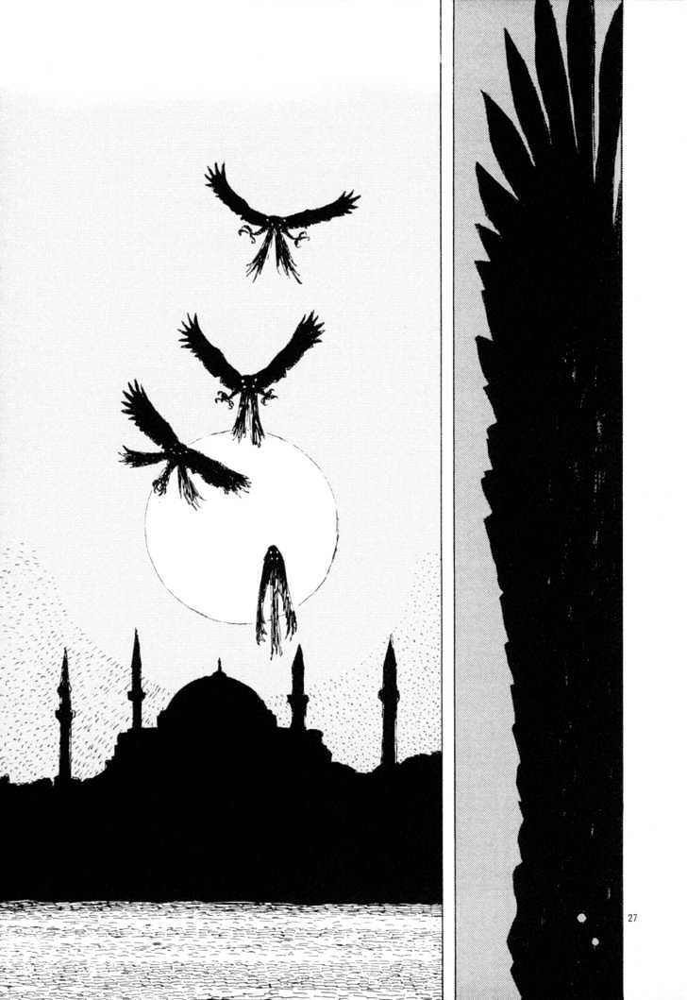

SPOILERS FROM THE DUNE MOVIES AND BOOKS

 

 *While for western technocapitalism, the desert gives rise to the oiliness of war machines and the hyper-consumption of capitalism en route to singularity, for Jihad oil is a catalyst to speed the rise of the Kingdom, the desert. Thus for Jihad, the desert lies at the end of an oil pipeline.* Reza Negarestani, *Cyclonopedia*, p. 35

 

*[B]ecoming the desert itself, an utter communication platform with
the Divine* Idib., p. 149

 

*The desert grows: woe to him who harbors deserts!* Friedrich Nietzsche, *Thus Spoke Zarathustra*, *LXXVI. Among Daughters of the Desert*

 

0

The following text is composed of notes that serve as a preview of a larger and still evolving investigation into the connections between *Dune* (as a universe combining novels and screen adaptations), solarpunk, eco-jihad, the desert, mysticism, Polish Romanticism and fate.

The observation that Denis Villeneuve with *Blade Runner 2049* employed an iconic cyberpunk movie to make a symbolic transition to a solarpunk aesthetic exposes a transformation of political imagery already underway; transformation of what is necessary and possible to imagine a community. This search for a new aesthetics for tales of power and the political is necessitated by accelerating global climate change.

For Frank Herbert *Dune* above all was intended to be a critique of authoritarianism: "it began with a concept: to do a long novel about the messianic convulsions which periodically inflict themselves on human societies" and "that superheroes were disastrous for humans". However, the spectacular resurgence of *Dune* in the third decade of the 21st century isn't just on the account of its attempt to warn against the cult of the leader and religious fanaticism (which in context of fascism and the Holocaust is almost reflexively presupposed by post-WW2 Westerners). Sure, Herbert as a hippie-republican preferred the liberty of individuals to go about their own business, to delve into the unknown regions of the mind, to experiment with consciousness-altering substances, best close to nature, and especially without the interference of the bureaucratic state and the media industry. Still, I think *Dune* steps beyond the horizon of Herbert's intentions and follows the unconscious vectors that cast the question of power in this Arrakian cycle onto a board laid out outside the rules of the game of enlightened, liberal, bourgeois democracy. If Hollywood's fantasy factory sensed an opportunity to capitalise on *Dune* now, it is precisely because we are currently facing the dragging agony of liberalism's institutions and inventiveness. The actuality of *Dune* will be even less surprising if we further consider that - alongside the spice melange trade - the two gravitational fields of the entire universe are the war against artificial intelligence and the unforgiving climate. We have already entered the board of another aesthetic and political game, which instead of horses and cars is traversed by sandworms secreting the water of life to a new spirituality.

 

1 Diagram of the solarpunk politics

At the outset of the *Climate Leviathan*[^2] from 2018 Geoff Mann and Joel Wainwright declare that the chance to prevent the extreme consequences of anthropogenic climate change has already been lost (from a 2024 perspective, this is no longer the least bit controversial). They then proceed to consider four possible formulas through which planetary politics might adapt to the conveyor belt of environmental crises.

 

 

According to Mann and Wainwright, the first and most likely scenario is the formation of *Climate Leviathan*, i.e. a system capable of making environmental policy decisions on a planetary scale (such as solar geoengineering) while maintaining capitalist economy. This planetary sovereign will decide on the distribution of regulations, resources and funds in "green capitalism": where and when to declare a state of emergency, how to implement infrastructure projects, who can emit greenhouse gases. *Climate Mao* represents an anti-capitalist variant of the Leviathan. The revolutionary reorganisation of infrastructure would be led by a sovereign with a global reach, but its authority would stand above capital and the market, as in the People's Republic of China. Then, they discuss *Climate Behemoth*, which could also follow two divergent trajectories. In the *reactionary conservative* variant, the Behemoth opposes the tendency to submit to a planetary sovereign and preserves the dominant structure of nation-states instead. To this end, as we can already witness, reactionary state powers will often turn to populist movements such as climate denialism or anti-immigrant sentiment. However, the Behemoth can also take another form, that of *Climate X*, in which case anti-state and anti-leviathan mass movements, rather than being captured by fascist forces, create institutions of just environmental politics. For Mann and Wainwright, Climate X serves the function of a utopian placeholder, as it not only has to push for environmental protection, but also for decolonial, feminist, workerist and other demands related to marginalised groups or modes of living.

Whatever the adaptation scenario, climate change is inevitable and is now setting in motion our planetary fate. The aesthetics and politics of this destiny I call solarpunk. Solarpunk broke through the hype threshold at the turn of the 2010/2020s, penetrating left technophile environmentalist circles. Solarpunk was meant to be a utopian antidote to the dark and nihilistic cyberpunk that was gaining popularity about that time both in mainstream media (TV, AAA games, memosphere) and in fashion. Some short stories, blog notes, manifestos and curatorial texts were written, but mostly it was the infosphere that produced memes depicting a better, greener, more sustainable world we should dare to dream of. Anyone could put their fantasies into a meme format, the cleanest ones, most equal ones, those with lowest carbon footprint. Today, in 2024, it is safe to say that the hype has pretty much gone up in smoke, leaving little trace, certainly nothing like the imprint the cyberpunk of the 1980s-90s made on culture. Certainly one of the reasons for this transience of the solarpunk aesthetic is the logic of social media. No pattern of information - meme, aesthetic trend or idea - can escape this cycle: it is born in some niche, rapidly escalates into a viral, only to suddenly fade away as time on the attention plateaus is finite and popularity always balances on the edges of cringe. The fact that nothing remains of solarpunk is down to the shallowness and superficiality of that hype, which was formatted as -core from the start.

I think it is worth trying to reclaim solarpunk because - like cyberpunk for the late 20th century - it can help articulate a matrix of multiple integrated processes at the intersection of aesthetics and politics in the early 21st century. However, if the term solarpunk is to make any sense, it must refer to *punk*, and punk is a dystopian genre derived from the hopelessness of the dominant social system, not an advertisement for the latest UX. Solarpunk, not as a greenwashing of the future, but as a problem that encompasses climate change, its catastrophes and technosocial adaptation to what is coming. The politics of solarpunk is survival on a harsh planet using complex computational techniques and biochemical body modification (the spice melange).

Villeneuve's cinema casts the solarpunk aesthetic in the future tense. We will arrive on Arrakis. The inhuman/all too human planet draws an abstract diagram of solarpunk, in which the desert occupies the place of all the other cataclysms: sudden temperature spikes, hurricanes, locusts, tsunamis. I will return to the figure of the desert, but first I want to point out a few more vectors of solarpunk that run through Villeneuve's films.

Cyberpunk was such an alluring aesthetic and *genre of thought* because it took a pressing problem of its time: AI + corporations + the city, and amplified the impact of AI on the other two components. This is what gave it the futuristic yet contemporary and relatable feel; it was fascinating because it designed the future from what was around (unlike a lot of classic scifi, which invented untold worlds that were mindlessly textured with the same habits and fantasies of the American middle class of the 1950s.). This also explains why cyberpunk has almost never been a moralistic tale of a fallen world, but rather - following Simon Sellars[^3] - an affirmative dystopia in which the protagonists do not judge the world through the prism of an idealised set of moral principles, but think, desire and act from the immanence of cyberpunk. In the works of William Gibson, David Cronenberg, Kathy Acker or Hideaki Anno, autonomy is afforded by updating software, discovering one's non-human origins, the trauma of digital media, escaping the android hunters or running away with a cyborg and a pirate girlfriend. For solarpunk to really work as an aesthetic or a genre of thought it has to confront a contemporary problem of its own, which is more or less: AI + institutional collapse[^4] + desert. Villeneuve's films are machines traversing the solarpunk diagram.

If cyberpunk possessed something of the irony of the baby boomers (and I mean it in a good way), Villeneuve's solarpunk is post-ironic. Perhaps we've come full circle, and post-irony is simply the new Romanticism[^5] - it's no coincidence that also the themes of ecstaticism and escapism are also back - this time with a strongly non-individualistic trait (I don't want to say political, because Romanticism was also political and subversive of the 18th/19th century order). Already *Arrival* displayed its story on a high note, but Villeneuve was still held back by the constraints of typical Hollywood privatised realism. Only solarpunk allowed Villeneuve to create cinematic vehicles of pathos capable of carrying the ideas he touches upon. Romantic post-irony and pathos, already present in *Blade Runner 2049* and both *Dunes*, are the conditions of the new spirituality that the subjects of solarpunk will be cultivating.

 

2 Behemoth: anarchy and authoritarianism

M&W argued in 2018 that climate Leviathan was the most probable scenario that will be driven by the need to protect capital with technologies, such as solar geoengineering, that are impossible to implement without the legal and political instrument of global financial organisations. From the perspective of 2024, it seems increasingly likely that we are approaching the end of the age of American globalisation, as exidenced, for example, by wars on the borders of the West (Ukraine and Israel), the bipolarity of technological developments (AI and chip wars with China), and climate, land and nationalist movements in the Global South. Because Leviathan is based on Western secular liberalism, its political opposition finds resources in religion, especially Islam. "Where Leviathan calls for planetary management, what we might call *climate al Qaeda* represents an attack on the hubris of liberal attempts at planetary sovereignty"[^6]. The slow transition of capitalism from a system animated by liberal democracy to a hybrid of feudalism or absolutism and market economy draws even sharper parallels with the universe of *Dune*, where aristocratic families, orders and guilds are engaged in overt and covert struggles over energy resources.

The Fremen in *Dune* are composed of a number of culturally related but separate peoples inhabiting the deserts of Arrakis, whose political organisation resembles relatively small communities (syndicates maybe?) called sietches. A sietch is led by a naib - a military and spiritual guide of the Fremen - who can be challenged to a knife duel at any time, and thus replaced if their leadership is considered to be bad[^7]. This combination of authoritarianism and anarchist immediacy in relation to Fremen power is already interesting in the context of solarpunk politics. According to a prophecy - presumably originating in both the Zensunni religion and the Bene Gesserit socio-technics - the Fremen await the coming of a messiah, the Mahdi, who will take them to the Green Paradise. Until this point, the Fremen's liberation struggle was limited to gathering resources and resisting the imperial powers by staying out of sight. Paul Atreides would never have had the chance to embrace the Mahdi's destiny had it not been for a fitting, somewhat coincidental and somewhat designed by the Bene Gesserit nexus in Imperial politics (on the one hand, the Padishah Emperor first sending the Atreides to Arrakis, then bringing back the Harkonnens to destroy the Atreides, and on the other hand, the long-standing environmental projects of Liet-Kynes). Drawing the Fremen into imperial politics has unleashed the simmering potential to reclaim the planet to which they are indigenous, as opposed to the aristocratic stewards of spice extraction, and to embark on its utopian terraformation. This, however, exposed the Fremen to a new threat - characteristic of Climate Behemoth - such as the emergence of an authoritarian structure that is almost twinned with the anarchist movement (which is for many reasons: one mechanism may be an aversion to the state with simultaneous need to adopt a unifying and directly derived power subject within the movement). In this way, *Dune* stages the diagram of solarpunk politics: authoritarianism vs anarchy replacing liberal oligarchy vs democracy.

The solarpunk problem is not "how will humanity be able to live in an anarchist way", but "how to navigate between authoritarianism and anarchy - the two poles of the coming era in which we live?" Continuing global warming is fuelling the desire to put in power those who are prepared to make tough decisions on climate and economic issues, because over the past two decades, parliamentary politics and the liberal system, in both the Global North and the Global South, have offered no hope for programmes that address environmental challenges. Instead, we see chaotic contortions from symptom to symptom rather than addressing the causes of deteriorating living conditions and widening social inequalities on a national and global scale.

The solarpunk question also arises in the universe of *Dune*, where the relationship of the Fremen to Lisan al-Gaib and Paul Atreides to the Fremen, at least initially, carries a virtual image of an arrangement between authoritarianism and anarchy without violent oppression. Especially in the context of the discussion of orientalisation, colonial codes and the figure of the white saviour in *Dune*, it would be a mistake to see the Fremen as unformed matter to which Paul gave form[^8]. Forced to escape the Harkonnen captivity, he had no plan, but he brought a set of instruments and levers in the imperial political game in addition to the genetics and training of the Bene Gesserit, against which the Fremen emerged with their field of potentiality linked to a highly skilled army, as well as techniques and spirituality integrated into the desert. It was only the gradual synthesis of these two vectors (the Atreides and the Fremen) that unleashed the Behemoth, which embarked on the path of cosmic eco-jihad. It is this synthesis of the forces of "big politics" and grassroots environmental and liberation movements that brings Arrakis and Earth into resonance. Thus, the consequences of this synthesis, dramatised in *Dune*, can also be projected into the Earth's future.

And precisely because it does not present a utopia, but a story of power struggles with the dangers of authoritarianism and anarchist fanaticism, *Dune* draws a different model of the political from the one commentators on capitalism right and left condemn us to. The sheen of solarpunk politics in *Dune* is glimpsed in the fact that its tragedy is not the collapse of functioning democracies (after all, as we know well, every state democracy ruthlessly prescribes who and how can enjoy its legalistic equality), but the degeneration of Fremen institutions and mentality along with the jihad against the Empire. *Dune* throws us into a feudalistic dystopia of solarpunk realism, in its boundaries we can follow the illuminations of a better future: jihad + ecology[^9].

Eco-jihad from a European perspective sounds as extreme as Pandora's box, but when after decades of peaceful marches and climate protests more climate summit agreements continue to be broken, while fossil fuel extraction, clothing production and the amount of plastic in the oceans continue to grow - we are up against a wall and other ideas, techniques and strategies are urgent. More than 20 years of  Western media saturation has created a clear image of jihadists, but it should be remembered that terrorism targeting innocent people is only one of the forms jihad can adopt. Jihad in Arab cultures means, in a broad sense, taking action to "get to a better place"; it is also about caring for one's place, making laws and fighting for survival. Negarestani adds that jihad is the resistance of the desert against the invasion of empire. In all these senses, jihad involves directed technicality, cunning and secrecy in the name of survival. Now, this idea can be applied to climate activism through Andreas Malm's *How to blow up a pipeline*. In this 2018 book, Malm argues the reason why climate strikes are ineffective is that they are absolutely committed to pacifism - the lack of a militant wing to perform acts of sabotage against the private property of the bourgeoisie, energy infrastructure, industry, etc. deprives an otherwise large movement of a tool to put pressure on state authorities. Crucially - and Malm stresses this time and again - sabotage cannot target ordinary citizens, it cannot be bloody on grounds that are both obviously ethical (because killing innocent people is wrong, period) and strategic, because then you alienate the public from the movement and the cause[^10].

The problem projected by the solarpunk diagram and *Dune* can be rephrased once again: what must be done to morph  Behemoth into thousands of venerated icons, faces, mouths and maws, rather than into the service of the cult of one face? The transformation must be broader than political and economic institutions, or aesthetic style - the levels on which the modern mind has been focused - but at the same time much closer and deeper than engagement with civil society. *Dune* locates this behemoth energy in religion, because religion is the only matrix we know that has the capacity for something so holistic and radical (Latin *radix* - root, core). Religion represents a vehicle for social revolution long untried, capable of creating a new mental ecology or metaphysical horizon. Under an ever harsher sun and with ever deeper shadows, the only path left to us, our Fate, is radical spiritual transformation - illumination instead of enlightenment.

 

 

3 White boy jihad summer

Before I move on, I want to discuss a few issues relating to colonialism, exocitism and orientalisation in the context of *Dune*.

The books are saturated with complex references to Arab and Islamic cultures (such as *Lisan al-Ghayb* "the voice from Outside", as the Persian poet Hafez was called, or the concepts of *alam al-mithal*, *sarfa*, *bilal*, *tahaddi* and many others), these linguistic and aesthetic tropes largely give *Dune* its unique climate with Herbert managing to avoid naïve orientalisation. Although alt-right and republican circles love to find in the *Dune* universe a confirmation of their fantasies about the myth of the Great Individual, the power of the white coloniser or social Darwinism, and Herbert himself was something of a hippie republican, it'd be wrong to reduce the fiction to seemingly unambiguous counterparts of Paul Atreides, the Bene Gesserit, the Guild etc. on Earth.[^11] As I mentioned earlier, Herbert rejected the imperialist ambitions of the West; he was not simply concerned with transposing a European-coded aristocratic game of thrones into a desert setting, which he could then fill with pop-cultural Muslim ornaments. Rather, he found in the dynamic between Western-coded houses and Arab-coded peoples a platform to fictionalise the desert's resistance to colonisation and the dangers of fanaticism of the oppressed, and the attempts to harness it for political ends. But the further the Arrakian cycle advances, the more the ecstatic space opera slips from the grasp of Herbert's intentions....

Here, the desert is a real actor, an environment that radically alters the rules of the game, as empires have repeatedly discovered throughout the Earth's history at the cost of their armies, communications and minds. Nor does Herbert lapse into the typical colonial fantasy of the desert as wilderness and wasteland, a blank page or hermitage, to which one recedes from civilisation to hear the voice of God in its purity. Paul's transition to Kwisatz Haderach does indeed take place in the desert, where his visions escalate under the influence of the melange, but it is a desert traversed by a multiplicity of stories, techniques of travel, technics of spirituality and lifeform transformations (the kangaroo rat, the djinn, the voices of witches from the past)[^12]. At the same time, Villeneuve approached this syncretism with enough awareness to allow for stylistic variation (making the sietches visually distinctive while still remaining syncretic in relation to the traditions of Earth). The differences between these sietches can cause internal tensions among the Fremen, who from the external perspective of the Harkonnens and the Empire represent a unified entity. They are not idle pawns, they can work together to influence the imperial politics - so Paul and the Fremen are drawn into the dynamics of the cult of the individual, as he accepts his role as the leader and Mahdi, but equally this role has been forced upon him (similar to the Wallfacer in *The Three Body Problem*) and he becomes an instrument in the realisation of the Fremen legend.

From an interesting angle, the idea of the desert was combined with issues of exoticism and the fetishisation by Negarestani in *The Draw of the Desert*, this year's seminar at The New Centre for Research and Practice:
	*Why exoticism of the desert is so great? Why is it that exoticism of certain sort of tropes is so alluring? Not only to the Western people, but to everyone. Exoticism needs to be articulated, it doesn't need to be occult. But articulation of exoticism doesn't mean merely disenchanting, or getting rid of exoticism. Exoticism is there for a reason... from that sort of geographical, geological idea of the desert. No, desert is exotic - deal with it. It has fetishism, it has ideology, but that the whole idea of exoticism in which you see a number of conflicting desires: for the other, for romance, for love, for universality, for strategy, for manipulation, for gasligthing and so on and so forth.*
Negarestani suggests a profound connection between desert and alienation - as fetishism, as estrangement, as seclusion and as being under the influence of the alien. I only leave this thought here for another occasion.

 

4 Spiritual conversion - desert as mental ecology

The Empire, having caused the desertification of the planet, must now reign over the desert - a terrain it has never fully understood or mastered. The desert may be intersected by imperial communication routes, but in between is a space of noise, drones and inhuman voices. The desert is separated from the city by walls, the visions in the desert cannot be bounded and learned by the categories of reason developed in the forum of the city/*polis*. Such accounts are at risk of falling into orientalisation, since the desert in Poland can only be the Błędów Desert, and not geographically vast sandscapes. But even if there is no major desertification of Europe in terms of geological parameters, the desert as an idea and a fantasy that fascinates and draws us in will increasingly invade our imagination. The desertification of the lands and oceans has already implicated our mental ecology in the process of becoming-beast, becoming-jin, becoming-dune. If the multi-cephalic Behemoth arises from the dust and waste of the Leviathan apparatus, then we must also undergo a spiritual conversion that involves a preoccupation with mental ecology and insurrection in the name of bio-, noo- and techno-diverse ecosystems[^13].

Whether he had this in mind or not, in a making-of video for the soundtrack to the first part of *Dune*, Villeneuve spoke of the need to show Paul's spiritual transformation as credible as possible[^13]. The film achieved this through an *eerie* aesthetic - after Fisher: a space is *eerie* when something looks familiar or ordinary, but something doesn't fit, we sense some surplus presence or absence. Rather than using *weird* tropes, as sci-fi often does (e.g. *Star Wars*) the soundtrack of *Dune* experiments with the familiar, analogue and organic sounds - Villeneuve wanted the genre vector here to be a documentary. I guess one reason behind thinking of the blockbuster as a documentary is the complex plot and depth of politics in *Dune*. By building *Dune* visually and sonically from familiar elements (analogous to Jackson's decision at the level of production of the *Lord of the Rings* trilogy), Villeneuve allows the viewer to immediately grasp the context of the scene, rather than focusing on props and scenery to understand what is happening on the screen. We are immersed into a documentary that takes place on Arrakis, rather than into an exotic cosmos (this is generally a method of achieving strangeness through shifts and *delays* in what is known and familiar[^14][^15]). Consequently, Villeneuve's *Dune* interprets the sandworms as "divine beings", *eerie* Creators of the world, rather than hideous monsters; they are not meant to frighten, but to evoke a sense of contact with something sacred and spiritually transformative.

Paul undergoes an inner conversion as he is pushed deeper into the landscape/environment of Arrakis, but the documentary character, immersion and *eerie* sacredness draw us into this journey too. Paul's spiritual transformation implies a spiritual transformation in the solarpunk. What is the spiritual transformation in solarpunk to be? Considering the shape of the Behemoth, it is connected to the long-lasting rise of fanaticism across the globe (or put another way: the influence of fanaticism on the functioning of the institutions of liberal democracy is growing). Yet it cannot be evangelical fanaticism, which is a reaction to the Empire's sway under environmental cataclysms[^16]. Religious fanaticism also plays a key role in the unfolding of the relationship between the Fremen and Muad-dib, becoming the catalyst for the events of history, the conquest of Arrakis by the indigenous people and the spread of their jihad to other planets in Paul Atreides' *tour de force*.

What is the difference between the evangelists in the US and the Fremen? The desert, or the fact that - in Stilgar's words - *the sietch is a model of thought*. It is the landscape and geography that determines the spiritual ecology, the evangelicals grew up in the desert (California) just like the Fremen or the Islamic jihadists, but they repress the environment of their genesis. This is significant because the laws, rules and customs of the Fremen are linked to the "myth of the landscape", combining survival techniques, spiritual exercises and symbolic rituals, which brings them closer to mysticism than institutionalised religion. Every rule is a technical manipulation of social life, and each technology marks the time and space of the spiritual path.

The *Dune* universe stages two tensions that overlap with the solarpunk authoritarianism-anarchy bipolarity. The first is related to the fact that Fremen mentality challenges the distinction between law and technology (which, by the way, is currently driving the AI discourse). The unity of law and technology is imposed on the desert peoples by the very landscape of their social life. As Negarestani notes, the *polis* always seeks to distinguish and then to separate opposites so that they are clearly and distinctly recognisable. In the desert, however, distinctions and opposites merge, combine and shift into each other. The desert is ambivalent, it is *compositum oppositorium*, like the God of the Abrahamic religions: extreme patriarchy and extreme matriarchy, authoritarianism and anarchy. Negarestani: "There is no emancipation in the desert". Villeneuve: "*Dune* is all about contrasts, and that's what we wanted to do with the sound" (hence, for example, the contrast between the ethereal sounds associated with melange immediately followed by the harsh buzz of ornithopters and overbearing drones). Recalling the flight of saints and hermits from Europe to the deserts of North Africa and the Middle East, Negarestani observes that it is true that voices are better heard in the desert, but it is impossible to distinguish whether it is the voice of God, a malevolent genie or a mere fata morgana.

From this, then, arises the second tension of *Dune*: between visions and dogma in the foundation of religious beliefs. This is the key tension around which Villeneuve composes and sequences images and sound/speech. Paul's path leads through prophecies, epiphanies and visions of an impending eco-jihad, amplified by an overexposure to large doses of melange, a consciousness-altering drug constantly consumed by the Fremen. It is worth translating this into Christian tropes, because on this ground we must construct a solarpunk mental ecology from familiar elements. Paul is a mystic and a soothsayer, who indeed is involved in the house conflicts within the Empire, but at the same time heads the liberation struggle against the Empire.

Therefore, spiritual conversion 1/ must be Kierkegaardian, because only the knight of faith, whose mind is a sunless chamber with a window open to the absolute, can remain faithful to his destiny without expecting the reward of here and now measurable results, risking that his work and commitment will forever lie in the shadows[^17]; 2/ it must be Nietzschean because *amor fati*[^18] is the only entry to a path with no escape route - the willingness to sacrifice one's comfort, career or even life[^19] and the perseverance in the unstable, post-apocalyptic conditions of existence; 3/ must be Darkian (*d'Arc*), because in Joan of Arc we have the ultimate matrix of militarised political struggle integrated with mystical visions, and - as Malm reminds us - without a readiness for selective violence, economic system change and just adaptation to climate change will be unattainable (history teaches that there has never been a deliberate social revolution without riots, uprisings, destruction of private property and means of production, etc. ).

All these dispositions are *signposts of the becoming-Fremen in a post-apocalyptic world*. The knight of faith, the Nietzschean *amor fati* of overcoming oneself, the mystical guerrilla are the conditions of a mentality capable of waging eco-jihad in the age of solarpunk. Or at least that seems to me to be the outline of Behemoth's non-reactionary face. This is not a definitive proposition, for there are many dangers in considering this issue - I repeat: I do not mean to encourage the bloodshed of innocent people - but more and more of us are beginning to realise that we are up against a wall and that there must be a change in the way we think and act in the wake of a dying Earth.

(This BLOGNOTE is starting to grow to alarming proportions, I'm throwing the rest in a completely scribble format).

 

 

5 Polish Romanticism Mentality 

In *Mickiewicz's Purple Mantle*, Maria Janion explores the close relationship between Romanticism and the experience of imperial oppression. Romanticism in the Polish territories fuses the poet and the conspirator into a single disposition that created a system of symbols, figures and practices responsible for the emergence of a new mentality that was prepared to organise uprisings and take care of its cultural heritage (say - adapt to historical tendencies and replicate a pattern of spirit). Janion brilliantly disentangles there Romanticism as a matrix for a certain spirit from various conceptions of the nation, while also emphasising that the nation in the first half of the nineteenth century carried the revolutionary power to resist supranational empires before turning into a late-nineteenth- and twentieth-century Moloch. Janion hints at a direction for the restoration of Romanticism as messianism conveyed through poetry and conspiracy. Conspiracy perhaps also needs to be rethought, because 1/ the algorithmic architectures of social media platforms produce bubbles that actually function as conspiracy circles (this also applies to poetry or anarchist milieus); and 2/ conspiratorial thinking will prove necessary to sustain the eco-jihad when the empire tries to break it for the return of "business as usual". Poetry is a conspiracy. At the same time, Janion draws attention to the dangers and simplifications in the model of the Romantic soothsayer and messianism itself - FOR DEEPER EXPLORATION.

 

6 Fate and catastronomic drift

The themes of fate and catastrophism connect Polish Romanticism with *Dune*.

The deeper Paul goes into the desert, the more his identity and destiny (*telos* from the future?) force themselves upon him.

Villeneuve always makes films about destiny, which the characters have to accept in order to survive and to see a different way out than the course perceived before accepting their fate.

In *Dune*, destiny operates on a couple of levels, which can be understood as vehicles, media or "environments of fate". There is cosmic destiny, which recurs in Paul's visions and links his fate to the tragedy (in the ancient sense) of all humanity. There is the necessity imposed by the Voice of the Bene Gesserit witches, in which necessity and freedom depend on the knowledge and technology possessed. Then, the vehicles of destiny are both vertical lineages (Paul's impulsive grandfather) and horizontal families (Leto-Jessika-Paul), as well as economic and political rivalries within the empire. In addition, the Bene Gesserit's eugenic project known as *Kwisatz Haderach* intersects with the obsessive thinking of all rulers about interbreeding their offspring to increase the stakes in the probabilistically calculated fate of the family. Eugenics serves here as an image of the pursuit of perfection and the deliberate design of destiny pushed to the extreme.

From the very beginning, already in the first part of *Dune*, the spectre of catastronomic drift looms constantly over Paul; as he accepts his fate he enters a quicksand field of cataclysms. In *Dune the Messiah* this becomes even more explicit. Paul governs by constantly evading catastrophes, and each dodge means a change of trajectory from one impending disaster to another, more or less distant, to which one must adapt and devise a new strategy. Evasion and management - not only by Paul, but also by the Guild - is done by anticipating different possible future paths (calculating probabilities, predicting and speculating). When Paul loses his sight, he is already guided only by *prescience*, the power of speculation and prediction - and moves according to the version he chooses, which continuously updates the space of (catastrophic) possibilities. The falling of homogeneous grains of sand like strings of digits establishes a strong link between calculation and desert, catastrophe and time.

A reading of Greek tragedy (after Girard) that leads to anastrophe, precisely in the desert, where the lion turns into a child (Nietzsche). We must put to death our old names, we must die in order to be reborn in the future (Green Paradise).

 

7 Phoenix, eternal return, anastrophe

In *Romanticism: Studies in Ideas and Style*, Janion explained the role of Providentialism and progress in Zygmunt Krasiński's vision of history through the concepts of Pierre-Simon Ballanche, the Enlightenment mystic and theologian. For Ballanche, Providence and Fate (/Destiny) represented two ways of looking at human history and two external forces that interfere with individual freedom. "Fate, in the broadest and most general sense, is the irrevocability of an act of the will performed externally. Fate is thus either the result of divine will or Providence, or the work of man". According to Ballanche, from a certain point of view - e.g. in antiquity as a POV without biblical revelation - Providence can take the form of Destiny. It depends on one's point of view whether one is a man of Destiny who sees only evil and hardship in history (as in Greek tragedy, or Byron), or a man of Providence who believes that good ultimately triumphs over evil.

The only escape from Fate - as a stratified product of human will and circumstance - is through Providence, or external will, which can always change circumstances by granting grace. A problematic theme in Romanticism is its unbridled individualism, but this could be recast as a call to struggle against Destiny as social instrumental reason, or other forces of monocult. Irydion, from Krasiński's drama of the same name, is an instrument of Destiny (destined for something), but by accepting the tragic Fate he has gained grace (entered its virtual tensor) - he has responded to a kind of metaphysical test. Providence is a throw of the dice that transforms the logic of a dominant system that subordinates processes to a single end. The wings of freedom grow out of an act doomed to failure and in futile struggle they beat against the vision of a new order. This is where the symbol of the Phoenix and the concept of palingenesis enter the picture: the idea of death and of rising from the ashes; "defeat became the harbinger of rehabilitation, from the fall came salvation". Krasiński adapts Ballanche's concept of palingenesis to the context of 19th-century Poland under the occupation of foreign empires. For Romantic poets and conspirators futile uprisings were the only way to summon divine intervention that would inscribe a new logic into Fate.

Ballanche and Krasinski considered the Greek mentality as inferior because it is trapped in Fate - tragedy ends in the defeat of all the characters. But what they fail to take into account - and what Girard describes well - is that tragedy makes possible the purification of the city, the stopping of the spiral of violence in the well of blood, and is followed by expiation, anastrophe, the Phoenix. There is a sort of subterranean passageway between the ancient myth of the Phoenix and Nick Land and Sadie Plant's formula: what is a catastrophe from within history is an anastrophe of the unconscious. The anastrophe, however, is not a recreation of the old world, but a different logic - a repetition with a difference. "It was precisely in the theory of palingenesis that it was possible to incorporate both the knowledge of the necessity of the fall and suffering and the certainty of salvation and rehabilitation; to achieve a mystical harmony of the ideas of revolution and evolution". I cannot for the moment interpret this certainty of salvation, although I would tentatively say that salvation = grace = change of logic, even if, paradoxically, the change is for the worse (see McKenzie Wark's discussion of vectorialism). What is worth retaining from the Greek tragic mentality - coinciding again with the Land-Plant formula - is that it is not us who are the end, not the preservation of our existence, but the production of a new mentality that will come after us and be ready to live differently. Our place is within tragedy.

We can now circle back the spiral [^20]. There are parallels between the Polish Romantic mentality and the Fremen or climate Al Qaeda, waiting for Lisan al-Gaib, the Voice from beyond, to take them to a Green Paradise on a planet torn apart by imperial politics, an exploitative economic system and ecological catastrophes. Kwisatz Haderach's Golden Path runs through the diagram of a solarpunk that melts together Fate, Providence and Will into a single question: how to channel the planetary energies of anarchy into an integrated and multi-vectoral jihad against the Earth's inertial descent towards Arrakis.

 

8 Signs, media, libido

The question of producing icons as transmitters and accelerators of eco-jihad. In this way, *Dune* returns to the question of media - the relation of symbols and icons to desire - and technology as systems of techniques for transforming desire according to a particular logic.

The cult of personality is a certain form of idolatry or iconolatry that will not disappear as long as there is a face.

It is possible that *Dune* (along with all those Hollywood, Cannes, and Korean productions that take pleasure in harming the rich on screen), like socialist realism was in the Eastern Bloc, is designed to control and neutralise the explosive social energies generated by climate change. Even if this is the case, any attempt to control something leads to the proliferation of what the system was meant to control—in this case, Hollywood is drawing a solarpunk diagram.[^21]

 

 

9::0 | 0511

...

[^1]: M. Stachowicz, [*„Diuna”: Kontrasty nie z tego świata*](https://krytykapolityczna.pl/kultura/film/marcin-stachowicz-diuna-villeneuve/)

[^2]: G. Mann & J. Wainwright [*Climate Leviathan*](http://library.lol/main/6C7B6159E8FB4B01F759244556602DA8)

[^3]: S. Sellars, [*“Extreme Possibilities”: Mapping “the sea of time and space” in J G Ballard’s Pacific fictions*](https://www.monash.edu/__data/assets/pdf_file/0005/1763654/sellars.pdf)

[^4]: There're debates around the formation of a neofeudalist political and economic system (as indicated both by vectorialist sovereign with data serfdom and the substantial interest in the commons on the Left), but I'd say that today's technology magnates are more reminiscent of absolute monarchy era. Whatever the final shap, it will be some form of authoritarianism designed to subdue bottom-up anarcho-autonomist movements.

[^5]:  Fredric Jameson in his preface to *On Meaning. Selected Writings in Semiotic Theory* (p. XIX) uses A.J. Greimas' semiotic square to illustrate the relationships between stylistic eras in the 19th century. A square that is actually a spiral - after the period of irony, which in the twentieth century came to be known as postmodernism, comes the period of post-irony, romanticism and unity (though now understood differently than a hundred or two hundred years ago, of course). 
[^6]: From an article synthesising the book: G. Mann & J. Wainwright [*Climate Leviathan*](https://cpb-us-w2.wpmucdn.com/u.osu.edu/dist/4/45440/files/2017/04/Wainwright-Mann-2013-Climate-Leviathan-oqsypw.pdf)

[^7]: The *amtal* rule invoked by Jamis when he defies Stilgar to host Jessica and Paul.

[^8]: And the form in this quasi-hylemorphic model = violence.

[^9]: *...to spread this desert, thus broadening the path of Jihad* - R. Negarestani, *Cyclonopedia*, s. 151.

[^10]: In *The Subversive Seventies*, Michael Hardt analyses left-wing activism of the 1970s and points out that it was precisely because of violent terrorist attacks that ground left-wing organisations with radical political agendas lost public support. There are two conclusions to be drawn from this: one, this mistake cannot be repeated, and two, perhaps the lack of militias prepared to destroy private property is - along with neoliberal postmodern consumerism - a significant reason for the powerlessness of the left in recent decades.

[^11]: I found an excellent analysis of these themes in the article by [Haris A. Durrani](https://newlinesmag.com/writers/haris-a-durrani/): "Collapsing Herbert’s ideas of American and non-Western traditions, particularly Islam, is discombobulating. If the Fremen are savage adherents to qadi justice, it’s unclear who the savages are supposed to be in relation to their supposed savior, Paul. Is Paul the T.E. Lawrence to the Fremen Bedouin? Or is he the Prophet Muhammad to the Quraish whom he reformed — or to later conflicts about his successors? The historical Mahdi to the Berbers, Sudanese or Caucasians — or the eschatological Mahdi (or Dajjal) to their descendants in the distant future? Jesus to the Romans? A colonial bureaucrat or rival chief to the Mura, Arawak, Navajo, Quileute, Kalahari, Indonesian or Malay peoples? Paul is all of this and more. But he is also John F. Kennedy, and the Fremen are the American people. How does one square the claim that Paul is a white savior, a reformer of stagnant Fremen custom, with the fact that Herbert disliked Americans’ unabashed adoration for JFK, to whom he frequently compared Paul? How could Herbert be a conservative critic of American liberals if his portrayal of the Atreides family, the saga’s liberals par excellence, is too sympathetic? If the Bene Gesserit breeding programs are extensions of Herbert’s eugenicist ideology, then how do they also mirror the missionary work of the Fatimid Caliphate that proselytized Abdullah ibn al-Husayn as the Mahdi, the 12th Imam in Shiism, across the Middle East and North Africa? Put simply, if reform was the problem, what was the tradition Herbert sought to recover?"

[^12]: Poetry is a desert. This explains why Rimbaud quit poetry in the form of bourgeois virtuosity and became a trade representative in Yemen and Abyssinia. He abandoned his former life because he found in the desert these hoards of spirits, this bad blood that he had previously shed through his poems. The desert is a vector of desire, the next stage in the unfolding of the spirit, not a desertion from the life of *le poète maudit*.

[^13]: Desert (AQ = 125). The Xerodrome (or the dry-singutarity of the Earth) as both the all-erasing monopoly of the monotheistic Cod and the Tellurian Omega or the plane of base-participation with the cosmic pandemonium (Dust. Sun and the Tellurian Insider). Desert signifies a militant horizontality o a treacherous plane of consistency — in a Deleuze-Guattarian sense — between monotheistic apocalypticism and Tellurian Insurgency against the Sun (god). As a dry-singulanty, desert is usually linked to unheard-of wet elements and thus brings about the possibility of revolutionary but anomalous (and perhaps weird) cosmogenesis or world-building processes". Reza Negarestani, *Cyclonopedia*, s. 238.

[^14]: I write about it here, but it's in Polish, so you have to process it in a machine translator: [on eerie post-truth, Fisher and *Annihilation*](https://www.minasmongrel.xyz/blog/eerie-postprawda/).

[^15]: NB In this respect, Villeneuve took a more interesting approach to the idea of making a documentary on nature in *Dune* suggested by Klara Cykorz in her review for Dwutygodnik. Rather than taking Arrakis as an object to be represented in an image, he reached for the documentary method to create a soundtrack that would become the backdrop for the imagery of *Dune*. An example of this is the soundscape of the desert; the sound designers went to the desert, where they realised that the swishing wind or ‘piercing silence’ of the desert in cinema was just a lazy cliché, as the dunes actually sing or wail, the movements of the sand masses produce drone-like sounds of varying pitch that contribute significantly to the *eerie* atmosphere of the film.

[^16]: I recommend the podcast series [*Charismatic Revival Fury: The New Apostolic Reformation*](https://icjs.org/charismatic-revival-fury/).

[^17]: I came to this conclusion after the [monologue of Luthena Raela (Stellan Skarsgård) from *Andor*](https://www.youtube.com/watch?v=-3RCme2zZRY), which is one of the better pop-culture images of revolution as a worthy and romantic but potentially fruitless effort.

[^18]: Repeated in the book by Paul: *so it is happening* (I can't remember the exact quote).

[^19]: More recently, Malabou, who has now turned her attention to developing anarchist thought, remarked that we have become so profoundly formatted by individualism that we are incapable of making sacrifices and are thus walking dead. According to her, the willingness to sacrifice one's life is a condition of politics (not meaning, of course, recklessly throwing oneself at the imperial apparatus of oppression).

[^20]: Nietzsche's eternal return as a spiralling palingenetic necessity to repeat a new beginning: not a return to something, but a return of something - ectoplasmic freedom.

[^21]: In a blog post [*Image Without Metaphor*](https://all-cats-are-beautiful.ghost.io/image-without-metaphor-dune-2-and-the-return-of-socialist-realism/) Vicky Osterweil links the recent trend in Hollywood cinema towards literal, metaphorless portrayals of social problems to an ideological stifling of the "energies, desires and dreams" born of systemic oppression. I partly agree with Osterweil, but the difference between *In the Triangle* or *Parasite* and *Dune* is in the images of fascination, which are an excess against the aims of the ideological apparatus. It is also possible that the film abandons metaphor in favour of deixis (a semantic deictic function), specifically its form of cataphor which, following Greimas, "unlike anaphor, is characterised by the fact that a condensed term precedes an extended term". E.g. "Since *she* had her first vision, Joan was guided by the Voice". So here *Dune* would be a cataphor condensing into itself all the issues of the solarpunk diagram raised in this blogpost: global warming, authoritarianism-anarchy, destiny, the cult of the individual etc.