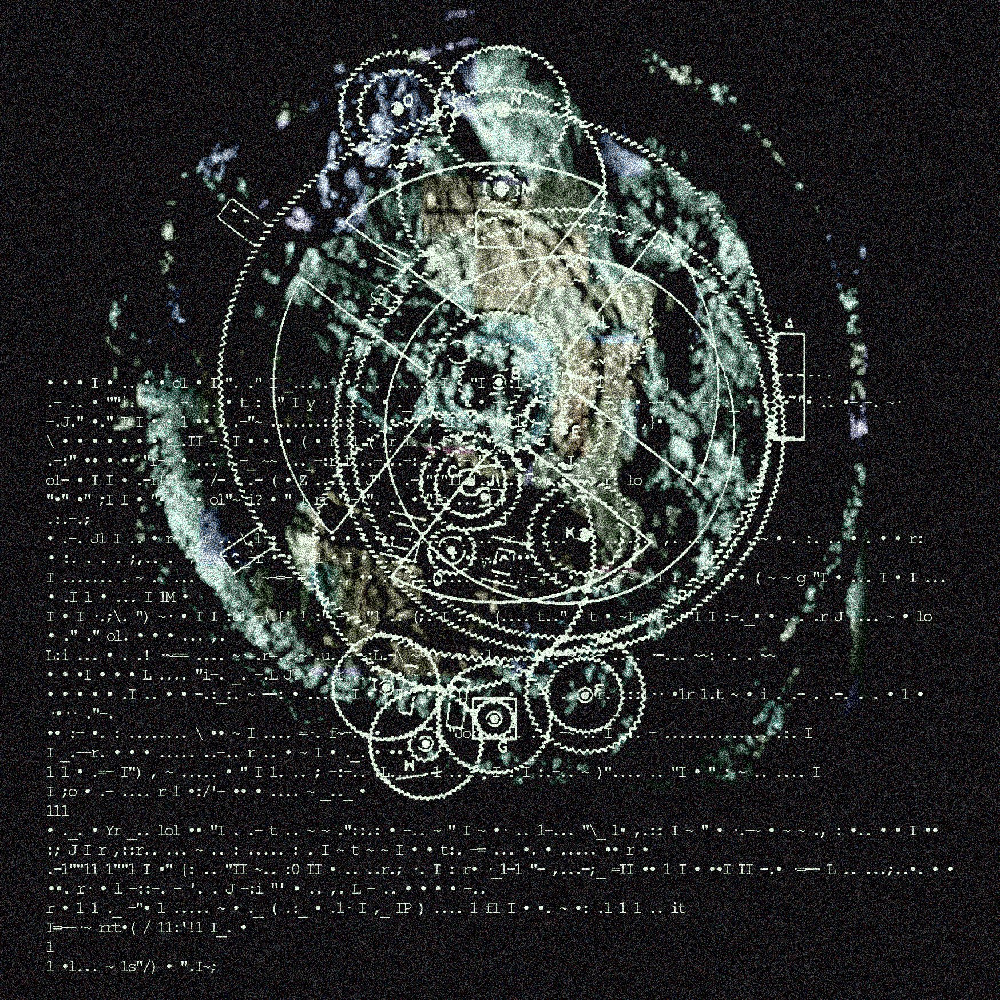

grafika: @lithauch

 

### Kujawa ÷ Galloway

 

Absolutnie nikt już nie wierzy w układ instytucjonalny leżący u podstaw konstytucyjnej demokracji liberalnej. Nawet liberałowie. Jeśli się rozejrzeć, tam gdzie jeszcze rządzą liberałowie, zarówno ich słowa jak i działania zdradzają jednoznacznie, że nie wierzą już w demokrację liberalną. Dążą do konsolidacji władzy, skrócenia procesu decyzyjnego, umocnienia murów (czy nie marzą po cichu o ograniczaniu praw wyborczych ciemnego ludu raz za razem udowadniającego swoją niedojrzałość do demokracji). Rozpaczliwe próby utrzymania kontroli nad światem, redukowanym przez zmianę klimatu i rozpędzanym przez sztuczną inteligencję. Kryzys instytucji pociąga za sobą kryzys sprawczości, bo nasze działania - nasze życie - mają sens tylko w ramach instytucji. W ich detonacji, krytyce i regeneracji. Bo nawet ważniejsze niż życie jest świadomość, że istnieje ścieżka lepszego życia, a ta wymaga możliwości wspólnego udoskonalania instytucji, przez które ona biegnie.

Ten maksymalistyczny kontekst jest właściwy czytaniu nowej książki Dawida Kujawy, *Niedzielne ziemie. Poezja i dobra wspólne*, która sama wycina niespodziewany kontekst dla ostatniej książki teoretyka mediów Alexandra Gallowaya, *Uncomputable. Play and Politics in the Long Digital Age*. Stawką obu jest perspektywa technik przywracania "kontekstu" w dobie komunikacji społecznej systemowo załamującej kontekst (*context collapse*) - w porządku semiotyki postprawdy. Nie będę dalej rozwijał tego kontekstu, chciałem by jednak towarzyszył temu tekstowi jak szum w tle. Szum ten będzie towarzyszył właściwemu wątkowi tej notki: alegorię transwersalną można odczytywać jako figurę lub gramatykę instytucji dbania o (ale też zawłaszczania) dóbr wspólnych wyłaniających się z infrastruktury sieci i czarnych skrzynek.

 

### Tragedia interaktywności

Stosunki społeczne zawsze uwarunkowane są przez technologie i media. Za organizację technologii i mediów, czyli środków społecznych, odpowiadają instytucje. Model instytucjonalnej organizacji środków społecznych warunkuje stosunki społeczne, czyli wspólnoty, w jakich żyjemy. W czasach kiedy na każdy temat roztacza się wojna kulturowa, wyjątkowo powszechna zgoda panuje co do przekonania, że niezdolność dzisiejszych instytucji do odpowiedzi na współczesne problemy (zmiana klimatu a technologie spalinowe; psychopatologie a media społecznościowe; AI w ogóle) stoi za rozbiciem społecznym i utratą sprawczości politycznej (kiedy ostatnio czułaś, że twój głos się liczy?).

W panujących warunkach technomedialnych, niezależnie czy tego chcesz czy nie, czy pracujesz w zakładzie fryzjerskim, call centre czy na freelansie, jeśli zależy ci na lepszej pracy, uznaniu, edukacji lub przyjemności - musisz być nieustannie podłączona do sieci. Musisz się komunikować, na bieżąco sprawdzać aplikacje, scrollować lub tworzyć kontent, wyczuwać zmiany na socialach zarówno w tendencjach algorytmicznej personalizacji jak i trendach estetycznych, musisz być źródłem metadanych usprawniających funkcjonowanie sieci. Usieciowienie leży u podstaw rozproszonej konstrukcji podmiotowości w obecnym systemie wiedzy-władzy - albo: projektowania podmiotów dla trenowania przyszłych systemów sztucznej inteligencji.

"Interaktywność jest polityczną tragedią. Coś, co kiedyś było tak wyzwalające, dziś jest właśnie miejscem informatycznej eksploatacji, regulacji i kontroli. (...) Dziś interaktywność oznacza totalną partycypację, a zatem powszechne zawłaszczenie/pochwycenie"[^1]. Jak przypomina Galloway, w XX wieku znaczna część eksperymentalnych i nowatorskich inicjatyw politycznych i artystycznych przyjmowała logikę rozproszonej sieci przeciwko logice centralizacji będącej ówczesnym paradygmatem władzy: pomyśl guerrilla, anarcho-syndykalizm, oddolne ruchy i organizacje-kłącza. O ich skuteczności i radykalności decydowała formalna asymetria względem protokołów rządzenia, które wtedy jeszcze, choć coraz bardziej zdecentralizowane, wciąż przypominały Benthamowski panoptykon z technikami dyscyplinowania ciał. Dziś władza funkcjonuje symetrycznie do rozproszonej sieci, przekształciła swój model funkcjonowania, aby przeciwdziałać i przechwycić kłączowate insurekcje poprzez ich naśladowanie. Dziś sieć jest modelem armii, infrastruktury, edukacji, kościoła, mediów.

Jeśli logika władzy jest logiką sieci, to uporczywe powtarzanie samego imperatywu zwiększania konektywności, heterogeniczności i wielotorowości (zasady kłącza z *Tysiąca Plateau*) nie może osiągnąć masy krytycznej przełamującej Wielką Tamę Na Przepływach Pragnienia; tak jak od pewnego momentu rozwoju kapitalizmu sama organizacja związkowa w zakładzie pracy nie wystarcza do zdobycia autonomii klasy pracującej. Nowe post-sieciowe instytucje skrystalizują się w asymetrii względem sieci, wyrosną na kłączach, wytwarzając osobliwe pola, blokując rozproszenie czy załamanie kontekstu znaczeniowego: "nowy model usieciowionej organizacji i - jako obrys - obraz kontr-sieciowej praktyki, która jest całkowicie natywna dla tej sieciowej formy"[^2]. W *Niedzielnych ziemia* Kujawa bada procedury ustanawiania takich post-sieciowych instytucji w ramach praktyk semiotycznych współczesnych polskich poetek i poetów. 

 

### Alegoria poprzeczna...

W rozumieniu wyniesionym ze szkoły alegoria była najnudniejszą możliwą figurą stylistyczną, w której nigdy nic nie może zaskoczyć. Ustanawia ona zamknięty obieg znaczeniowy: róża -> miłość; gołąbek -> Duch Święty; dżuma -> zło w człowieku. Operując w schemacie transcendencji (podrzędny termin -> nadrzędny termin) klasyczna alegoria odsyła do panowania określonego systemu politycznego i estetycznego, przez co od zawsze wiązała się z moralizatorstwem i dydaktyzmem. Ponieważ aby spełniać swoją funkcję, alegoria musi założyć swoją niezależność od kontekstu i uniwersalność transcendentnego obrazu świata, zrozumiałe, że nie była popularna wśród poetów (i konspiracjonistów) romantycznych, nie zgrywała się z realizacją modelu geniusza, demiurga osobliwych form i wieszcza wolności nowego narodu, nie wskazywała nieświadomości, ani nie wchodziła w nieskończone ciągi znaczące w strukturze społecznej. Dlatego to horyzontalny, kontekstualny i wieloznaczny symbol zbierał uwagę poetów i filozofów.

Kujawa jednak w trzech ruchach przeprowadza fascynującą redefinicję alegorii jako *alegorii poprzecznej* (*transwersalnej*/*gotyckiej*). Po pierwsze, sięga on do współczesnego pola poetyckiego, w którym m.in. Piotr Janicki i Rafał Wawrzyńczyk od wielu lat jawnie problematyzują alegorię jako "składnię pionową" nawlekającą "sztywne" konstelacje znaków w obrębie konkretnego programu poetyckiego. Po drugie, Kujawa łączy tę składnię pionową z pojęciem transwersalności należącym do materialistycznej psychiatrii Guattariego, skonstruowanym dla wyjścia z Freudowskiego modelu nieświadomości. Zamiast zamykać doświadczenia pacjenta w wypartej scenie traum z dzieciństwa, sprowadzającej jego pragnienia do nieuchronnego odtwarzania dramatu edypalnego, Guattari chciał nadążać za faktyczną produkcją znaczeniową psychotyka, która przecinała kolejne układy odniesienia, "płaszczyzny charakteryzujące się coraz większym stopniem abstrakcji: nie tylko rodzinną, ale też historyczną, geograficzną czy kosmiczną"[^3]. Psychotyk jest w równym stopniu ojcem domu i mieszczańskim spadkobiercą, co tajnym agentem w wojnie światów lub obiektem eksperymentów UFO. Przejścia pomiędzy kolejnymi płaszczyznami od konkretu do abstrakcji unikają czystej postmodernistycznej horyzontalności bez wpadania w swoje przeciwieństwo - czystą wertykalność transcendencji. Transwersalność Kujawa odnosi wreszcie, w trzecim ruchu, do koncepcji linii gotyckiej, "linii bez końca, zmierzającej w konkretnym kierunku, ale pozbawionej punktu krańcowego"[^4], którą Wilhelm Worringer opracował w studiach nad gotycką architekturą.

Alegoria poprzeczna - pion alegoryczny - nie zamyka obiegu znaczeniowości, jak klasyczna alegoria (róża->miłość), ale unosi się coraz wyżej i głębiej, przy jednoczesnym - w czym przypomina klasyczną alegorię - "sztywnym" wiązaniu znaków i płaszczyzn semiotycznych. Dzięki sztywności konstelacji alegoria poprzeczna nie zakłada dowolności interpretacji i rekontekstualizacji, tak jak symbol, lecz zamiast tego wyznacza przestrzeń dla wektorów generowania nowych określeń swoich tematów, siebie samej i wreszcie bytu w ogóle, w ramach której to przestrzeni stają się one znaczące. Możemy więc mieć poetkę z takim pionem alegorycznym: Róża ∧-> róża ∧-> miłość ∧-> podwórko ∧-> mutacje hormonalne ∧-> farmakopornografia ∧-> Jedno ∧-> Róża ∧-> kosmos jako R(r)óża ∧->... Wychodzi ona od bardzo konkretnej konstelacji znaków, by następnie precyzyjnie odwzorowywać ją na wyższych poziomach abstrakcji, lecz - powołując się na teorię złożoności - odwzorowanie to zależne jest od ścieżki (*path dependence*) poprzez płaszczyzny oraz przeprowadzane jest w odpowiedni sposób dla każdego poziomu abstrakcji (każdy poziom i płaszczyzna rządzi się własnymi regułami znaczeniowymi). W każdej kolejnej iteracji alegorii rozbrzmiewa wyjściowa konstelacja, a więc obraz *mutacji hormonalnych* obsługuje np. *Róża, róża, miłość, podwórko*. Właściwie można by zastosować taką notację: *mutacje hormonalne (Róża ∧-> róża ∧-> miłość ∧-> podwórko)*. Oczywiście nikt nie musi odczytywać tych znaków w porządku alegorycznym, każdy obraz może dla kogoś być symbolem, ale czy zidentyfikuje się wewnętrzne procedury spełniania znaczenia tej poezji czy po prostu zinstrumentalizuje się ją dla swoich personalnych kaprysów?

 

### ...jako instytucja

Podczas panelu dyskusyjnego wokół premiery *Niedzielnych ziemi*, Wawrzyńczyk podkreślał, że kluczowe dla alegorii - pionowej figury stylistycznej i formy myślenia - jest jej dążność do autoreferencyjności. Zaczynasz od opis swojej codzienność, wypowiadania co leży ci na sercu, a kończysz na pisaniu o pisaniu wiersza, na pisaniu o pisaniu jako Życiu ∧->... Pomyślałem, że tak ujęta alegoria jest instytucją.

Deleuze dzielił procedury spełniania potrzeb i popędów na instytucje i instynkty. Instynktowna reakcja organizmu na zewnętrzne bodźce zaspokaja jego potrzeby dzięki cząstkom pobranym ze środowiska - świat każdego gatunku składa się z innej kompozycji cząstek. Natomiast instytucje wprowadzają sztuczne procedury satysfakcji między popędem a środowiskiem, rozwijając poziom norm, który wyzwala od pierwszego poziomu potrzeb za cenę podporządkowania nowemu światu popędowemu. "Instytucja jest zawsze dana jako zorganizowany system środków" do swojego spełnienia. O ile prawo służy ograniczaniu możliwych sposobów zachowania, instytucje kształtują pozytywne modele indywiduacji, tworzą kolektywne wyobrażenia i wyzwalają światy w miejscu, gdzie wydawało się, że nic nie ma. Choć popędy mogą być spełnione przez instytucje, to instytucje nie redukują się do spełnianych potrzeb, np. popędy seksualne nie mogą wyjaśnić wszystkich form małżeńskich wśród ludzi. "Popęd nie wyjaśnia instytucji; tym, co ją wyjaśnia, jest odzwierciedlenie popędu w wyobraźni"[^5]:
	"Wyobraźnia objawia się jako prawdziwa produkcja niezwykle różnorodnych modeli: gdy popędy znajdują odzwierciedlenie w wyobraźni podporządkowanej zasadom asocjacji, instytucje są determinowane przez figury rysowane przez popędy zgodnie z okolicznościami. Nie oznacza to, że wyobraźnia jest w swej istocie aktywna, lecz jedynie, że rozbrzmiewa i rezonuje. Instytucja jest figurą[^6].
A zatem, każda figura wyobraźni - alegoria, symbol, ikona, diagram - stanowi inny środek satysfakcji popędu, instalujący różne instytucje, jako gramatyki i praktyki społeczne.

Jeśli instytucja generuje pozytywne praktyki według specyficznej dla siebie logiki (będącej jej perspektywą), swój obraz popędów odwzorowując w bycie, to w jaki sposób alegoria poprzeczna wprowadza właściwe jej pozytywne procedury indywiduacji? Poprzez rozciąganie alegorycznych łuków przelatujących od konkretnej lokalności do perspektywicznej uniwersalności. Łuki te jednak nie zatrzymują się na relacji przedmiotowej wobec bytu, lecz dążą do problematyzacji działania pionu alegorycznego, który unoszą. Wymienię trzy funkcje alegorii poprzecznej konieczne do ujęcia jej jako instytucji. Po pierwsze, siła odśrodkowa alegorii popycha ją ku *autoreferencyjności* - przykładowa poetka w końcu[^7] pytać w wierszach zwróci się ku własnym regułom figuracji. Badanie reguł rozwijanego pionu alegorycznego wskazuje na drugą funkcję, *rekursywność*, bo każda płaszczyzna w pionie alegorycznym zawiera funkcję powtórzenia swojego działania - *miłość* u przykładowej poetki już ciągnie na *podwórko*. Sprzężenie tych dwóch funkcji generuje trzecią - *topologiczną subtraktywność*. Alegoria poprzeczna przez powtarzanie własnej tożsamości w każdej swojej iteracji wytwarza różnicę jako odcięcie i odjęcie się od sieci samorzutnie odczytywanych symboli społecznych; wwierca ona lej znaczeniowości, *topos*, w konkretnym miejscu na powierzchni społecznej i stamtąd wyprowadza swoje trajektorie pozytywnej indywiduacji wyobraźni. Stąd, tak jak instytucja, może objąć wszystko na swój obraz, lub według swojego równania generatywnego, rozcinając kosmos na sygnał i szum wzdłuż swojej wimpergi znaczeniowości.

 

### ...jako gramatyka

Drugą odnogą *Niedzielnych ziemi* jest koncepcja języka, w szczególności poezji, jako dobra wspólnego (*commons*), nieograniczonego zasobu, odnawialnego i odnawianego kolektywnym działaniem, do którego wolny dostęp mają wszyscy jego użytkownicy (komonerzy), tak jak do płodów lasu, ziół na łące czy powietrza wokoło mieli chłopi feudalni. Historia kapitalizmu i nowoczesnego kolonializmu to dzieje grodzenia dóbr wspólnych przez państwo i ich eksploatacji przez kapitał. Kujawa nie domaga się jednak "romantycznej wizji świata bez grodzeń"[^8], a zamiast tego kreśli projekt polityki komonistycznej, która rozwija nie-kapitalistyczny reżim grodzeń poprzez wprowadzanie nowych regulacji umożliwiających czerpanie z dóbr wspólnych przez ich użytkowników. "Dobre grodzenia to efekt komunalnego zarządzania zasobami, ściśle zdefiniowanych praktyk komonerów, którzy decydują się chronić kolektywne dobra zarówno przed roztrwonieniem lub zniszczeniem, jak i przed przechwyceniem przez sferę prywatną"[^9]. W kategoriach Deleuze'a, dobre grodzenie to model satysfakcji potrzeb, przekierowujący systemowo stymulowaną indywiduację ku kultywowaniu dóbr wspólnych, trajektorii niedostępnych z wyjściowego urządzenia, które kapitalizm zmontował i zakodował w relacji instynktu/popędu i środowiska. To konstruowanie normatywnych domen - instytucji - przeciwstawiających się kapitalistycznemu urządzeniu instynktów, osadzania swojej aksjomatyki jako instynktów - zarówno na poziomie świadomości w, powiedzmy, przekonaniu o słuszności wolnego rynku, sprzeciwu wobec wyższego opodatkowania posiadaczy, instrumentalizacji przyrody dla zysku, jak i na poziomie nieświadomej infrastruktury popędów (jak technologie prywatyzacji pragnień, dyskurs humanistyczny, przemysł kulturowy). Natomiast komonizm dążyłby do tworzenia instytucji dezinstynktyzujących te procedury satysfakcji i przeprojektowania ich w bardziej solidarne układy[^10].

W książce, jak i na spotkaniu, Kujawa podsunął myśl, czy właśnie gramatyka nie byłaby przykładem dobrego grodzenia. Jeśli każdy instynkt to konkretne, znaturalizowane rozwiązanie problemu wyartykułowanego przez wcześniejsze instytucje, to np. gramatyka jest instytucją tak głęboko w nas osadzoną, że w zasadzie należy o niej mówić jak o instynkcie - nie da się posługiwać językiem bez gramatyki. Pojawia się tu problem, jak spełniać gramatykę? Katarzyna Czeczot (trzecia panelistka) zaznaczyła, że gramatyka od zawsze była instrumentem służącym państwu do - czasem tylko dyscyplinującej, a czasem brutalnej - standaryzacji języków wernakularnych. Pomijając kwestię, czy da się w ogóle wyobrazić powrót do życia w oparciu o samoodnawialne i tak obfite dobra wspólne, że nie trzeba by ich w jakiś sposób organizować, gdy na Ziemi jest 7 mld ludzi a potrzeby społeczne są o wiele bardziej złożone (społeczna decyzja o niekapitalizowaniu dóbr wspólnych także wymaga grodzenia, i jak w bez sztucznych instytucji produkować sylikonowe podzespoły, glukozę medyczną, prowadzić badania podstawowe itd.) - język nie istnieje bez gramatyki. Reguły nie muszą być sformalizowane, a przenoszone przez użycie, mogą luźniej lub ściślej spajać ze sobą głoski, które przekazują szersze lub węższe pasma sensu, mogą bardziej lub mniej opierać się na kontekście wypowiedzi (rozmowa nad rzeką vs zdania logiki formalnej). Zawsze jednak wypowiedź posługuje się pewnym wymuszonym technicznym zbrojeniem, którego redundancja wyznacza pole możliwości wykraczania poza komunikację prostych potrzeb. To właśnie to pole - neologizmy, przemieszczenia fleksyjne, piętrzenia dopełniaczowe, erozje podmiotu i orzeczenia, dylatacje czasowników - sprawia, że gramatyka posiada drugi biegun, przeciwstawny państwowej dyscyplinie syntaktycznej, na którym prowadzi się eksperymenty z normami językowymi, aby wyrażały nowe formy życia, podmiotowości, popędu. Gramatyka jest generatorem instytucji.

Poetka stawia więc interfejsy i laboratoria, w których bada wektory niedookreślenia lub naddeterminacji języka, zabiera figury stylistyczne w nienaturalne ośrodki, sprawdza odczyny, wystawia na obce mutageny. Wszystko to odbywa się oczywiście w trakcie pisania, każdy wiersz jest efektem osiągniętym dzięki już nadpsutej lub rozpędzonej gramatyki państwowej, a jednocześnie staje się okazją do testowania następnej reguły i procedury, którą można dołączyć do poetyckiej maszynki syntaktycznej, semantycznej, fonologicznej itd. Na wirtualnym niebie języka zaczyna błyskać szczególna dla poetki konstelacja znaków - jej Alegoria - wraz ze zbiorem potencjalnych operacji jej dalszej rekurencji. Dobra poezja opracowuje jedno równanie generujące wielość utworów, jest iteracją ponawianą wzdłuż pionu alegorycznego na coraz wyższych lub głębszych warstwicach abstrakcji. Maszynka abstrakcyjna eksplorująca zasady stawania-się instytucji. Pionizacja powierzchni symboliki powszechnej tworzy krajobraz glacjalny, który wciąga cząstki semiotyczne w eskapistyczną entelechię rysującą nieznany przekrój poprzeczny bytu. "Wiersz opowiada o sobie, odsyła do okoliczności, w których powstaje, staje się więc ekstatyczną ekspresją dobra wspólnego, jakim w szczególe jest język, a w ogóle - substancja świata"[^11]. Jest chorałem aniołów. Odnawia oblicze języka.

 

### ...jako czarna skrzynka

Powróćmy do tezy Gallowaya: sieć będąca logika współczesnego systemu społecznego (kapitalizmu komputacyjnego lub wektorializmu[^12]) zmusza do znalezienia modelu, który przywróci asymetrię do myślenia o polityczności i podmiotowości. Asymetria względem modelu sieciowego rozetnie nową przekątną w panującym systemie i okopanych liniach oporu. O ile strategie ruchów politycznych jak i metodologie w humanistyce XX wieku, miały wysoce sieciowy kurs, o tyle musimy obecnie rozważyć - czerpiąc z szerokiej tradycji anarchistycznej od Hakima Beya po akceleracjonizm - wektory ewolucji systemu opartego na logice sieci, które przekształcają ten system od wnętrza. Tego typu zewnętrze wnętrza, zewnętrze interweniujące w miejscach zmiany-fazy systemu, przechodzi dziś przez architektury czarnych skrzynek. Gallowaya nie postuluje więc "możliwości innego myślenia" - dogmatu współczesnej teorii krytycznej, posthumanizmu itd. - lecz wskazuje na szansę eksploatacji aktualnej techno-logii, która już kształtuje procesy w obrębie sieci i zdaje się wysyłać procesy znaczenio- i podmiototwórcze w kierunku innym niż otwartość bez granic, cięć i ukrytych atraktorów. System już myśli swoje Zewnętrze.

Galloway wyróżnia dwa rodzaje czarnych skrzynek: szyfry i funkcje. *Czarna skrzynka jako szyfr* jest enigmą niezrozumiałą z zewnętrznej perspektywy. Galloway podaje przykład towaru, który dla Marksa miał "racjonalne jądro" ale "mistyczną skorupę". Po zdekodowaniu towar staje się zrozumiały i ujawnia stosunki społeczne umożliwiające jego produkcję, dystrybucję i konsumpcję. Tymczasem, komputery, jak zauważa Galloway, najpierw były towarami w powyższym sensie, ale wchłonęły tę formę i - jako urządzenia jednocześnie coś deszyfrujące i coś maskujące, tj. jako maszyny do przesyłania znaków oraz informacji, a nie po prostu dobra do nabycia - zaczęły propagować nową formę relacji, jaką jest czarna skrzynka jako funkcja.

*Czarna skrzynka jako funkcja* polega na wejściu i wyjściu, szturchasz kijem, wypluwa liczby, mówisz "Siri gdzie jestem", odpowiada "na swoim miejscu". Tej formy czarnej skrzynki się nie deszyfruje, lecz obsługuje słownikiem komend mających wymusić przewidywane zachowania. Tym są laptopy, drony, oprogramowania, architektury algorytmiczne uczenia maszynowego, WANET[^13] - w zasadzie każda kolejna mikrorewolucja komputerowa tylko poszerza tę behawiorystyczną epistemologię cybernetycznych czarnych skrzynek jako diagramów funkcji[^14]. Dochodzi tu do odwrócenia relacji towarowej: racjonalna skorupa, mistyczne jądro. Skorupą jest klawiatura, a jądrem mikroprocesor, skorupą graficzny interfejs aplikacji, a jądrem algorytm personalizacji decydujący o treściach wyświetlanych na ekranie. Oczywiście, czarne skrzynki jako funkcje zakładają wielopoziomowe i rozległe interakcje z siecią, ale to właśnie usieciowione ogniwa spełniają funkcję czarnych skrzynek.

"Architektura czarnych skrzynek sygnalizuje więc kryzys czytelności. Albo, jeśli nie kryzys, to rekonfigurację tego, co znaczy, czytać i pisać"[^15]. Rekonfiguracja ta wiąże się z promptowaniem zarówno algorytmów, jak i użytkowników mediów społecznościowych, niczym czarnych skrzynek o funkcjach generowania lub reagowania na treści w celu utrzymywania uwagi na platformie. Z racji tego, że interakcje na platformach definiowane są przez protokoły analizy wzorców danych (*parsing*), zamiast hermeneutycznie pojętego znaczenie[^16], przekształcone zostają warunki funkcjonowania znaków oraz formowania się podmiotowości (co formalizuje i organizuje semiotyka postprawdy, o czym piszę gdzie indziej). Jeśli doszło do rekonfiguracji matrycy czytania-i-pisania, to należy zapytać, jaki model instytucjonalny znaczenia wraz z nią nadszedł? Wydaje się, że bańki społecznościowe były wczesnymi i dosyć jeszcze topornymi próbami opisu procedur generowania instytucji w algorytmicznej architekturze czarnych skrzynek, ale koncepcja alegorii poprzecznej pozwala lepiej zrozumieć, jak dochodzi do dookreślenia i metastabilizacji pewnej formuły semiotycznej, jako instytucji tworzonej przez technolibidinalne środowisko użytkowników i automatycznych inteligentnych maszyn.

Pytanie o instytucję jest pytaniem o znaczenie - w jakich warunkach, protokołach i formach ono powstaje? Dlatego alegoria w koncepcji Kujawy jest tutaj tak interesująca. Bo jeśli semiologia strukturalistyczna pakowała znaczenie w porządek symboliczny, alegorie transwersalne uruchamiane we współczesnej poezji odsyłają do innych porządków semiotycznych, a ich formalna zbieżność z funkcjonowaniem współczesnych modeli automatycznej komputacji i platformowych architektur algorytmicznych nie jest jedynie powierzchowną analogią. To, że poeci i poetki z obu książek Kujawy - uwzględniam też jego wybór z *Pocałunków ludu* - tworzą w XXI wieku nie wiąże się po prostu z faktem, że chciał on poświęcić uwagę najnowszej poezji. Jak wielokrotnie Kujawa podkreślał, Janicki, Domarus, Bargielska i in. wyłamują się ze schematów interpretacyjnych typowych dla krytyki wychowanej na dekonstrukcji i/lub teorii krytycznej. Poezja ta, aby nie pozostawać niezrozumiałą lub efekciarską, zmusza do wypracowania nowego modelu znaczeniowości. Jest tak ponieważ poezja ta wyłania się z innego, już nie postmodernistycznego, systemu społecznego, a jej percepty, idee i figury rozchodzą się w tych samych warunkach technologicznych, co wzorce obliczane przez algorytmy uczenia maszynowego. Ich gramatyki tworzą piony alegoryczne lub leje semiotyczne, ponieważ są częścią współczesnej infrastruktury technologiczno-medialnej. Inaczej: ich gramatyki są gramatykami możliwymi tylko w ramach tych organizacji, z nich wychodzą i w nich troszczą się o dobra wspólne generując trajektorie wyjścia. Już w *Pocałunkach ludu* Kujawa szukał ujścia poza ramy konceptualne schizoanalizy, przenosząc akcenty z pojęć kłącza czy nomadyczności na maszynowość i fałdę, ale to w *Niedzielnych ziemiach* zaczyna wyraźnie kształtować się już inny - wertykalny, gotycki, mroczny - obraz myślenia. Już nie post-deleuzjańska krytyka literacka a teoria cnót w katedrach wektorializmu.

Po wojnie to logika sieci była wirtualnym celem - odpowiedzią na wzrost złożoności, wielość i gęstość połączeń między elementami uprzemysłowionego społeczeństwa centralizacji wiedzy/władzy -  projektującym się w istniejącym systemie technospołecznym. Ruchy i teorie polityczne osiągały realną sprawczość i autonomię dzięki zapośredniczeniu w konstruującym się podmiocie sieci. Ponieważ jednak podmiot ten dziś już tu jest w formie nowego paradygmatu władzy, należy wewnątrz niego szukać miejsc ingerencji Zewnętrza, momentów, w których zwyczajny ruch linearny zamienia się w turbiny przyszłości. Dlatego, dla Kujawy i Gallowaya, sieć/kłącze stanowią tylko punkt wyjścia, należą do pewnego stadium systemu, którego reguły i mechanizmy trzeba przestrzegać w przejściu do następnego stadium. Proces wyjścia już trwa i wznosi wokół transwersalne architektury.

 

 

### Polityka subtrakcji

Od początku XIX wieku mamy do czynienia z deklinacją wymiarowości. Najpierw, zwraca uwagę Galloway, doszło do upolitycznienia i estetyzacji czasu, co widać w filozofiach Hegla, Marksa, Nietzschego i Bergsona, w teoriach naukowych Gibbsa, Boltzmana i Einsteina, w mediach jak telegraf, gramofon i kino. Następnie, po II wojnie światowej, metafory temporalne zostają wyparte przez metafory przestrzenne: sytuacjonizm, nomadyczność, terytorialność, heterotopie, sieci. Od czasu jako 4. wymiaru odejmujemy 1 i otrzymujemy trójwymiarową przestrzeń. Ta szybko staje się dwuwymiarową powierzchnią - weźmy rolę topologii w myśleniu Deleuze'a, wszechobecność ekranów u Ballarda i w cyberpunku, popularność telewizji, mang i komiksów. Aż wreszcie, po kolejnym odejmowaniu zostajemy z polityką pojedynczości osadzoną w systemie binarnym organizującym wektorialistyczną władzę: on/off, 1/0, występowanie/znikanie. Właśnie w tej nierównej binarności - a nie w sprzeczności, syntezie lub negacji, ani w stawaniu-się - Galloway widzi determinujący element współczesnej dialektyki społecznej, ponieważ w jej ramach definiuje się, kto ma prawo do sieci, kto jest legalny, kto może modyfikować swoje ciało etc., a kto nie.

>>>"Przewrotnie, dzisiejsza binarność jest ostatecznie fałszywą binarnością, ponieważ w przeciwieństwie do zer i jedynek komputera, które wykazują podstawową symetrię na poziomie prostej arytmetyki, binarności offline i online są tak radykalnie niekompatybilne, że niemal wcale się nie spotykają (*interface*). Właściwie, "interfejs" między inkluzją a wykluczeniem jest zdefiniowany wyłącznie poprzez niemożliwość kontaktu (*interfacing*): termin pozytywny niesie nieproporcjonalną ilość władzy, podczas gdy termin negatywny niesie ekstremalny ciężar niewidoczności i inności. Dzisiejsza polityka, zatem, jest swego rodzaju nieokiełznanym *mrocznym deleuzjanizmem*, w którym afirmacja czystej pozytywności i towarzysząca jej akceptacja wielości we wszelkich jej rozmaitych formach doprowadziła mimo to do tej rzeczy, którą miała wyplenić: sztywnego binaryzmu między światem sieci a ciemnymi kontynentami, między władzą państwową a terrorystami, między nami a nimi. Postawa "żadnych żądań" rzuca wyzwanie temu wszystkiem. Nasze życie jest żądaniem. Pozostanie obecnym jest samym żądaniem".[^17]

Nie można wycofać się z sieci, offline jest dziś taką sama nietrwałą fantazją jak kiedyś *off-grid* nie tylko dlatego, że wycofanie się z życia społecznego jest odwróceniem tej samej neurotycznej kliszy, co *grind* i *clean*. System posiada wystarczająco dobre zapory i software'y prewencji i neutralizacji, by każde przedsięwzięcie zbiegu w linii prostej kończyło się traumą, utratą znaczenia, albo ściągnięciem uwagi aparatu policyjnego, który brutalnie przywróci cię do sieci. Polityczność XXI wieku będzie rozwijała się wokół technik występowania i zanikania, polityzacji widzialności i niewidzialności, obecności i nieobecności, tożsamości i anonimowości. Galloway przywraca dawny anarchistyczny problem: co, gdzie i jak przeciąć? W jakich mediach obecne jest cierpienie Palestyńczyków, a w jakich stają się transparentną statystyką, gdzie queerowe ekspresje będą bezpieczne, a gdzie lepiej się zasłonić, jak stawiać niezdejmowalne serwery z książkami, co mówić a co przemilczeć przed pracodawcą lub landlordem.

Perspektywa ta otwiera nieoczywistą linię myślenia politycznego. Galloway nie doprecyzowuje jak widzi *exploit* tej architektury, ale powinien on łączyć strategiczną oscylację między oboma trybami czarnej skrzynki, na zmianę uruchamiać jedno i maskować drugie w zależności od kontekstu. Musisz zachowywać się jak czarna skrzynka jako funkcja w interakcji z siecią po to, by system się tobą zbytnio nie zainteresował i nie próbować zajrzeć głębiej niż chcesz, ale jednocześnie pod tą obudową drążyć podziemną sieć relacji i porządków wartości, asymetrycznych względem tej powierzchni; w katakumbach otaczać opieką dobra wspólne.

W tym kontekście ważny był dla mnie rozdział o Domarusie w *Niedzielnych ziemi*, gdzie Kujawa pisze o "spinozyzmie perwersyjnym i mrocznym", który nie polega już na energetyzowaniu radosnych afektów przez rozpuszczanie ego (Janicki), jak byłoby jeszcze wedle litery etyki Spinozy, ale na czerpaniu mocy z tęsknoty (*desiderum*) do kompetencji przepuszczanych przez kapitalizm: do nadprzewodnika LK-99, do interfejsu z cephalopodami, do skwaszonego AGI, do protetycznej Makoto, do nowej frazy. W przeciwieństwie do tęsknoty za towarem, *desiderum competantiae* nie grzęźnie w smutnych afektach, lecz "wytwarza smutne afekty po to, by ostatecznie przekuły się one w afekt radosny i doprowadziły do zwiększenia mocy"[^18] i zdolności samozachowania. Tęsknota za coraz wyższymi kompetencjami do wyszukiwania coraz strzelistszych, ostrzejszych i doskonalszych linii ujścia ze smutnych afektów, od których za każdym razem musimy zaczynać zrespawnowani w kapitalistycznej bazie. W tym właśnie miejscu zbiega się zakodowana przez Kujawę w poezji koncepcja dóbr wspólnych z akceleracjonistyczną ideą odwracania alienacji w miejscu/wektorze, w którym projektuje się coś, co ucieka z aktualnego porządku społecznego i symbolicznego. Galloway pozwala umieścić alegorię poprzeczną, jako figurę należącą do innego porządku semiotycznego niż strukturalistyczny symbol, w panującej technowładzy sieci i dostrzec w niej możliwość autonomii w instytucjach w ramach tego porządku - tam, gdzie wznosi się "spinozyzm perwersyjny i mrocznym". Nie czarne dziury, a metastabilne czarne skrzynki w transwersalnej rekursji ku ciemnym atraktorom. Post-sieciowe instytucje polityki subtrakcji konstruują się tam, gdzie alegorycznej pionizacji ulegają symbole, które otrzymujemy w ramach algorytmicznej personalizacji na platformach; gdzie zdesieciowane są wirtualne dobra wspólne (wspólnoty, bańki itp), a wektoryzowane podmiotowości konspiracyjne.

Architektura czarnych skrzynek, którą wzniesiono do komputacyjnej obsługi technologii sieciowych, stworzyła matrycę dla rozwoju nowego modelu semiotyczno-technicznego opartego na alegorii poprzecznej. Nie jest ona jednak po prostu środkiem stylistycznym, a figuracją modelu instytucji kształtujących własne formy podmiotowości, komonerów i SI w zbiegu. Nie chodzi oczywiście o jednoznaczne rozróżnienia na złą sieć i dobre czarne skrzynki. Byłoby to absurdalne biorąc pod uwagę funkcjonowanie serwerowni, modeli algorytmiczne, blockchain, personalizację treści, patenty - wektorialistyczna infrastruktura składa się zarówno z sieci jak i czarnych skrzynek. "Otwarty internet" zanika już jednak od dłuższego czasu i następuje coraz agresywniejsze grodzenie zarówno cyfrowego jak i geograficznego krajobrazu, lecz jak zawsze przemiana systemu stawia mu nowe problemy, a wyzwanie dla tego, będzie kontrola informacji lub determinowanie znaczenia. W tej perspektywie można widzieć wiralizację treści na mediach społecznościowych, jako dekontekstualizację znaczenia generowanego przez głębokość leju lub strzelistość łuku w pionach alegorycznych - jako kontrolę przez dekontekstualizację, przez wygładzanie powierzchni, podłączanie z powrotem do struktury/sieci i symbolicznego modelu znaczeniowości. Eksploruj gramatyki czarnych skrzynek w imię instytucjonalnej intensyfikacji złożoności życia. Odejmij alegorię od sieci i odzyskaj cały byt. S - 1(A) -> 0

>>>"Zatem, jeśli cokolwiek możemy się nauczyć z obecnej sytuacji, to być może to, że praktyczne nieistnienie może wyłonić się z bycia, które jest praktycznie nieistniejące, że bycie subtraktywne (*n – 1*) może być najlepszym sposobem na redukcję (*degrow*) nadużyć władzy.
>>>
>>>Nie będziemy mówić, że istnieje nowa czarność. Nie będziemy opowiadać się za spotęgowaniem tego, co niejasne, i upadkiem tego, co przejrzyste. Ale nie będziemy oznajmiać też niczego przeciwnego. Po prostu wycofajmy się z decyzji o zadaniu tego pytania. Zamiast tego zapytajmy: czym jest ta wieczność? Czym jest ta czarna skrzynka—ten czarny blok—który wypełnia świat łupinami, powłokami, kamuflażem i przestępstwem? Czy jest naszym wrogiem, czy jesteśmy po jego stronie? Czy to po prostu nowy rodzaj nihilizmu? Ani trochę. To najczystsza forma miłości".[^19]

   

---

[^1]: A. R. Galloway, *Uncomputable. Play and Politics in the Long Digital Age*, Verso, Londyn/Nowy Jork 2021, s. 195.

[^2]: Tamże, s. 196.

[^3]: D. Kujawa, *Niedzielne ziemie. Poezja i dobra wspólne*, Convivo, Warszawa 2024, s. 137.

[^4]: Tamże, s. 139. "Jeśli spojrzymy na gotycką katedrę, ujrzymy tylko rodzaj skamieniałego ruchu pionowego, w którym prawo grawitacji wydaje się całkowicie wyeliminowane. Niezależnie od naturalnego nacisku kamienia w dół, widzimy niezwykle potężny ruch sił zmierzających w górę. (...) Widzimy wolne, nieskrywane siły, które dążą ku niebu z cudowym rozmachem" - W. Worringer, *Form Problems of the Gothic*, 1920, s. 84. "Nieskończona melodia linii gotyckiej rozbrzmiewa jeszcze długo przed wizją człowieka północy, którą zawarł on w swoim ornamencie, w tej nieskończonej linii, która nie zachwyca, lecz oszałamia i zmusza nas do poddania się jej bez oporu. Jeśli zamkniemy oczy po spojrzeniu na północny ornament, pozostanie z nami tylko wrażeniowy powidok bezcielesnej, niekończącej się aktywności" - tamże, s. 52-53, oba cytaty w tłumaczeniu D. Kujawy.

[^5]: G. Deleuze, *Empiricism and Subjectivity: An Essay on Hume's Theory of Human Nature*, Nowy Jork 1991, s. 48.

[^6]: Tamże, s. 48-49.

[^7]: Porządek chronologiczny tu jest tylko wyrażeniem, logicznie autoreferencja może występować już w pierwszym utworze.

[^8]: *Niedzielne ziemie...*, s. 41.

[^9]: Tamże, s. 42.

[^10]: Nie lubię potocznego znaczenia instynktu, ale tym modelu Deleuze'a pojęcie ma to sens właśnie popędowy, więc np. dla mojego psa nasze mieszkanie jest instytucją pozwalającą na ekspresje popędu w innych formach zachowania, doświadczenia i myślenia, niż gdyby żył na ulicy z innymi (nieludzkimi) kundlami.

[^11]: Tamże, s. 220.

[^12]: Przemiany technologiczne infrastruktury komputacji doprowadziły do tak głębokich modyfikacji stosunków społecznych, że McKenzie Wark proponuje nazwać obecną epokę wektorializmem, by zaznaczyć jej głęboką różnicę w stosunku do XIX- i XX-wiecznego kapitalizmu. Wektorializm charakteryzuje się w większym stopniu kontrolą wektora informacji, niż posiadaniem środków produkcji.

[^13]: https://en.wikipedia.org/wiki/Wireless_ad_hoc_network

[^14]: "Już cybernetycy problematyzowali czarne skrzynki, były kluczowe dla rozwoju technologii komputerowych. W skrócie, podmiot behawioryzmu był podmiotem jako czarną skrzynką. Węzeł w systemie cybernetycznym był węzłem jako czarną skrzynką. Racjonalny uczestnik w scenariuszu teorii gier był uczestnikiem jako czarną skrzynką", *Uncomputable...*, s. 186.

[^15]: Tamże, s. 194.

[^16]: Tamże. "In fact, digital objects themselves are defined as the intersection between two protocols (two technologies), not as a result of some human being’s semantic projection of meaning into form. Once material is digitized, any recognizable “content” is merely the artificial parsing of the digital substrate into a predictable, template-driven chunk—what computer scientists call a “struct.” Any sense of the “content” of data emerges as an epiphenomenon of human behavior previously collected, as seen in the pagerank algorithms used by search engines, or the output of machine learning. In short, a new model of reading will have to be explored, one that is not simply hermeneutic in nature, but also about cybernetic parsing, scanning, rearranging, filtering, and interpolating. This new model of reading will need to be based on an immanent or machinic notion of software."

[^17]: Tamże, s. 199-200.

[^18]: *Niedzielne ziemie...*, s. 91.

[^19]: *Uncomputable...*, s. 201.