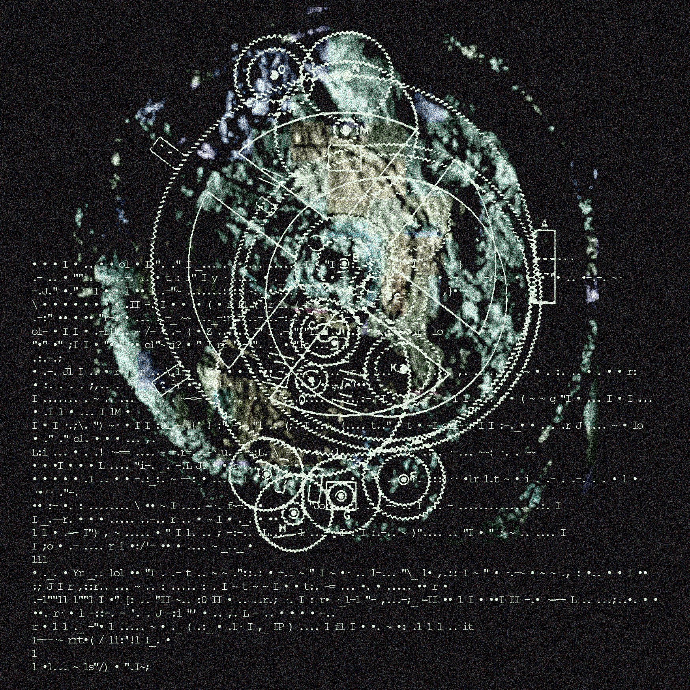

graphics: @lithauch

 

### Kujawa ÷ Galloway

 
Absolutely no one believes anymore in the institutional framework underpinning constitutional liberal democracy - not even the liberals. If you take a look around, everywhere liberals still are in power, both their words and deeds unequivocally reveal disillusionment with liberal democracy. Their objective now is only to consolidate power, shorten decision-making, strengthen borders (isn't there a secret wish for restricting the voting rights of the "ignorant masses," who time and again prove their immaturity for true democracy?). Desperate attempts to maintain control over a world, diminished by climate change and accelerated by artificial intelligence, of a petrified animal. The crisis of institutions implies a crisis of agency, because what we do - how we live - makes sense only trough institutions. Through their detonation, critique, and regeneration. Because even more important than life itself is the awareness of a path to a better life, and this demands the ability to collectively (re-)design the institutions accross which the path runs.

This maximalist context is appropriate for reading *Sunday Lands. Poetry and the Commons*, in which Dawid Kujawa, a Polish literary critic & deleuzoguattarian / operaist thinker, crops out a peculiar context for *Uncomputable. Play and Politics in the Long Digital Age*, the latest book by Alexander R. Galloway. At stake for both is a prospect of techniques or models of restoring "context" in the age of systematic *context collapse* - i.e. in post-truth semiotic regime. I won't elaborate further on that context, though I wanted it to be put in the background as noise of this text; the noise that shall underlay the proper thread of this blogpost: a transversal allegory can be understood as a figure or grammar of institutions that take care of (but also appropriate) the commons emerging from network and black-box infrastructure.

 

### The Tragedy of Interactivity

Social relations have always been conditioned by technologies and media. Technologies and media, that is the means of (un)sociality, are organised into institutions. The institutional model of organisation of means conditions the social relations, the communities, we live. At the time when a culture war looms over every topic, there is a remarkably widespread agreement that the inability of today's institutions to respond adequately to contemporary problems (climate change vs. combustion technologies; psychopathologies vs. social media; AI in general) lies behind social disintegration and loss of political agency (when was the last time you felt your voice counted?).

In the prevailing technomedia environment, whether you want it or not, whether you work in a hairdressing shop, call centre or freelance, if you aspire to a better job, or want recognition, education or pleasure - you must be continuously logged into the world wide web. You must communicate, you must keep checking apps, scrolling or creating content, you must sense changes on social media, trends in both algorithmic personalisation and online aesthetics, you must be a source of metadata improving the functioning of the network. This paradigm rests at the root of the distributed subjectivity constructed by the current power-knowledge, or governmentality - or let's say: its reason is to design subjects for the training of future artificial intelligence systems.

"Interactivity is a political tragedy. What was once so liberating (..,) is today the very site of informatic exploitation, regulation, and control... Today, interactivity means total participation, and
thus universal capture."[^1]. As Galloway reminds us, experimental and radical politics and art in the twentieth century adopted the logic of distributed web against the logic of centralisation: take guerilla, anarcho-syndicalism, grassroot movements and rhizomatic bodies. Their effectiveness and radicality stemmed from the formal asymmetry in relation to the protocols of governance, which then, although increasingly decentralised, still resembled Bentham's panopticon with its disciplinary apparatus. But today power functions symmetrically to a distributed network, it has transformed its model to counter and capture rhizomatic insurrections by imitating them. The network today is the model of the army, of infrastructure, of education, of the church, of the media.

If the logic of power is the logic of a network, then repeating insistently the same imperative to increase connectivity, heterogeneity and multidirectionality (the principles of rhizome in *A Thousand Plateaus*) cannot reach a critical mass breaching The Great Dam on Desiring Flows; just as since a certain moment in capitalist development organising trade unions in workplace alone isn't enough to achieve autonomy for the working class, too. New post-network institutions will crystalize through asymmetry to the web, they will bud from rootstalk, creating singular fields, and deflecting dispersion or context collapse of meaning: "a new model of networked organization and, via silhouette, an image of a counter-network practice that is entirely native to the network form."[^2] In *Sunday Lands* Kujawa investigates the procedures of establishing such post-network institution by semiotic practices of contemporary Polish poets.

 

### Transversal allegory...

Following what we were taught in school, allegory should be the dullest stylistic figure possible. Establishing a closed circuit of signification it never surprise with anything: rose -> love; dove-> Holy Spirt; plague -> evil in man. Operating in a scheme of transcendence (subordinate term -> superordinate term), classical allegory refers - or constitutes a reference - to a rule of a political and aesthetic system, and so has been for a very long time associated with moralism and didactism. Since, in order to fulfil its function, allegory must presuppose its independence from context and the universality of a transcendent image of the world, it is understandable that it was not popular among Romantic poets (and conspiracists), did not align with the genius demiurge of singular forms, useless for the bard composing verses of freedom of a new nation[^3] (przypis do POLSKICH WIESZCZÓW), it did not point to the unconscious, nor did it enter into endless chains of signification in the social structure. Therefore, it was the horizontal, contextual and multivalent symbol that attracted the attention of poets and philosophers.

Kujawa in three moves makes a fascinating redefinition of allegory as a *transversal (/gothic) allegory*. First, he draws from the contemporary poetry field, where Piotr Janicki and Rafał Wawrzyńczyk for several years explicitly problematised the allegory as "a vertical syntax" threading "fixed" constellations of signs within a concrete poetic programme. Second, Kujawa couples the vertical syntax with the notion of transversality arising from Guattari's materialist psychiatry, intended to decouple from the Freudian model of the unconscious. Instead of locking the patient's experience into a repressed childhood traumatic scene, reducing their desire to the inescapable reenactment of an Oedipal drama, Guattari sought to follow the psychotic's real production of meaning, which traversed successive systems of reference, "planes characterised by an ever-increasing degree of abstraction: not only familial, but also historical, geographical or cosmic."[^4] The psychotic is as much a father of the house and a bourgeois heir, as he is a secret agent in the war of the worlds or a subject of UFO experiments. The transitions between the successive planes from the concrete to the abstract avoid pure postmodern horizontality without falling into its opposite - the pure transcendent verticality. Finally, Kujawa relates transversality, in the third move, to the concept of the Gothic line, "a line without end, heading in a concrete direction but lacking an end point",[^5] which Wilhelm Worringer developed in his studies of Gothic architecture.

The transversal allegory - the allegorical vertex, or vent, or funnel - does not enclose the circuit of signification as the classical allegory does (rose -> love), but ascends ever higher and sinks ever deeper, while at the same time - similarly to the classical allegory - ‘fixedly’ tying together signs and semiotic planes. Thanks to the fixity of the constellation, the transversal allegory does not presuppose arbitrary interpretation and recontextualisation, as does the symbol, but instead designates a vector space where new determinations of its themes, of itself and, finally, of being as such are generated - and within which they become meaningful. So we can have a poet with such an allegorical vertex: Rose ∧-> rose ∧-> love ∧-> backyard ∧-> hormonal mutations ∧-> pharmacopornography ∧-> One ∧-> Rose ∧-> cosmos as R(r)ose ∧->.... It departs from a very concrete constellation of signs and then precisely maps it onto higher levels of abstraction. This mapping is dependent on the path (*path dependence*) through the planes and is executed in an appropriate way for each level of abstraction (each level and plane is governed by its own constraints and rules of signification). In each successive iteration of the allegory, the initial constellation resonates, and so the image of *hormonal mutations* operates, for example, through *Rose, rose, love, yard*. Actually, one could apply such notation: *hormonal mutations (Rose ∧-> rose ∧-> love ∧-> backyard)*. Of course, no one has to interpret these signs in the allegorical order, any image can be a symbol for someone, but will we identify the internal procedures for satisfying the meaning of this poetry or simply instrumentalise it for our personal whims?

 

### ...as institution

During a panel discussion on the premiere of *Sunday Lands*, Wawrzyńczyk emphasised that key to allegory - both a vertical stylistic figure and a form of thought - is its drive towards self-referentiality. You start by describing your everyday life, speaking what's on your heart, and you end up writing about writing a poem, writing about writing as Life ∧->.... It came to me then that framed in this way allegory was an institution.

Deleuze divided the procedures for satisfying needs and drives into institutions and instincts. An instinctive reaction of an organism to external stimuli fulfils its needs with elements drawn the environment - the world of each species is a different composition of elements. Institutions, on the other hand, introduce artificial procedures of satisfaction between the drive and the environment, developing a level of norms that liberates from the first level of needs at the cost of subordination to a new level of drives. "An institution is always given as an organized system of means" for its satisfaction. While law serves to limit possible modes of behaviour, institutions shape positive models of individuation, conduce collective imaginaries, and unearth worlds where it seemed there was nothing. Although drives can be satisfied through institutions, institutions are not reducible to the needs they satisfy; for example, sexual drives cannot explain all forms of marriage among humans. "The drive does not explain the institution; w h at explains it is th e reflection of the drive in the imagination"[^6]:
	"Imagination is revealed as a veritable production of extremely diverse models: when drives are reflected in an imagination submitted to the principles of association, institutions are determined by the figures traced by the drives according to the circumstances. This does not mean that the imagination is in its essence active but only that it rings out, and resonates. The institution is the figure. [^7].
So, every figure of the imagination - allegory, symbol, icon, diagram - represents a different means of satisfying the drive, installing different institutions as grammars organizing social practices.

If an institution generates positive practices according to its own specific logic (its perspective), mapping its image of drives onto being, then how does the transversal allegory introduce its corresponding positive procedures of individuation? By stretching allegorical arcs that leap from a concrete locality to perspectival universality. However, these arcs do not merely apprehend being as its object, but instead problematize the functioning of the allegorical vertical axis that they elevate.

I will outline three functions of the transversal allegory necessary to understand it as an institution. First, the centrifugal force of allegory pushes it toward *self-referentiality* - the exemplary poet will, in the end,[^8] take a turn to examine rules of figuration in their own poetry. The examination of the rules governing the developed allegorical vertex reveals its second function, *recursivity*, as each plane in the allegorical vertex contains a repetition function of its operation - in our example, *love* already pulls toward the *backyard*. The coupling of these two functions generates the third: *topological subtractivity*. By repeating its own identity in each of its iterations, the transversal allegory produces difference as a cut-off and subtraction from the network of spontaneously interpreted social symbols; it bores a funnel of meaning - a *topos* - into a concrete site on the social surface, and from there draws its trajectories of positive individuation of the imagination. Hence, like an institution, now it can incorporate everything onto its image, according to its generative equation, slicing the cosmos into signal and noise along its wimperg of signification.

 

### ...as grammar

The second branch of *Sunday Lands* is a theory of language, particularly of poetry, as a *common land*, an unlimited and renewable resource, sustained and regenerated through collective action, to which all its users (the commoners) have free access - just as feudal peasants once had access to the fruits of the forest, herbs in the meadows, or the air around them. The history of capitalism and modern colonialism is the story of enclosing the commons by the state and their exploitation by capital. However, Kujawa does not call for a "romantic vision of a world without enclosures,"[^9] but instead he indicates a project of commonist politics that develops a noncapitalist regime of enclosures by introducing new regulations enabling users to benefit from the commons. "Good enclosures are the result of communal administration of resources, of precisely defined practices by commoners who choose to protect collective goods both from being squandered or destroyed and from being captured by the private sphere"[^10]. In Deleuzian terms, good enclosures provide a model of need satisfaction that systematically redirects stimulated individuation toward the cultivation of the commons, along trajectories inaccessible from the initial apparatus that capitalism assembled and encoded within the relationship between instinct/drive and the environment. This involves constructing normative domains - institutions - that challenge the capitalist apparatus of instincts, which embeds its axiomatics as instincts both at the level of consciousness (e.g., beliefs in the righteousness of the free market, opposition to higher taxation of capital, or the instrumentalization of nature for profit) and at the level of the unconscious infrastructure of drives (e.g., the technologies of privatizing desires, humanist discourse, or the cultural industry). Commonism, by contrast, would aim to create institutions that de-instinctualize these procedures of satisfaction and redesign them into more solidary arrangements.[^11]

In the book, as well as during the premiere, Kujawa brought up an idea whether grammar itself might serve as an example of good enclosure. If every instinct is a concrete, naturalized solution to a problem articulated by earlier institutions, then grammar, for instance, is an institution so deeply embedded within us that it essentially functions as an instinct as it’s impossible to use language without grammar. This raises the question of how to "satisfy" grammar. Katarzyna Czeczot (the third panelist) insisted that grammar has always been an instrument used by the state for a - sometimes merely disciplinary, sometimes brutally enforced - standardization of vernacular languages. Leaving aside the question of whether it’s even possible to imagine a return to a way of living based solely on self-renewing and abundant commons that require no form of organization, given the 7 billion people on Earth and vastly complex social needs (a communal decision not to capitalize on commons also requires enclosures, and how could we produce silicone components, medical glucose, or conduct fundamental research without artificial institutions?) - language does not exist without grammar. The rules don’t necessarily have to be formalized; they can be carried through usage, they may loosely or tightly bind together phonemes that convey broader or narrower bands of signification, relying more or less on the context of the utterance (a conversation by riverside versus statements in formal logic). Nonetheless, every utterance operates within a kind of imposed technical scaffolding, whose redundancy delineates the field of possibilities for moving beyond the communication of simple needs. It is precisely this field - neologisms, flexional displacements, genitive pilings, erosions of subject and predicate, dilatations of verbs - that forms grammar's second pole, opposing the state’s syntactic discipline; pole where experiments with linguistic norms take place to express new forms of life, subjectivity, and drive, but also where various metastable formalizations are iterated into the future. Grammar is a generator of institutions.

The poet sets up interfaces and laboratories where they examine the vectors of indeterminacy or overdetermination in language, arranging stylistic figures in unnatural environments, exposing to foreign elements, or checking how far the same allegory can be taken. All of this, of course, happens during the act of writing, each poem is an effect of already slightly corrupted or accelerated state grammar, while simultaneously serving as an opportunity to test the next rule or procedure that can be added to the poetic machine - syntactic, semantic, phonological, and so on. A unique constellation of signs begins to flicker on the virtual sky of language - the poet's allegory - along with a set of potential operations for its further recursion. Good poetry develops a single equation capable of generating multiple works, it is an iteration repeated along the allegorical vertical axis at ever higher or deeper layers of abstraction. An abstract machine exploring the principles of institution design. The verticalization of the surface of universal symbolism creates a glacial landscape, pulling semiotic particles into an escapist entelechy that sketches an unknown cross-section of being. "A poem speaks about itself, refers to the circumstances of its creation, and so becomes an ecstatic expression of the common good, that is language in particular, and the substance of the world in general."[^12] A choir of angels.

 

### ...as black box

Let us return to Galloway’s thesis: since the network is the logic of contemporary social system (computational capitalism or vectoralism or neo-XVIth-century), we have to figure out a model that reintroduces asymmetry into thinking about politics and subjectivity. Asymmetry in relation to the network model will cut a new transversal into both the dominant system and the entrenched lines of resistance. While the strategies of political movements and the methodologies of 20th-century humanities were highly network-oriented, we must now consider - drawing on the broad anarchist tradition, from Hakim Bey to accelerationism - the evolutionary vectors of a system based on network logic that transform the system from within. Today, this type of interior exterior -an outside intervening at points of phase-change within the system - passes through black-box architectures. Galloway does not advocate for the "possibility of thinking differently", the dogma of contemporary critical theory, posthumanism, and so on. He rather points to an opportunity to exploit the current techno*logic*, which already shapes processes within the network and seems to direct, through cuts and hidden attractors, meaning-making and subject-forming processes toward something other than boundless openness. The system is already thinking its outside.

Galloway distinguishes between two types of black boxes: ciphers and functions. *A black box as cipher* is an enigma, incomprehensible from an external perspective. Galloway gives an example of the commodity, which for Marx had a "rational core" but a "mystical shell." Once decoded, the commodity becomes comprehensible and reveals the social relations that enable its production, distribution, and consumption. Meanwhile, computers, Galloway observes, initially operated as commodities in the above sense but eventually absorbed that form and - as devices that simultaneously decrypt and obscure, i.e. machines for transmitting signs and information rather than simply goods for purchase - began to propagate a new form of relation: the black box as function.

*A black box as function* operates through input and output: you prod it with a stick, it spits out numbers; you ask, “Siri, where am I?” and it replies, “in your place.” This type of black box is not deciphered but conducted through a vocabulary of commands designed to elicit predictable behaviours. These are laptops, drones, software, neural nets, mixtures of experts (MoE), WANET[^13] - essentially every successive micro-revolution in computing only expands this behaviourist epistemology of cybernetic black boxes as function diagrams.[^14] Here, the commodity relation is inverted: a rational shell, a mystical core. The shell is the keyboard, the core is the microprocessor; the shell is the graphical application interface, the core is the personalization algorithm determining the content displayed on the screen. Naturally, black boxes as functions involve multi-level, extensive interactions with the network, but it is precisely these networked nodes, or vertices, that function of black boxes.

"Black box architecture thus signals a crisis in legibility. Or, if not a crisis, then a reconfiguration of what it means to read and write"[^15]. This reconfiguration involves prompting both algorithms and social media users, addressing them as black boxes with functions to generate or react to content in order to keep and valorise attention on the platform. Since interactions on platforms are defined by protocols for data pattern analysis (parsing), rather than hermeneutically understood meaning,[^16] the conditions for the functioning of signs and the formation of subjectivity are transformed (a process formalized and organised by the semiotics of post-truth, which I discuss in [my doctoral thesis](https://www.academia.edu/125027595/Diagramatyka_postprawdy_w_%C5%9Bwietle_materializmu_transcendentalnego_Deleuze_a_i_Guattariego)). If the matrix of reading-and-writing has been reconfigured, the question arises: what institutional model of signification has accompanied this change? It seems that social media filter bubbles were early and relatively crude attempts to describe the procedures for generating institutions within the algorithmic black-box architecture, but the concept of transversal allegory allows for a better understanding of how a particular semiotic formula is determined and metastabilized as an institution formed out of the technolibidinal environment of users and autonomous intelligent machines.

The question of the institution is a question of meaning - under what conditions, protocols, and forms is it constituted? This is why Kujawa’s theory of allegory is so compelling. While structuralist semiology placed meaning within a symbolic order, the transversal allegories executed in contemporary poetry point toward another semiotic order, and its formal convergence with the functioning of modern models of automated computation and algorithmic platform architectures is not a superficial analogy. The fact that the poets featured in Kujawa’s two books - including his selection from *Pocałunki ludu* (*The People's Kisses*) - are writing in the 21st century is not simply due to his interest in latest poetry. As Kujawa has often emphasized, poets like Janicki, Domarus, Bargielska, and others break away from the interpretative frameworks typical of criticism rooted in deconstruction and/or critical theory. These poets, in order to avoid being dismissed as illegible or ostentatious, call for a new model of signification. This is because it emerges from a social system that is no longer postmodernist, and the percepts, ideas, and figures of this poetry unfold under the same general technological conditions as patterns computed by machine learning algorithms. Their grammars create allegorical vertices, or semiotic funnels, as elements of the contemporary technomedia infrastructure. Put differently: their grammars are only possible within and arise from these systems, caring for the commons while generating trajectories of escape. Already in *The People's Kisses* Kujawa sought a way out of the conceptual framework of schizoanalysis, shifting focus from the rhizome or nomadism to the machinic and the fold, but it is in *Sunday Lands* that a distinctly different image of thought begins to take shape - vertical, gothic, dark, but also based on metastability, recursivity and self-referentiality. This is no longer a post-Deleuzian literary criticism but a theory of virtues inside the vectorialist cathedrals.

After the World War II, the logic of the network drew a virtual end - responding to the radical increase in complexity, multiplicity, and density of connections between elements of industrialized and centralized society - that designed itself through the existing technosocial system. Political movements attained real agency and autonomy by mediating through the emerging networked subject. However, since this subject has now fully materialized as a new paradigm of power, it is within this framework that we must identify sites of intervention from the outside - sites where regular linear motion converts into the turbines of futuricity. For this reason, for both Kujawa and Galloway, the network/rhizome is merely a starting point, belonging to a particular phase of the system, whose rules and mechanisms must be respected in the transition to the next phase. The transversal architectures beam the departure already underway.

 

 

### Politics of subtraction

Since the early 19th century, we have witnessed a declension of dimensionality. Galloway points out that this began with the politicization and aestheticization of time, manifest in the philosophies of Hegel, Marx, Nietzsche, and Bergson, in the science of Gibbs, Boltzmann, and Einstein, and in media such as the telegraph, phonograph, and cinema. Subsequently, after World War II, temporal metaphors were replaced by spatial ones: situationism, nomadism, territoriality, heterotopias, networks. From time as the fourth dimension, we subtract one and arrive at three-dimensional space. This quickly becomes a two-dimensional surface - consider the role of topology in Deleuze, the ubiquity of screens in Ballard and cyberpunk, the popularity of television, manga, and comics. Finally, after another subtraction, we are left with the politics of singularity embedded in the binary system that installs the vectorialist power: on/off, 1/0, presence/absence. It is precisely within this uneven binarism - not in contradiction, synthesis, or negation, nor in becoming - that Galloway identifies the determining element of contemporary social dialectics, because precisely within this frame it is defined who has the right to access the network, who is legitimate, who can modify their body, and who cannot.

>>>Perversely, today’s binary is ultimately a false binary, for unlike the zeros and ones of the computer, which share a basic numeric symmetry at the level of simple arithmetic, the binaries of offline and online are so radically incompatible that they scarcely interface at all. In fact, the “interface” between inclusion and exclusion is defined exclusively through the impossibility of interfacing: the positive term carries an inordinate  amount of power, while the negative term carries an extreme burden of invisibility and alterity. Today’s politics, then, is a kind of rampant “dark Deleuzianism” in which the affirmation of pure positivity and the concomitant acceptance of the multiple in all its variegated forms resulted nevertheless in the thing it meant to eradicate: a strict binarism between the wired world and the dark continents, between state power and the terrorists, between us and them. The “no demands” posture flies in the face of all of this. Our lives are the demand. Remaining present is the demand..[^17]

It is impossible to withdraw from the network. Offline today is just as unsustainable a fantasy as *off-grid* once was - not only because withdrawing from social life is merely the inverse of the same neurotic cliché as *grind* and *clean*. The system has sufficiently effective firewalls and preventive and neutralizing software to make sure that any attempt at a straight-line fugitivity ends in trauma, loss of meaning, or attracts the attention of the policing apparatus, which will brutally restore you to the network. The politics of the 21st century will develop around techniques of appearance and disappearance, the politicization of visibility and invisibility, presence and absence, identity and anonymity. Galloway revives an old anarchist question: what, where, and how should we cut? In which media is the suffering of Palestinians visible, and in which it is dissolved into transparent statistics or used as an empty empathy trap? Where are queer looks safe, and where is it better to conceal? How do we establish imperceptible servers with online libraries? What should be articulated, and what should be left unsaid before an employer or landlord?

This perspective opens up a latent line of political thought. Galloway does not specify exactly how he envisions the *exploit* of this architecture, but I imagine it should involve a strategic oscillation between both modes of the black box - alternating between activating one and masking the other should be context-dependent. You must behave like a black box as a function in interaction with the network so that the system does not take too much interest in you or attempt to look deeper than you want, but at the same time, beneath this casing, you must sprawl an underground network of relationships and value regimes that are asymmetrical to this surface; in the catacombs, you must nurture the cobwebs of the commons.

In this context, to me particularly important in *Sunday Lands* was the chapter on Cezary Domarus, where Kujawa writes about a "perverse and dark Spinozism" - one that no longer consists in energizing joyful affects through the dissolution of the ego, as would still be in line with the letter of Spinoza’s ethics (& Janicki's poems), but rather in drawing power from the longing (*desiderum*) for competencies and promises that capitalism still doesn't, or won't, deliver: for the LK-99 superconductor, for an interface with cephalopods, for a sour AGI, for prosthetic Makoto, for a new phrase. Unlike the longing for a commodity, *desiderum competentiae* does not get stuck in sad affects but "produces sad affects so that they ultimately transmute into a joyful affect and lead to an increase in power"[^18] and the ability to self-preserve. A longing for ever greater competencies, for searching out ever sharper, more perpendicular and perfect lines of flight from sad affects - affects we must start from each time we respawn in the capitalist base. It is precisely at this point that the commons encoded in poetry by Kujawa converge with the accelerationist idea of inversing alienation at the site/vector where escapes from the current social and symbolic order are designed. As for Galloway, his comments on black-box architectures and politics of subtraction allow us to position the transversal allegory as a figure belonging to a different semiotic order than the structuralist symbol. By setting the allegorical order within the technocratic network we can see how conjugated institution can ascend to contextual and metastable autonomy of "perverse and dark Spinozism". Not black holes, but metastable black boxes in a transversal recursion toward dark attractors. The post-network institutions of subtractive politics construct themselves precisely where the symbols we receive through algorithmic personalization on platforms undergo allegorical verticalization; where virtual commons (communities, bubbles, -cores etc.) are de-networked, and conspiratorial subjectivities are vectorized.

The black-box architecture, built for computating the network, has created a matrix for the development of a new semiotic-technological order based on transversal allegory. This is not merely a stylistic device but a figuration of a model for institutions shaping specific forms of subjectivity - converging commoners and AIs. The point is not, of course, to draw a simplistic distinction between a "bad" network and "good" black boxes. That would be absurd, given the functioning of server farms, algorithmic models, blockchain, content personalization, and patent law – the vectorialist infrastructure consists of both networks and black boxes. The "open internet" has been fading for some time, with increasingly aggressive enclosures of both digital and geographical landscapes. Yet, as always, systemic transformation brings new problems: the central challenge here will be the control of information or the determination of meaning. From this perspective, the viralization of content on social media can be seen as the decontextualization of meaning generated in the depths of a funnel or by the sharpness of an arch in an allegorical vertex. It's a form of control through decontextualization, through smoothing surfaces, through reconnecting them back to the network and the symbolic model of signification. What is to be done? Explore the grammars of black boxes for institutional complexification along a fixed arch. Subtract allegory from the network and retrieve the entire being. S - 1(A) -> 0

>>>"So, if anything can be learned from the present predicament it might be that a practical nonexistence can emerge from a being that is practically nonexistent, that subtractive being (n – 1) might be the best way to degrow the abuses of power.
>>>
>>>We shall not say that there is a new blackness. We shall not ratify the rise of the obscure and the fall of the transparent. But do not proclaim the reverse either. Simply withdraw from the decision to ask the question. Instead ask: what is this eternity? What is this black box—this black bloc— that fills the world with husks and hulls and camouflage and crime? Is it our enemy, or are we on the side of it? Is this just a new kind of nihilism? Not at all. It is the purest form of love."[^19]

---

[^1]: A. R. Galloway, *Uncomputable. Play and Politics in the Long Digital Age*, Verso, Londyn/Nowy Jork 2021, s. 195.

[^2]: Ibid, s. 196.

[^3]: https://en.wikipedia.org/wiki/Three_Bards

[^4]: D. Kujawa, *Niedzielne ziemie. Poezja i dobra wspólne*, Convivo, Warszawa 2024, s. 137.

[^5]: Ibid. s, 139. "If we glance at the Gothic cathedral, we see only a kind of petrified vertical movement in which the law of gravity seems to be wholly eliminated. In contrast to the natural downward pressure of the stone, we see only a prodigiously strong movement of forces upward... We see only free and unhindered forces that strive heavenward with a prodigious *élan*" - W. Worringer, *Form Problems of the Gothic*, 1920, s. 84. "The infinite melody of line hovers before the vision of northern man in his ornament, that infinite line which does not delight but stupefies and compels us to yield to it without resistance. If we close our eyes after looking at northern ornament, there remains only the echoing impression of incorporeal endless activity" - ibid., s. 52-53.

[^6]: G. Deleuze, *Empiricism and Subjectivity: An Essay on Hume's Theory of Human Nature*, Nowy Jork 1991, s. 48.

[^7]: Ibid, s. 48-49.

[^8]: The chronological order here is only an expression, logically the self-referentiality can already appear in the first work.

[^9]: *Niedzielne ziemie...*, s. 41.

[^10]: Ibid, s. 42.

[^11]: I don't like the colloquial meaning of instinct, but in Deleuze's model the concept has this libidinal, so for my dog, for example, our flat is an institution that allows the expression of drive in different forms of behaviour, experience and thought than if he lived on the street with other (non-human) mutts.

[^12]: Ibid, s. 220.

[^13]: https://en.wikipedia.org/wiki/Wireless_ad_hoc_network

[^14]: "The new sciences of behaviorism, game theory, operations research, and what would soon be called cybernetics put in place a new black-box epistemology in which the decades if not centuries old traditions of critical inquiry, in which objects were unveiled or denaturalized to reveal their inner workings—from Descartes’s treatise on method to both the Kantian and Marxian concepts of critique to the Freudian plumbing of the ego—was replaced by a new approach to knowledge, one that abdicated any requirement for penetration into the object in question, preferring instead to keep the object opaque and to make all judgments based on the object’s observable comportment. In short, the behaviorist subject was a black-boxed subject. The node in a cybernetic system was a black-boxed node. The rational actor in a game theory scenario was a black-boxed actor", *Uncomputable...*, s. 186.

[^15]: Ibid, s. 194.

[^16]: Ibid. "In fact, digital objects themselves are defined as the intersection between two protocols (two technologies), not as a result of some human being’s semantic projection of meaning into form. Once material is digitized, any recognizable “content” is merely the artificial parsing of the digital substrate into a predictable, template-driven chunk—what computer scientists call a “struct.” Any sense of the “content” of data emerges as an epiphenomenon of human behavior previously collected, as seen in the pagerank algorithms used by search engines, or the output of machine learning. In short, a new model of reading will have to be explored, one that is not simply hermeneutic in nature, but also about cybernetic parsing, scanning, rearranging, filtering, and interpolating. This new model of reading will need to be based on an immanent or machinic notion of software."

[^17]: Ibid, s. 199-200.

[^18]: *Niedzielne ziemie...*, s. 91.

[^19]: *Uncomputable...*, s. 201.