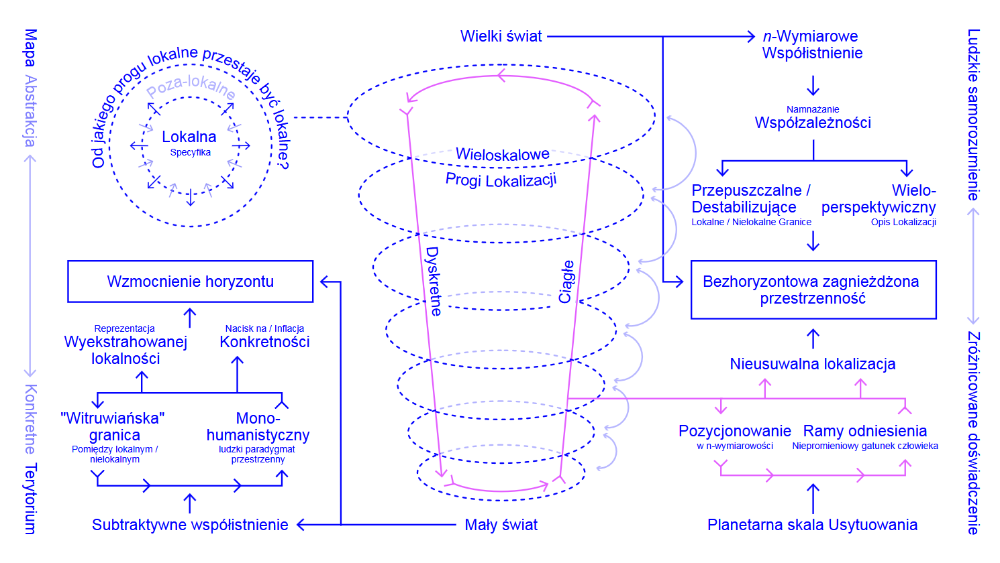

Jedna z najbardziej zajechanych piosenek wszech czasów została skomponowana przez disneyowskich "Imagineersów" dokładnie w momencie, gdy zwiększona łączność komunikacyjna, komercyjne globalne podróże i ponadnarodowe ekonomiczne zależności stawały się (lub miały zaraz się stać) powszechnością. "It's a Small World" zadebiutowało w 1964 roku na targach światowych w Nowym Jorku. Choć łatwo jest cynicznie zbyć jej tekściarskie płycizny, warto się pochylić nad tą nieubłaganie wpadającą w ucho piosenką: jej słowa uchwytują coś z podstępnych, krępujących idealizmów, które nie ustępują do dziś. To banalne wyrażenie zawarte w tytule, powtarzane praktycznie z automatu, zazwyczaj opisuje nieoczekiwaną zbieżność odniesień w sytuacjach skądinąd niepewnych i nieznanych. Rzadko kiedy używa się go w tonie skargi. Nie ma nic złego w przyjemności z takiego napotkania "małego świata", nic samego w sobie, ale rodzi jednak bardziej ogólne pytania o to, dlaczego uczucia uchwycone w tym wyrażeniu wydają się nam pożądane i dlaczego znajdujemy w nich pocieszenie. Co wyrażenie to mówi nam o podejściu do nawigowania we współczesnym świecie?

W tych czterech, prozaicznych słowach kryją się dwa splecione ze sobą problemy. Po pierwsze, wyrażenie "to jest mały świat" wskazuje na przyjemność płynącą z potwierdzania znajomych ram odniesienia, mających oswoić spotkanie z czymś nieznanym lub obcym - z nieznajomym, z percepcją, ideą bądź sytuacją. Jako opowieść kierująca wczesnym przyswojeniem internetu do domowego użytku, rama „małego świata” sprowadza się do hasła reklamującego uproszczony świat, gotowy i przystępny dla ludzkiej wrażliwości w jej obecnym stanie, „obiecującego” zminimalizowanie nieporęcznej globalności do przytulnej, intymnej skali wioski. Po drugie, to pozornie nieszkodliwe sformułowanie maskuje niezasadne założenie, że wzmożona współzależność zacieśnia więzi i prowadzi do poczucia bliskości. Choć dziś istnieje więcej logistycznych, ekologicznych, ekonomicznych i komunikacyjnych wektorów łączących ludzi i nieludzi w głębokich łańcuchach relacji niż kiedykolwiek wcześniej, to z perspektywy strukturalnej stan ten wskazuje raczej na coś przeciwnego do małego świata. Wskazuje raczej na zwiększoną *wymiarowość* współistnienia wytworzoną przez wykładniczo pomnożone wektory relacji. Co istotniejsze, wyidealizowany mit małości, którą można ogarnąć, ogranicza zdolności poznawcze, etyczne i technologiczne potrzebne do bardziej adekwatnego i sprawiedliwego nawigowania przez świat w jego obecnej *n-wymiarowości*. Namnażanie się wzajemnych powiązań i współzależności przyniosło, na dobre lub na złe, *bardzo duży świat*. Jest to świat, który wymaga bardziej adekwatnych ram odniesienia (przestrzennych, percepcyjnych i językowych), aby skonstruować orientację wewnątrz i wobec jego rozległej wielowymiarowości.

„Skala planetarna” służy jako wstępny terminologiczny indeks dla stanu *n-wymiarowości* współistnienia w tym "wielkim świecie". Skala planetarna, w ciągu ostatniej dekady stosowana zwłaszcza w dyskusjach wokół zmiany klimatycznej i wszechobecnej komputacji, odnosi się zazwyczaj do rozmiaru konsekwencji (niektórych) ludzkich działań techniczno-ekonomicznych (takich jak zależność od paliw kopalnych i ich produktów/efektów ubocznych) oraz złączenia ich wzajemnie oddziałujących skutków, które przekraczają możliwości przyswajania przez Ziemię (jak rosnące stężenie dwutlenku węgla w atmosferze). Czy poza swoim znaczeniem diagnostycznym, zastosowanie tego terminu oznaczającego „skalę tego, jak rzeczy obecnie się mają”, może posłużyć jako nowa rama odniesienia dla transformacji społecznej? Czy może on posłużyć za decydujące pojęcie umożliwiające praktyki tworzenia innych światów – „tworzenia”, zawsze już będącego przerabianiem świata, który mamy pod ręką[^1]? Czy to pojęcie „skali planetarnej” może funkcjonować jako podstawa dla politycznej inwencji i solidarności, wyprowadzając nas poza ramy małego świata, który daje zbyt prosty komfort? Dzisiaj ten komfort i te ramy działają raczej jako zagrożenie niż obietnica, ponieważ „globalne wioski” mutują w rozdrobnione bańki społeczne, silnie zamknięte w pułapce efektu potwierdzenia. Jeśli skala planetarna narodziła się w wyniku agregacji XIX-wiecznych liberalnych zachęt do prywatnej akumulacji bogactwa, to czy istniejącą hiperrelacyjność i zależność od ścieżki dotychczasowego rozwoju, endemiczną dla planetarnej koegzystencji, można wykorzystać wbrew ideałom, które legły u podstaw samej materializacji tego stanu? Oczywiście sam marker językowy to za mało, by odpowiedzieć na tak brzemienne pytania. Jednocześnie jego sformułowanie nie musi być trywialnym zabiegiem, pod warunkiem, że pojęcia posiadają pewną ważność i niosą konsekwencje, a nie stanowią jedynie elementów żargonu danej dyscypliny. Pojmując język jako interfejs między człowiekiem a światem, który służy do obrazowania i korelacji z rzeczywistością, trzeba także wydobyć to, w jaki sposób termin ten - skala planetarna - mógłby przekształcić dane ramy odniesienia, a następnie, w jaki sposób te zaktualizowane ramy mogłyby posłużyć za punkt wyjścia do formułowania hipotez dotyczących implikacji nawigacyjnych zarówno *w* skali planetarnej, jak i *wobec* niej.

 

#### **Nawigacja jako synteza**

Zanim przystąpimy do omówienia nawigacji w skali planetarnej, warto pokrótce zarysować, czym właściwie jest nawigacja. Nawigacja to przede wszystkim działanie syntetyczne. Po pierwsze, polega ona na ciągłej mediacji pomiędzy intencjonalnością a przygodnością nieznanych lub przypadkowych zdarzeń. Nawigacja nie jest punktem docelowym, ale nie jest też całkowicie od oderwana od destynacji. Jest to ruch z określoną inklinacją, zakładający markery i punkty orientacyjne. Jeśli nawigacja wymaga inklinacji, aby nadać ruchowi funkcjonalną lub afektywną wartość kierunkową, polityka nawigacji jest ściśle związana z dążeniem do konstruowania tych punktów orientacyjnych, a także do uczynienia ich sensownymi, zrozumiałymi i udostępnialnymi.

Po drugie, nawigacja opiera się na ponadlokalnych, umysłowych diagramach przestrzeni i czasu, które są na bieżąco odnoszone do usytuowanej lokalizacji. W ten sposób nawigacja ucieleśnia kontinuum między tym, co pojęciowe, a tym, co materialne; to właśnie dzięki temu przeplataniu się nawigatorzy mogą z biegiem czasu ciągle korygować i dostosowywać swoją choreografię oraz punkty orientacyjne. Jak to się mówi, „mapa nie jest terytorium”. Jednak zatrzymanie tej myśli w jej czysto opozycyjnym stadium podważa kluczową dynamikę syntetyczną, zgodnie z którą mapa (rozumiana jako artefakt pojęciowy) częściowo kształtuje:

a) zdolność terytorium lub systemu do percepcji i do bycia postrzeganym,
b) sposób, w jaki uważa się, że terytorium lub system istnieje poza bezpośrednim sprzężeniem zwrotnym zmysłów (o ile w ogóle jest poznawalne zmysłowo),  
c) przestrzeń możliwości wyobrażonej uchwytności terytorium lub systemu oraz 
d) rozumienie wzajemnych związków przyczynowych, które współtworzą obrazy sprawczości.

Mapa, bez względu na to, czy jest opowieścią, rysunkiem, schematem, modelem czy projekcją matematyczną, może różnić się od terytorium lub systemu, do którego się odnosi, ale kształtuje (*informs*) sposób, w jaki jest ona pojmowana, udostępniana i wyobrażana jako nawigowalny byt. Do nadużyć kartograficznych dochodzi wtedy, gdy abstrakcja mapy lub schematy mentalne są stałe i nie reagują na sytuacyjną lokalizację. Przenoszenie europejskich nazw na istniejące, zamieszkane i lokalnie nazwane miejsca jako sposób na wykorzystanie projekcji kartograficznej do roszczeń eksterytorialnych stanowi tylko jeden z przykładów, w których nadużycia abstrakcji były historycznie instrumentalizowane w celu zniesienia lub zignorowania sytuacyjnej rzeczywistości[^2].

Wreszcie, aktywność nawigacyjna zakłada istnienie nawigowalnego bytu. Jeśli chodzi o teraźniejszość, na ile nawigowalny jest dzisiejszy świat w swojej złożonej, *n-wymiarowości*? Myśląc polityką nawigacji należy koniecznie wziąć pod uwagę kilka powiązanych pytań: Dla kogo lub w imię czego optymalizuje się nawigowalność? Dla kogo lub dla czego sama możliwość nawigacji zostaje wykluczona i poprzez jaką dynamikę władzy określa się te możliwości? Nie należy zakładać, że dostępna pod ręką nawigowalność jest czymś oczywistym; aktywność nawigacji jest nieodłącznie związana z resetowaniem i/lub kwestionowaniem ram odniesienia, aby w ogóle uczynić dane warunki nawigowalnymi. Ponieważ skala planetarna oznacza „obiekt” tak złożony, że przekracza możliwości indywidualnego, heroicznego ludzkiego umysłu, staje się jedynie częściowo dostępna z poziomu kolektywnego lub rozproszonego. Innymi słowy, planetarną nawigację można rozpatrywać jedynie jako równie złożony, kolektywny projekt. Geometrie, narracje, epistemologie, obrazy i interfejsy (zarówno w funkcjonalnej, jak i językowej formie) konieczne dla umożliwienia nawigacji w skali planetarnej wydają się być dopier w swej fazie początkowej, o ile w ogóle istnieją. Nie jest to próba zniechęcenia w obliczu czekającej nas pracy, a raczej nutka optymizmu podszyta realizmem.

 

#### **Rozważania planetarne**

Spekulując na temat przekształcenia „skali planetarnej” z jej obecnego stanu diagnostycznego w stan, który mógłby oferować punkt odniesienia dla orientacji politycznej, należy wziąć pod uwagę kilka czynników. Pierwszy i najbardziej oczywisty czynnik pociąga kluczowe pytanie, jak postępować ze skalą jako taką. Historycznie rzecz ujmując, ambicje skalarne utożsamiano z formami dominacji, konformizmu i homogenizacji. O tej korelacji świadczy obecna (choć słabnąca) wersja tak zwanej globalizacji – „jednostronnej globalizacji” zbudowanej, jak to ujął Yuk Hui, ze „szczególnych epistemologii od regionalnego światopoglądu po rzekomo globalną metafizykę”[^3] – a także trwające formy ucisku kolonialnego, w tym wyprowadzone z nich pochodne menedżerskie. Jednym z wielu przykładów takich pochodnych menedżerskich jest sporna i trwająca do dziś gwarancja francuskiego skarbu państwa dla waluty franka środkowo- i zachodnioafrykańskiego.

Kolejny czynnik pozwalający na wyobrażenie emancypacyjnej skali planetarnej wiąże się z pytaniem o to, jak ta *n-wymiarowa abstrakcja* kształtuje i przeobraża ludzkie samorozumienie. Skala planetarna nie jest jedynie warunkiem zewnętrznym, lecz stanowi również konceptualną okazję do przeformułowania ram określających położenie człowieka na tej skali oraz do zmiany pozycji, z której kaskadują inne ścieżki i logiki nawigacji po świecie. Jakie nowe perspektywy otwierają się, gdy samo-obrazowanie człowieka ulega przemieszczeniu w tej *n-wymiarowości*? Jakie inne modele (*modes*) relacji wyłaniają się z tego przesunięcia pozycji w samo-obrazowaniu? I jak można opisać konsekwencje tej zmiany perspektywy, zarówno w hipotetyczny, jak i znaczący sposób? Jeśli ma istnieć jakakolwiek sprawiedliwa i polityczna nawigacja w skali planetarnej, te fundamentalne czynniki muszą zostać uwzględnione na poziomie epistemologicznym i etycznym. Wspomniane perspektywy oraz modele można również postrzegać właśnie jako ściśle splecione w pojęciowo-materialnej aktywności nawigacji.

 

#### **Zachowanie specyfiki**

By wyobrazić sobie nawigację w skali planetarnej nie przekształcając jej w formę wymuszonej jednolitości, do tego strukturalnego warunku *n-wymiarowości* należy podejść z zamiarem zachowania lokalizacyjnych różnic. Czym jest polityka lokalizacji w skali planetarnej? „Polityka lokalizacji” kładzie nacisk na uwzględnianie (i odpowiedzialność wobec) specyfiki, aby uniknąć tyranii sprowadzającej zróżnicowanie świata do sztywnego i *redukcyjnego obrazu* całości. Pytanie to skłania do usytuowanego ujęcia lokalizacyjnych kontekstów geohistoryczno-materialnych, z pozycji których się wypowiada, myśli, nawiązuje relacje, uczy i działa – innymi słowy, do świadomej aktywności pozycjonowania twórców wiedzy. Jak pisała Donna Haraway, nacisk na „pozycjonowanie” nie polega jedynie na ujawnianiu uprzedzeń i nadużyć w nauce. Odnosi się on również do modelu (*mode*) obiektywności postrzeganej jako produktywna częściowość (*partiality*), a ponieważ wiedza (zarówno w formie propozycjonalnej, jak i materialnej) wywodzi się z tej częściowej obiektywności, jest ona kształtowana przez perspektywiczne okoliczności określonego miejsca. Co ważne, ta częściowa, lokalizowalna wiedza nie jest przykładem relatywizmu, w którym wszystko jest dozwolone, służącego jedynie za „lustrzane odbicie” bezpozycyjnego modelu obiektywności (triku z boskim okiem), ale raczej należy ją rozumieć jako bramę do „sieci powiązań zwanych w polityce solidarnością, a w epistemologii – wspólnymi rozmowami”[^4]. Wartość tego „nacisku na sytuacyjność” leży w tym, że zachowuje on kontekstualną osobliwość i pozwala dostrzec w tych ramach sposoby na budowanie lepszych, bardziej wiarygodnych opisów rzeczywistości. Nacisk na sytuacyjność nie oferuje jednak ścisłych wskazówek metodologicznych, jeśli chodzi o podejście do *spójności* uogólnionego, lepszego opisu – czyli tego, w jaki sposób wszystkie te „rozmowy” lub powiązania między epistemologicznymi lokalizacjami wpływają na siebie nawzajem i współtworzą się w sposób spójny. Jak można sformułować uwarunkowanie sytuacyjne, biorąc pod uwagę *n-wymiarową relacyjność*, zarówno poprzez relacje bliskie, jak i odległe, poprzez te, które są bezpośrednio postrzegalne, jak i te, które nie są? Jednym z centralnych problemów stawianych przez propozycję politycznej orientacji w skali planetarnej jest możliwość jednoczesnego utrzymania wielu skal relacyjności. Jest to problem mereologiczny, dotyczący relacji część-całość, jeden-do-wielu i wiele-do-jednego, który jest stary jak sama filozofia. Stawka związana z poszukiwaniem sposobów *współistnienia w* ramach tego pojęcia sprawia jednak, że staje się ono pilną kwestią pragmatyki społecznej.

 

#### **Dyskretne i ciągłe**

Pod tym względem można dostrzec wspólną linię myślenia, obecną już w pismach Édouarda Glissanta z końca XX wieku poświęconych koncepcji „jednego świata” (*tout monde*). *Tout monde* Glissanta składało się z ogromnie zróżnicowanych światów, wraz z ich reprezentacjami, uniemożliwiających mówienie o całości z jednej pozycji[^5]. Negocjowanie tej wielości odbywa się poprzez stosowanie proponowanej przez niego „światowej umysłowości” (przemiana *mondialisation* w *mondialité*[^6]) – umysłowości przeciwstawiającej się spłaszczającym siłom jednostronnej globalizacji (w jego relacji napędzanej przez umysłowość nie-miejscową lub nie-pozycyjną) – przy jednoczesnym podtrzymywaniu obrazu niejednorodnej totalności[^7]. Koncentrując się na relacyjności jako specyfice lokalizacji, zachowuje on partykularność, odnosząc się (*addressing*) jednocześnie do połączonego osadzenia tego miejsca, o ile jakakolwiek konkretna lokalizacja nie jest wyodrębnialna z całości swoich relacji, pomimo swojej różnicującej specyfiki. Obraz specyfiki u Glissanta jest obrazem wielościowym i zagnieżdżonym, a nie subtraktywnym, co stanowi ważny ruch teoretyczny skierowany przeciw redukcyjnym twierdzeniom łączącym specyfikę ze zatomizowanym indywidualizmem[^8].

Z innej, dość odległej dziedziny, przełomowe rozwiązania podobnych problemów dotyczących relacji między częścią a całością można znaleźć w matematyce. Dokładniej rzecz biorąc, druga połowa XX wieku przyniosła opracowanie tego, co matematyk René Thom nazwał „fundamentalną aporią matematyki”: mianowicie dialektyki między tym, co dyskretne (lub szczegółowe), a tym, co ciągłe (lub całościowe)[^9]. Alexander Grothendieck, matematyk, aktywista klimatyczny, zaciekły krytyk scjentyzmu i współzałożycielem grupy *Survivre et Vivre* (Przetrwać i żyć), podjął ten problem drogą geometryczną. Doszedł do czegoś znanego dziś jako „geometria arytmetyczna” – gdzie „arytmetyka” oznacza to, co dyskretne, a „geometria” to, co ciągłe. W swojej obszernej półautobiografii *Récoltes et Semailles* ("Żniwa i siew: Życie matematyka, refleksje i świadectwo") Grothendieck szczegółowo opisuje, (nieco) przystępnym językiem, zakres swojej geometrycznej innowacji, historycznie porównywalnej (na jej czasy) z innowacjami geometrii euklidesowej, a także transformację ogólnej koncepcji czasoprzestrzeni wynikającej z teorii względności Einsteina:
	Jeśli chodzi o Geometrię, można powiedzieć, że w ciągu dwóch tysięcy lat swojego istnienia jako nauka w nowoczesnym tego słowa znaczeniu „siedziała ona okrakiem” pomiędzy dwoma rodzajami struktur: „dyskretną” i „ciągłą”. Można więc powiedzieć, że nowa geometria stanowi syntezę tych dwóch światów, które uznawano dotychczas za odrębne mimo tego, iż sąsiadują ze sobą i pozostają w ścisłej współzależności[^10].

Ta porównawcza dygresja przez Glissanta i Grothendiecka miała uzmysłowić, że dla obu myślicieli, wywodzących się z tak odmiennych dziedzin, nie ma mowy o przeciwstawianiu tego, co dyskretne, temu, co ciągłe. Obaj odrzucają ten fałszywy dylemat i dążą do sformułowania relacyjnego spoiwa, które integrowałoby skalę dyskretną i ciągłą jednocześnie[^11]. Niewątpliwie każde z tych podejść niesie ze sobą własny zestaw konsekwencji i kontekstów zastosowania, jednakże łącząc myśli obu autorów otrzymujemy model (*mode*) rekonfiguracji relacji przestrzennych, a także relacji do przestrzenności, który zapewnia istotne wglądy dla nawigacji w skali planetarnej. W efekcie wyłania się obraz usytuowania jako dyskretnie zlokalizowanego, ale także, co kluczowe, nierozerwalnie związanego z ciągłą lub niejednorodną totalnością.

 

 

#### **Rozproszona lokalizowalność**

W syntetycznej soczewce tego, co dyskretne oraz tego, co ciągłe, lokalizacje lub miejsca nie tylko istnieją w otoczeniu szerszych kontekstów i pozostają z nimi w relacjach, ale także ta relacyjność  zwrotnie na nie oddziałuje. Oznacza to, że miejsca lub sytuacje są współtworzone przez pozalokalne relacje. Istnieje cała gama warunków kontekstowych, które współtworzą każdą instancję lokalizacji. Dzisiaj nie jest to tak skomplikowana idea, gdyż należy do codzienności osób z dostępem do internetu, nawet jeśli w wielu przypadkach nie przekłada się to na bezpośrednie doświadczenie. Bycie online pociąga relacje zarówno z lokalizacjami, które służą jako miejsca pozyskiwania surowców dla naszych maszyn, jak i z specyficznymi robotnikami wykonującymi tę pracę. Pondato, komputacyjna analiza naszych żądań inicjuje reakcje łańcuchowe (kolumny) w różnych geolokalizowanych jurysdykcjach i podmiotach jednocześnie, niezależnie od zupełnie przygodnej, fizycznej lokalizacji użytkownika. W kategoriach operacyjnych, ta kondycja współczesna sprawia, że ludzie są wielokrotnie zlokalizowani – jest to rozproszona forma usytuowania. W żaden sposób nie znosi ona konkretnego zróżnicowanego doświadczenia lokacyjnego ucieleśnienia, ale oferuje szerszy, lokalny/pozalokalny obraz „bycia usytuowanym” w odniesieniu do zależności od ścieżek rozwoju (*path dependencies*), które konstytuują skalę planetarną. Lokalizacja jest częściowo definiowana przez specyfikę doświadczenia, ale nie da się jej sprowadzić wyłącznie do tego, co można bezpośrednio doświadczyć. Chociaż może się to wydawać bezużytecznym akademickim ujęciem (*framing*) lokalizacji, to przywołując takie pojęcie jak „systemowy ucisk”, już wskazuje się na obie skale lokalizacji: przyczynowe siły rozproszonych lokalizacji, które współtworzą konkretnie zlokalizowane (ucieleśnione, przeżywane i znane) doświadczenie ucisku.

Zdefiniowanie lokalizacji – lub zdefiniowanie czegoś jako lokalnego – wymaga założenia geometrycznego progu. Termin ten jest zazwyczaj brany za oczywisty, a jednak implikuje on działanie specyficznych (i przygodnych) norm przestrzennych, skal, perspektyw i abstrakcji – rzadko jawnych, a wytyczających granicę między ogólnym terenem a pojedynczą instancją. Zrozumienie domyślnych i niejawnych abstrakcji przestrzennych zawartych w takim pojęciu jak „lokalny” dostarcza okazji do krytycznej analizy pewnych założeń. Jaki jest warunek brzegowy lokalizacji i od jakiego progu lokalne przestaje być lokalne? Z jakiej perspektywicznej pozycji wytycza się te progi? Odpowiedzi jest wiele, ponieważ dylematy wokół lokalizacji wskazują, że lokalizacja jest przede wszystkim względnym, a nie absolutnym, pojęciem przestrzennym.

W jaki sposób to wieloskalowe rozumienie lokalizacji – jako kontinuum między tym, co konkretne, a tym, co abstrakcyjne – wpływa na względną perspektywę, w której rozpatrujemy usytuowanie w skali planetarnej? Jak mamy w tych ramach rozumieć „pozycjonowanie”, skoro zależy ono od świadomie *zlokalizowania* markera wiedzy – od lokalizowalności ujętej teraz w ramach zagnieżdżonej, nie-ekstrahowalnej, a jednak perspektywicznie różnicującej się wymiarowości? Odpowiedź jest dwukierunkowa: możemy rozumieć pozycjonowanie na podstawie położenia konkretnej osoby ludzkiej *w relacji do* ogólnego położenia ludzkich, pojęciowych wyobrażeń o sobie. Jeśli pozycja człowieka w skali planetarnej jest zdecentrowana – to znaczy, nie można jej już pojmować jako heroicznego, monohumanistycznego[^12] człowieka oddzielonego od świata i mistrzowsko nad nim dominującego – to w jaki sposób zdecentrowanie to wpływa na nawigacyjną syntezę między tym, co pojęciowe, a tym, co materialne, w ramach wzajemnego oddziaływania między czynnikiem abstrakcyjnym a konkretnym? Mówiąc prościej, w jaki sposób zdecentrowany obraz człowieka oddziałuje na nas w formie diagramatycznej sprawczości, wpływającej na sposób, w jaki ujmujemy usytuowanie w tej *n-wymiarowej* ramie odniesienia, która została ukształtowana przez to, co bezpośrednio konkretne, lecz nieredukowalnej do niego?

 

#### **Zmagania wokół Człowieka**

Jest wielu orędowników aktywnego wzmacniania turbulencji nawigacyjnych wywołanych przez zdecentrowane położenie człowieka w skali planetarnej, doprowadzając do zaciętych walk o prawo do wyznaczania orientacji. Tendencje te kwitną wśród wielu techno-neoreakcjonistów, którzy całkowicie negując możliwość nawigacji w skali planetarnej z perspektywy nowego położenia człowieka, ostatecznie opowiadają się za odebraniem ludzkości jej poznawczo-politycznych zdolności do przekształcania danych ram odniesienia. Paradoksalnie, rzekomy techno-fetyszystyczny futuryzm jest w istocie niczym innym jak pozbawionym wyobraźni konserwatyzmem, gloryfikującym ochronę istniejących ram odniesienia. Te istniejące ramy broni się tak, jakby były one niepodważalnym faktem natury, światem „naturalnie” zorientowanym według dziewiętnastowiecznych ram nawigacyjnych, teraz rozszerzonych o XXI-wieczną sztuczną inteligencję, inteligentne miasta i iPhone'y. W destrukcyjnym zanegowaniu tych zdolności można dostrzec milczące poparcie dla dehumanizacji. Nie chodzi jednak o to, że w tym poparciu posiłkuje się obrazami supremacji maszyn, co często bywa przedmiotem krytyki, lecz o to, że rezygnuje się z możliwości wysuwania roszczeń dotyczących *sztucznej natury* samego człowieczeństwa oraz fikcyjnej konieczności współistnienia - niezbędnej do konstruowania punktów odniesienia dla kolektywnej orientacji. Ostatecznie, rozkoszowanie się chaotycznym trwaniem turbulencji nawigacyjnych w skali planetarnej jest niczym więcej niż pozbawionym inwencji skostnieniem fikcyjnego status quo w postaci danych i niezmiennych faktów. Znajdujemy się w momencie, w którym staje się oczywiste, że walka o orientację współistnienia w *n-wymiarowości* wymaga interwencji na tej sztucznej płaszczyźnie, aby wykorzenić znaturalizowane konserwatyzmy często podszywające się pod migotliwą retorykę futurystyczność.

 

 

Sylvia Wynter wysunęła zasadniczą tezę, że nie istnieje żaden paradygmat historyczny bez odpowiadającej mu koncepcji człowieka, na której opierałaby się jego logika, metody uzasadniania określonych działań/decyzji oraz ramy odniesienia dla "nadawania sensu". Jako hybrydowe, bio-mitologiczne istoty, za które uważa nas Wynter (całkiem podobnie do „naturokultur” Haraway), żadna z naszych rzeczywistości społecznych nie byłaby możliwa bez konceptualnego zaprojektowania pewnego „gatunku bycia człowiekiem”. Ten gatunek-pojęcie funkcjonuje zarówno jako model dla wyidealizowanej adaptacji człowieka (wyznaczając przy tym granice włączenia/wykluczenia), jak i jako narzędzie służące do legitymizacji określonych sposobów organizacji życia społecznego[^13]. Paradygmatyczna zmiana epistemologii i polityki jest ściśle związana z tym, jak pojmuje się gatunki bycia człowiekiem, co oznacza, że podkreślanie znaczenia człowieka niekoniecznie prowadzi do większego antropocentrycznego narcyzmu, ponieważ konsekwencje transformacji ludzkiego obrazu-siebie dotyczą nie tylko samego człowieka, o ile to niepromieniowe usytuowanie służy jako podstawowa abstrakcyjna lokalizacja, od której może rozpocząć się pojęciowa rekonstrukcja. W reakcji na totalizujące skutki jednostronnej globalizacji, zapoczątkowanej przez logikę zontologizowanego, monohumanistycznego człowieka oraz narzucony przez nią model *homo economicus*, wykraczający daleko poza ramy regionalne swojego wynalezienia, Wynter podkreśla potrzebę konstrukcji gatunków bycia człowiekiem „dopasowanych do skali planetarnej” jako sposobu na sprawiedliwe zmierzenie się z tą całkowicie nierozerwalną, splątaną totalnością[^14]. Jak wyobrazić sobie to „dopasowanie” (*measuring-up*) ludzkości tak, aby obejmowało zarówno współistnienie w *n-wymiarowości*, jak i uwzględniało przygodne, zlokalizowane zróżnicowanie?

Odpowiedź na to pytanie wychodzi od negacji, ponieważ nie powinno zależeć nam na kontynuowaniu brutalnego precedensu, jakim było stworzenie warunków o skali planetarnej poprzez absolutyzację perspektywy konkretnej, regionalnego gatunku człowieka. Precedens ten obejmuje przypadki dominacji wywodzące się z odrębnych warunków, które zostają wyolbrzymione do skali ciągłej, wtłaczając różnorodność świata w redukcyjny wzorzec. Taka redukcja nie oferuje schematu orientacji proporcjonalnego do skali planetarnej. Aby odpowiedzieć na to wyzwanie, konieczne są *n-wymiarowe* podejścia, które mogłyby uwzględniać i odpowiadać za zróżnicowanie, złożoność oraz systemy wzajemnej ludzkiej a nieludzkiej zależności, bez zgubnego, upraszczającego komfortu związanego z utwierdzaniem się w tym, co znajome. Niemożliwe jest niehomogenizujące podejście do tego planetarnego *n-wymiarowego* stanu w oparciu o ramy odniesienia mające zastosowanie wyłącznie do skali małego-świata.

Na tym etapie należy dokonać istotnego rozróżnienia między, z jednej strony, rozszerzeniem lokalnie usytuowanego pojęcia do skali wielkiego świata, a z drugiej strony – usytuowaniem tworzenia pojęć w perspektywie wielkiego świata. Perspektywę małego świata można rozumieć jako subtraktywną korelację z rzeczywistością, w której granice lokalizacji pozycyjnej są „oczywiste” i wytyczone zgodnie z przyjętymi proporcjami gotowego, bezpośredniego doświadczenia ludzkiego – podobnie do proporcjonalnych granic diagramu człowieka Witruwiańskiego. Perspektywa wielkiego świata w żaden sposób nie zaprzecza lokalizacji małego świata; jest to niezbędna pozycja wyjściowa, lecz podkreśla ona niewystarczalność takiego pozycjonowania samego w sobie, aby odnieść się do skali planetarnej (i być za nią odpowiedzialnym). Pozycjonowanie w wielkim świecie wymaga zagnieżdżonego opisu usytuowania, gdzie „lokalizacja” nie jest już postrzegana jako oczywista, pomimo jej różnicującego statusu, ale raczej wyobrażana jako synteza między bezpośrednim/konkretnym otoczeniem a wymiarowymi wektorami relacji, które ją współtworzą. Perspektywa wielkiego świata nie jest motywowana arogancką ambicją dążenia do iluzorycznej „doskonałej” wizji całości. Perspektywy te, jak wszystkie inne, są zawsze częściowe. Ambicją jest raczej zaproponowanie lepszego ujęcia przekształcenia koncepcji przestrzeni i wymiarowości w tej skali, aby uniknąć pułapek skalarnych związanych z mieszaniem części z całością oraz stosowaniem tej obawy jako ostatecznego markera nawigacyjnego.

 

#### **Bezhoryzontowa przestrzenność**

Jeśli chodzi o kwestie przestrzenne i geometryczne, warto podkreślić, że klasyczna perspektywa pokrywała się z koncepcją monohumanistycznego człowieka – czyli gatunkiem centralności człowieka, w którym rzeczywistość pojmuje się jako optymalizowalną zgodnie ze swoim własnym, dobrze znanym obrazem, a „poznanie” często sprowadza się do obrazowania świata jako zasobu dla ludzkich przedsięwzięć[^15]. Odpowiednio, w tej klasycznej perspektywie odtworzenie ludzkiego widzenia na płaszczyźnie dwuwymiarowej uległo mechanizacji, reprodukując obrazy, w których to, co pozalokalne, znika na progu horyzontu zgodnie z subtraktywnym modelem (*mode*) re-prezentacji. Służy to wzmocnieniu wąskiego przedstawienia tego, czym jest lokalizacja, poprzez wyodrębnienie jej z relacji pozalokalnych, naśladując jedynie ograniczenia ludzkich biosensorycznych systemów wzrokowych, które charakteryzują się ograniczoną głębią widzenia i mają tendencję do uprzywilejowania bezpośredniej bliskości. Co więcej, zarówno w języku potocznym, jak i akademickim, „horyzont” (podobnie jak wyrażenie „mały świat”) stał się automatycznym wyborem, odnoszącym się zazwyczaj do poczucia rozległości przestrzennej lub służącym za luźne odniesienie do nieznanego, kształtującego się, przyszłego zjawiska. W kontekście współistnienia *n-wymiarowości* horyzont jest po prostu nieadekwatnym odzwierciedleniem rzeczywistości: pod względem przestrzennym, reprezentacyjnym i językowym nie ma on rzeczywistego istnienia i może odzwierciedlać jedynie proporcje małego świata. Horyzont może z pewnością być użyteczny w codziennej, mechanicznej skali małego świata, ale w skali planetarnej stanowi on reprezentacyjny artefakt monohumanistyczneego świata człowieka.

Z tego historycznego przykładu należy przede wszystkim wyciągnąć wniosek o wzajemnym oddziaływaniu między powstającą (w tamtych czasach) koncepcją gatunku ludzkiego a reprezentacyjnym systemem jej uprzestrzenniania, dzięki któremu koncepcja ta stała się przystępna zarówno dla zmysłowości, jak i dla myślenia. Skala planetarna wymusza podobne podejście do obrazowania i uprzestrzeniania nowego gatunku bycia człowiekiem, odpowiadającego tej skali planetarnej, aby lepiej uwzględnić tę *n-wymiarowość*. Bez komfortu, jaki daje względna bliskość horyzontu wyodrębnionego (*discrete*) świata, odwzorowanego z powrotem na nasz własny obraz, wielki świat domaga się perspektyw z pozycji rozproszonej lokalizacji, złożonej z przygodnej osobistej lokalizacji geofizycznej, ale do niej nieredukowalnej. Postawienie hipotezy dotyczącej widzenia, słyszenia, poruszania się, nawiązywania relacji i komunikowania się z wnętrza tego wielkiego świata wymaga eksperymentowania z technikami uzyskiwania dostępu do jego nieznanych, często nieprzejrzystych i zagnieżdżonych skal – aby w ogóle uczynić jego zagregowaną przestrzenność możliwą do nawigacji. Jedną rzeczą jest nadanie nazwy dla „człowieka zdecentrowanego” i jego usytuowania w „skali planetarnej”, ale zupełnie inną jest nauczenie się znaczącego współistnienia w konsekwencjach tych pojęć, wraz z ich materialnymi, epistemicznymi i społecznymi implikacjami. Rozważna nawigacja w skali planetarnej będzie niemożliwa przy użyciu narzędzi, języka, pojęć i figuracji przestrzennych właściwych jedynie dla małego świata tego, co znane i odrębne (*discrete*). Jeśli ma istnieć optymizm nawigacyjny w odniesieniu do tej sytuacji, *optymizm realistyczny*, konieczna będzie mobilizacja istniejących wektorów relacji *n-wymiarowych* do przeciwdziałania mechanizmom wyzysku, które doprowadziły do ich powstania. Mechanizmy te opierają się na najbardziej zgubnej fikcji monohumanistycznego gatunku bycia człowiekiem, mitu atomizowanej tożsamości osobowej, której idea bogactwa odnosi się wyłącznie do najmniejszego możliwego świata. Jeśli istniejące relacje mają zostać skatalizowane przeciwko inflacji wyzysku w mały świecie (mem o 1 procencie oddaje to dobrze), potrzebna jest nie tylko światowa umysłowość, ale także ramy odniesienia wielkiego świata, w których można wysnuwać hipotezy dotyczące możliwości dla niepromieniowego współistnienia w tym *bezhoryzontowym n-wymiarze*.

 

Esej Patricii Reed pierwotnie ukazał się w e-flux nr 101 (2019) pt. *Orientation in a Big World: On the Necessity of Horizonless Perspectives*

   

---
[^1]: Nelson Goodman, *Ways of Worldmaking*, Hackett Publishing Company, 1978, s. 6.

[^2]: J. B. Harley, *New England Cartography and the Native Americans*, w *The New Nature of Maps: Essays in the History of Cartography*, Johns Hopkins Press, 2001, s. 169–95.

[^3]: Yuk Hui, *Cosmotechnics as Cosmopolitics*, e-flux journal, no. 86 (November 2017).

[^4]: Donna Haraway, *Wiedza usytuowana: Problem z nauką w feminizmie a przywilej przyjęcia częściowej, niepełnej perspektywy*, tł. A. Derra, w W E. Bińczyk; A. Derra (red.), *Studia nad nauką i technologią: Wybór tekstów*, Toruń: Wydawnictwo Naukowe UMK, s. 103–133.

[^5]: Édouard Glissant, *Traité du Tout-Monde (Poétique IV)*, Gallimard, 1997, s. 176.

[^6]: Zob. Édouard Glissant rozmowa z Laure Adler w 2004 https://www.youtube.com/watch?v=Ttqh1iIk_pc.

[^7]: Glissant, *Traité du Tout-Monde (Poétique IV)*, s. 192.

[^8]: J. Michael Dash, *Introduction*, w *Caribbean Discourse: Selected Essays by Édouard Glissant*, University Press of Virginia, 1989, s. xii.

[^9]: Fernando Zalamea, *Synthetic Philosophy of Contemporary Mathematics*, tł. Zachary Luke Fraser, Sequence Press, 2012, s. 138.

[^10]: Alexander Grothendieck, *Recoltes et Semailles*, Université Montpellier, 1986. Część I przetłumaczona przez Roya Liskera, dostępna: https://uberty.org/wp-content/uploads/2015/12/RS-grothendeick1.pdf.

[^11]: Fernando Zalamea, *Grothendieck and Contemporary Transgression*, siedmioczęściowe seminarium na Pratt we współpracy z the New Centre for Research and Practice, New York, October 7–24, 2015. Dostęp: https://www.youtube.com/watch?v=P2ACg83zI2Y.

[^12]: Katherine McKittrick, *Unparalled Catastrophe for our Species*, wywiad z Sylvią Wynter, w *Sylvia Wynter: Being Human as Praxis*, red. K. McKittrick, Duke University Press, 2015, s. 10.

[^13]: Sylvia Wynter, *A Ceremony Must Be Found: After Humanism*, boundary 2, vol. 12, no. 3 / vol. 13, no. 1 (Spring–Autumn 1984), s. 19–70.

[^14]:David Scott, przedmowa do Sylvia Wynter, *The Re-Enchantment of Humanism: An Interview with Sylvia Wynter*, Small Axe, no. 8 (2000), s. 119–207, dostęp: https://libcom.org/library/re-enchantment-humanism-interview-sylvia-wynter.

[^15]: Donna Haraway cytująca pojęcie “resourcing” z Zoë Sofoulis, w *Wiedzach usytuowanych*.