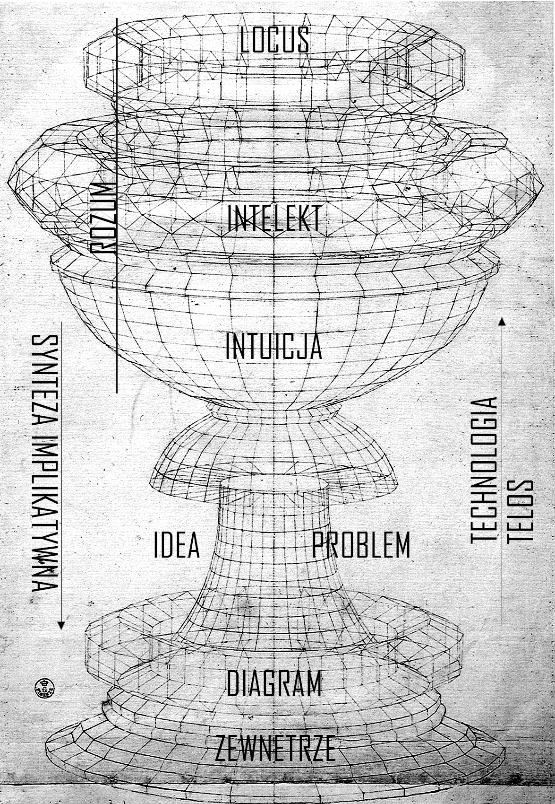

obraz: Paolo Uccello, *Święty Jerzy i smok*

 

Rozszerzony i zmodyfikowany referat z konferencji *Przeploty polifonii perspektyw II* w Toruniu

 

( )

Nazwałem swój referat „przeciw płaskości”, bo moim zdaniem paradygmat płaskiej ontologii dobrze uwidocznia szczególną ślepą uliczkę dzisiejszej filozofii. Płaskość jest uliczką, która w ogóle zabiera nas przez pewną konstelację współczesnego krajobrazu w humanistyce, tworzoną m.in. przez postulaty sieciowości, afirmacji, wyobraźni, możliwego. Przedstawię tu więc krytykę założeń i konsekwencji płaskiej ontologii, a następnie zarysuję alternatywne podejście do zewnętrza, obejmujące technologiczne ujęcie struktur transcendentalnych, Deleuzo-Kantowską koncepcji idei regulatywnych, a także powrót do trochę przykurzonych kategorii teleologii i autonomii. (Na konferencji wygłosiłem tylko część krytyczną, bo przygotowując referat uświadomiłem sobie, że omówienie całości w 20 minut jest niewykonalne).

Płaska ontologia to stanowisko związane z nowym materializmem, OOO, realizmem spekulatywnym i posthumanizmem, zajmowane, przynajmniej implicite, m.in. przez Levi Bryanta, Grahama Harmana, Jane Bennett, Timothy Morton, Bruno Latoura, Manuela Delandę, Karen Barad, Rosi Braidotti. Grunt dla rozwoju i popularności tego stanowiska na przełomie XX i XXI wieku został przygotowany przez dwa równoczesne procesy w filozofii i nauce. Jeśli chodzi o naukę, to w zasadzie od ustabilizowania się darwinowskiej ewolucji jako paradygmatycznej teorii mamy do czynienia z ciągłym i postępującym naruszaniem narcyzmu podmiotu ludzkiego, uderzającego w kolejne bastiony antropocentryzmu i humanizmu (choćby przez przyznawanie zwierzętom kolejnych wyższych zdolności poznawczo-społecznych, czy teorię autopojezy). Tymczasem w filozofii, od Oświecenia z każdym kolejnym pokoleniem radykalizował się gest krytyki kategorii przypisujących bytowi dwa przeciwległe znaczenie (np. myślenie-działanie, umysł-ciało, forma-materia, natura/kultura, człowiek/maszyna lub zwierzę). Szczególnie nabrało to impetu za sprawą poststrukturalizmu, zakorzenionego w Nietzscheańskim szturmie na metafizykę, oraz marksistowskiej teorii krytycznej - jedna i druga wyeksponowały wyraźny związek struktur rozumu z dominującymi dyskursami nowoczesności: kapitalizmem, patriarchatem, kolonializmem. Ta wielostronna krytyka metafizyki człowieka, wspomagana przez badania naukowe, otworzyła przed filozofią możliwość spekulacji o materii niezapośredniczonej w myśleniu, czy też: konstrukcji teorii uwzględniającej sprawczość materii (bądź różnych nieludzkich aktantów) bez konieczności odniesienia się do kwestii korelacji, w wariancie minimalnym uznając człowieka za niewyróżniający się podmiot myślenia, w maksymalnym – dekonstruując ważność kategorii człowieka w ogóle (biologicznie, społecznie itd.).

 

I

Zacznę od sformułowanej przez Raya Brassiera krytyki czterech podstawowych tez płaskiej ontologii, przedstawionych przez Levi Bryanta w *The Democracy of Objects*. Brzmią one następująco:

1) Płaska ontologia odrzuca istnienie jakiegokolwiek bytu transcendentnego czy wiecznie obecnego, który byłby źródłem wszystkich innych bytów. Zatem nie ma miejsca tutaj na formy, gatunki, typy, prawa, ani żadne inne abstrakcje, bo wszystkie byty muszą należeć do jednego pola.

2) Nie istnieje żaden super-przedmiot, który zbierałby wszystkie inne w harmonijną i domkniętą jedność, jak wszechświat, totalność, Jednia.

3) Relacja podmiot-przedmiot, czy żadna inna relacja transcendentalna, duchowa, ufundowana na myśleniu, nie jest ani nadrzędna względem innych relacji, ani w konieczny sposób uwzględniona we wszystkie relacje. Płaska ontologia nie wychodzi od rozpoznania warunków podmiotowych i epistemicznego dostępu do rzeczywistości, a od klasyfikacji i opisu bytu.

4) Wszystkie byty są ontologicznie równe. To może być nawiązanie do metafizyki hierarchii bytów, ale chodzi też o negację dualizmu reprezentacja-byt, bądź dialektyki, czyli o jednoznaczność bytu, immanencję.

Płaska ontologia nie wychodzi więc od negocjowania warunków poznawczego dostępu do świata. Zamiast tego zaczyna od uznania relacji człowiek-świat, tj. naszej relacji poznawczego dostępu do rzeczy, jako po prostu kolejnej rzeczy w świecie, czyli relacji międzyprzedmiotowej. Odrzuca ona twierdzenie, że ta poznawcza relacja jest wpisana we wszystkie obiektywizacje, tzn. że wszystko, co mówimy lub robimy z przedmiotami, odzwierciedla lub koduje pewien rodzaj pojęciowej lub praktycznej mediacji. Jednak całkowite odrzucenie relacji podmiot-przedmiot wraz z głoszeniem niezależności rzeczy od myśli, przy jednoczesnym ignorowaniu procedur, za pomocą których niezależność można pomyśleć, prowadzi do poważnych epistemologicznych komplikacji.

Weźmy Grahama Harmana, według którego istnieją wyłącznie indywidualne przedmioty – wszystko, co możemy pomyśleć jako przedmiot, nim jest, np. toster, galaktyka Andromedy, kolonia mikrobów, eter. Każdy przedmiot ujawnia inne właściwości zmysłowe w kontakcie z innym przedmiotem, ale żaden kontakt czy relacja z innym przedmiotem nie wyczerpują jego realnej istoty, która „wycofuje się” poza wszelkie możliwe relacje, w jakie może wejść. Np. trawa wchodzi w interakcję z glebą, ze mną, z powietrzem, każda ta interakcja wydobywa inną dynamikę, ale istota trawy wycofuje się z każdej z nich i ze wszystkich razem. Harman tak naprawdę rozszerza Husserlowską intencję na wszystkie możliwe przedmioty, każdy ma intencje, wydobywają z siebie nawzajem jakości, ale nigdy nie mogą dotrzeć do realnych rdzeni przedmiotów. Jak przekonuje Brassier, teoria ta wpada w dramatyczny problem niezdolności odróżnienia od siebie przedmiotów. Bo jeśli rozbijamy przedmiot na przedmiot realny i przedmiot zmysłowy, jak również odrzucamy instancję zdolną do odróżnienia własności jakościowych przedmiotu i jego realnej istoty, jaką byłaby świadomość (a dokładniej ja transcendentalne) u Husserla, to w jaki sposób możemy cokolwiek powiedzieć o tym przedmiocie? Moglibyśmy skorzystać z opisu naukowego, ale nie o to chodzi Harmanowi, dla niego taki opis jest ledwie jednym z wielu i nie daje nam żadnego szczególnego wglądu w rzeczywistość (nota bene, to argument powielany przez wiele posthumanizmów). A to prowadzi do niemożliwości orzeczenia tak naprawdę czegokolwiek o czymkolwiek, bo skąd wiemy, że za zmysłowymi własnościami dwóch rzek nie kryje się jeden przedmiot realny? A jeśli nie mamy kryteriów rozróżnienia tego, co jest zmysłową, a co realną własnością, w jaki sposób możemy indywiduować przedmioty?[^1]

Od siebie dodam, że mamy tu także do czynienia z problemem władzy poznawczej i statusu ontologicznego noematu: czym jest to, co poznajesz z przedmiotu, jeśli nie jest ono poznawane ani przez doświadczenie, ani przez łańcuch mediacji techno-naukowych, a jednocześnie nie jest tworem umysłu (noumenem lub pojęciem)? Nie jest również analizą gier semantycznych; Harman odrzuca też teorię intuicji (która i tak ani u Deleuze’a ani u Bergsona nie jest związana z obiektywnością a trwaniem (przeciwległym biegunem względem materii) i problemowymi ideami)? To nawet nie jest kwestia pytania o dostęp – w sensie, jak jakaś władza tworzy i/o ile pokonuje zapośredniczenie – ale kwestia wskazania władzy poznawczej zdolnej do tej operacji, do ontologicznego dyskursu oraz spekulacji o wycofanym przedmiocie?

Drugą krytykowaną przez Brassiera płaską ontologią jest ta rozwijana przez Manuela Delandę, który zamiast ontologii zwróconej ku przedmiotom realizuje coś w rodzaju antyreprezentacyjnego naturalizmu opartego na zestawie teorii naukowych i matematycznych – teorii złożoności, chaosu, systemów dynamicznych – zdolnych do uchwycenia przed-indywidualnych wirtualnych intensywności, czyli do operacjonalizowania realnej immanencji bez pośrednictwa reprezentacji. W skrócie, Delanda odrzuca reprezentację, bo reprezentacja dotyczy sądów propozycjonalnych o stanach rzeczy składających się z zindywiduowanych przedmiotów. Oznacza to, że pozostając na poziomie pojęć tego, co aktualne, już dokonane, ustalone, reprezentacja nigdy nie może dosięgnąć płaszczyzny immanencji z jej wirtualnymi, przedindywidualnymi tendencjami indywiduacji. To jest: żeby poznać i zrozumieć jakieś zjawiska, jak na przykład rozwój inteligencji poprzez wzrost złożoności informacyjnej w wojskowości[^2], musimy zbadać, w jaki sposób pewne indywidua, jak konkretny typ fortyfikacji, wyłaniają się ze sprzężenia różnych procesów indywiduacji, jak przemiany w funkcjonowaniu miast renesansowych, ulepszenie kontroli nad eksplozją prochu strzelniczego, itd. Według Brassiera odrzucenie reprezentacji przez Delandę (a szerzej, przez wszelkie post-deleuzjańskie odmiany płaskiej ontologii) prowadzi do problemu selekcji. Bez opracowania warunków reprezentacji, czyli sposobu odniesienia myśli do bytu na gruncie epistemologicznym, Delanda nie jest w stanie wyjaśnić, jak rozpoznaje i selekcjonuje wirtualny problem, którego rozwiązaniem jest aktualnym stan rzeczy, reprezentowany w naszym doświadczeniu; dlaczego akurat te nauki, a nie inne, opisują niereprezentacyjne wirtualne intensywności, z których dopiero indywidua się wydobywają. Nie pomaga tu wcale ani powołanie się na matematyczne modele, ani na praktyczno-techniczne opracowanie materiału – wciąż powraca problem odzwierciedlenia bytu w myśli, które rzekomo antyreprezentacyjna immanencja miała ominąć. Brassier wykazuje więc, jak płaskość tylnymi drzwiami przywraca rzekomo raz na zawsze pokonane idealizm i dogmatyzm.

Jeśli chcemy uniknąć zawalenia się badania bytu w (korelacjonistyczną) interpretację znaczenia, musimy właściwe zrozumieć, czym jest bycie niezależnie od naszego pojmowania, rozumienia i interpretowania bytu. Osiągniemy to jednak dopiero wtedy, gdy zrozumiemy pochodzenie, zakres i granice naszej zdolności do pojmowania, rozumienia i interpretowania tego, czym są rzeczy. Jedynym sposobem zachowania immanencji[^3] jest przywrócenie pierwszorzędnej roli epistemologii, ale nie zgadzam się z tym, że implikuje to również konieczność przywrócenia kategorii człowieka jako samowiedzy integrującej sens bytu, jak chcą neoracjonaliści, jak Brassier, Negarestani, Wolfendale.

 

II

Płaska ontologia wikła się w jeszcze jedno bagno pojęciowe,  nieomawiane przez Brassiera, a będące rezultatem odrzucenia wielkich narracji (zauważcie, że niemal zawsze gdy mówi się o antropocenie, natychmiast zostaje on zdekonstruowany, ponieważ ma zakładać nadrzędną sprawczość człowieka; pisanie nowego materializmu & co. jest impresyjne, często sięgające po litanię obiektów, anegdot biograficznych, pocztówek). To odrzucenie wielkich narracji odpowiada za inflację tekstów ścigających się w fabulacjach i spekulacjach o możliwościach, o możliwych światach, o wspólnotach, które mogą nadejść – mających dostarczyć środki na kryzys wyobraźni. A według mnie nie dlatego mamy większy problem z „wyobrażeniem sobie świata po kapitalizmie, niż koniec świata” (by powołać się raz jeszcze na tą najwytartszą z klisz), że mamy problem z wyobraźnią jako taką, lecz mamy niewystarczająco ugruntowane pojęcia, które mogą posłużyć za uzbrojenia wyobraźni, intuicji i technik pragnienia; niewystarczająco analiz wyprawiających znaczenia siatki pojęć w kwasie problemu czy układu, w którym mają one działać. W pewnym sensie mamy za dużo wyobraźni, ale przeprowadzamy ją przez korytarze tych samych metafizycznych i epistemologicznych pałaców odziedziczonych po poststrukturalizmie.

Dlatego myślę, że dziś o wiele ważniejszy jest powrót do pojęć, jak idea, teleologia, czy autonomia rozumu, niż kolejna spekulacja o wibracyjnej materii bądź dekonstrukcja językowa różnic, np. między kobiecym ciałem a ciałem wodnym. Jednym z charakterystycznych gestów dla płaskiej ontologii jest to, że bierze się wyabstrahowaną wspólną cechę różnych typów bytów - jak bycie ośrodkiem materialnych przepływów, bycie ciałem wodnym, czego przypadkami są akweny i kobiety - a następnie przepuszcza się przez siebie nawzajem ich przestrzenie semantyczne, w efekcie czego spodziewa się podważyć patriarchalną metafizykę opartą na ciałach stałych. Gest ten miałby być czymś więcej niż grą językową, miałby interweniować w samą materię. Nawiązuję tu do popularnej ostatnio koncepcji hydrofeminizmu Astridy Neimanis. Weźmy pojęcie "Hipermorza"[^4], zaadaptowanego przez Neimanis z nauk o Ziemi. Hipermorze nawiązuje do faktu, że życie ziemskie, aby przetrwać na lądzie, przenosi ze sobą wodne środowisko, z którego pochodzi. Bez przenośnego Hipermorza w komórkach życie nie mogłoby rozprzestrzeniać się i rozwijać dalszych form istnienia: "życie osadza się wewnątrz innego życia". Dzięki Hipermorzu „wchodzimy w kontakt z wszystkimi naszymi gatunkami stowarzyszonymi” (*Hydrofeminism*, 86), do których Neimanis wlicza wszystko to, co przenosi wodę lub jest płynne: kapusta, małże, mole. Wszystko jest wodą, my jesteśmy wodą, jesteśmy stowarzyszeni ze wszystkim wodnym - kondycja ta domaga się zakwestionowania schematów myślowe opartych na stałości. Widzimy tu m.in. płaskoontologiczne odrzucenie podziałów na typy czy gatunki, bo samo orzekanie wodności o bytach pozwala "pomyśleć płeć i reprodukcję inaczej" (*Bodies of Water*, 125). Z racji tego, że nauka podsuwa nam pojęcie Hipermorza, jako "przykładu pewnego rodzaju lateralnego procesu ewolucji, który zakłóca teleologiczny obraz ewolucji poprzez filialne pochodzenie" (*Bodies of Water*, 124), to wyobrażając sobie "posthumanistyczną ciężarność" możemy, według Neimanis, "rozpoznać tę cieleśnie połączoną wspólnotę, w której różnice między ludźmi a nieludźmi zaczynają się rozmywać. Żyjemy w wodnych dobrach wspólnych..." (*Hydrofeminism*, 92)

Rzecz w tym, że podobnie do tak wielu posthumanizmów osadzonych w płaskiej ontologii, Neimanis zatrzymuje się na "pomyśleć inaczej", pod którego to "inaczej" podstawiona zostaje wyobrażona wspólnota wodna mająca jakiś związek z jakąś teorią naukową, tutaj z Hipermorzem, ale jak to pojęcie miałoby się stosować do pola społecznego, przede wszystkim do poprawy sytuacji kobiet w systemie patriarchalnym, pozostaje zupełnie zlekceważone. Nie twierdzę, że wydobywanie nieobecnych bądź stłumionych przez dominujący dyskurs tropów estetycznych, takich jak metafory ciał i ruchów płynnych vs nadrzędne znaczące ciał stałych pozbawione jest wartości (czy jednak w XXI wieku na przecięciu mediów, duchowości self-care i korporacyjnej kultury pracy metaforyka płynności nie jest nachalnie obecna?) To ważna składowa filozofii. Ale odwołując się do "sprawczości materii" na polu wyobraźni, czy myślenia w ogóle, przy jednoczesnym ignorowaniu kwestii epistemologicznych i pragmatycznych[^5], teoria Neimanis wpada w serię trudności. Na przykład: co z tego, że poprzez picie wody odnawiamy wspólnotę ciał wodnych? Czemu mielibyśmy się tym przejmować? W jaki sposób wspólnota ta jest realna, a nie tylko poetycką wyobraźnią afirmującą mistykę wszechświata bez uwzględnienia metody aplikacji swojej spekulacji/fabulacji do systemowych ograniczeń dla tworzenia wspólnoty, dla myślenia, a przede wszystkim dla wolności? Równie dobrze mogę wyobrazić sobie opresyjny system społeczny dążący do maksymalizacji upłynnienia ciał stałych, do "wspólnoty" redukcji stałości - to przecież mógłby być kapitalizm w opisie akceleracjonistycznym. Choćby Neimanis odniosła się do tego, jaki ta wspólnota ciał wodnych ma sens dla nieświadomych pragnień? Czy dokonały się jakieś przemiany technologiczne, które pozwalają na to, by wspólnota ciał wodnych nabyła podmiotowości politycznej? Dlaczego „woda jest planetarnym archiwum znaczenia i materii”?[^6] Neimanis artykułuje tylko ideę pewnej możliwości, ale jeszcze nigdy możliwe pojęcie nie udowodniło istnienia czegoś realnie istniejącego - nie wyraża ono realnej genezy posthumanistycznej wspólnoty ciał wodnych a jedynie ich wyabstrahowaną ideę. (Daj mi metaforę a uczynię nią instrumentem krytyki fallogocentryzmu). Ta wyabstrahowana idea zakłada pewną wspólnotę smaku, niezbędnego by dać się przekonać temu obrazowi, wspólnotę opartą na kapitale kulturowym wzajemnie uznających się podmiotów. Neimanis w zasadzie powtarza Heideggerowską krytykę nowoczesnej techniki – tylko zamiast post-idealistycznej analizy pojęciowej sytuuje ją w obecnej bardziej dekolonialnej ekologii intelektualnej – tak jakby woda przednowoczesna nie była też ujmowana jako abstrakcja[^7]. Jakby duchy wody nie były abstrakcjami dokonanymi w myśleniu magicznym. Neimanis wyznaje witalistyczny empiryzm/pluralizm, który wierzy, że możemy teoretycznie rozproszyć kwestię abstrakcji za pomocą nieskończenie drobnej ziarnistości „przeżywanej materialności/doświadczenia”, a politycznie poradzić sobie ze wszystkimi przepływami materialnymi wprawionymi w ruch przez kapitalizm pozostawiając je lokalnym praktykom. Oba te poglądy są powiązane i moim zdaniem błędne, ponieważ kryzys klimatyczny i globalny kapitał wzmacniają się, zmuszając do koordynacji na skalę planetarną. Rozczarowująco, to nie jest nawet filozofia przedkryczyna, a presokratyczna dekonstrukcja językowa.

Potrzebujemy normatywności, a nie więcej możliwości. Potrzebujemy ryzyka wyrażania tego, co *należy* robić, a nie ciągłego odwoływania do tego, co *może być*, pustego placeholdera nieskończonej potencjalności. Tak, woda może być niemal wszystkim, i co z tego? Lekcją poststrukturalizmu jest nie to, że jesteśmy potencjalnością kropka, lecz to, że żadna normatywność nie jest naturalna, więc można zmontowane inne, by produkować lepsze formacje społeczne. Tyle. Ale do tego potrzebne są badania struktur transcendentalnych, infrastruktur technologicznych i architektur teleologicznych. Tym jest autonomia – odkrywaniem, jaką ideą i w jakim celu żyjemy, myślimy i doświadczamy, doąd rekursywnie powracamy, co jest naszą nieuniknioną iteracją, co jest ograniczeniem, co przeznaczeniem, co losem, a co technikami i praktykami organizacji, które być może pozwolą wpłynąć na teleologiczny schemat rozumu lub systemu. To miejsce, gdzie polityka i etyka zbiegają się ze żmudną orką epistemologiczną.

Tym aporiom płaskiej ontologii – bez konieczności przyjmowania stanowiska Brassiera (jego krytyka kiedy indziej) – można zaradzić, a przynajmniej rzucić na nie nową perspektywę, przywracając starodawne pojęcie teleologii… 

 

III

Powodem odrzucenia wielkich narracji w teoriach XX wieku było ich uzasadnienie przez teleologię, czyli koncepcję celowości natury, kultury lub historii. Ponieważ płaska ontologia powtarza tę decyzję, w paru zdaniach historia tego pojęcia. W klasycznym ujęciu Arystotelesa za przyczynę celową przyjmuje się, z jednej strony, wyidealizowany cel naturalnego rozwój organizmu, np. przyczyną celową pestki jest jabłoń, albo z drugiej - intencję wykonania taboretu z jabłoni. W starożytności pojawia się też pogląd, że rozum naturalnie dąży do swojej pełnej realizacji, jego celem jest najwyższe dobro lub kosmiczna harmonia. Następnie, przeskakując kilkanaście wieków do nowoczesności, ze względu na odkrycia mechanizmów działania natury, jak Newtonowskie prawo grawitacji czy prawa ruchu planet Keplera, porzucono naturalne przyczyny celowe na rzecz przyczyn sprawczych, które same powinny wystarczyć do naukowego opisu przyrody. Lecz idea przyczyny celowej niemal natychmiast powstała z umarłych, ponieważ funkcjonowanie żywych organizmów uporczywie nie dawało się kompletnie wyjaśnić w mechanicznych kategoriach. Wciąż powraca zdawałoby się nienaukowa potrzeba wskazania celu tego funkcjonowania – serce bije by krążyła krew by utrzymać organizm przy życiu, zachowania populacji zwierząt i roślin kształtują dany ekosystem, który jednocześnie jest warunkiem ich istnienia. 

Dobrze argumentuje to Kant w *Krytyce władzy sądzenia*: nie dostrzegamy teleologii w obiektywnej i naturalnej rzeczywistości, lecz w transcendentalnym działaniu samego rozumu, który z konieczności narzuca ją na naturę by wyjaśnić jej funkcjonowanie. Inną opracowaną przez Kanta celowościową aktywnością rozumu jest wytwarzanie idei, które organizują zarówno pojęcia intelektu, jak i doświadczenie, wykraczając poza doświadczenie. Trzeci sens teleologii, jaki znajdziemy u Kanta, wiąże się ze sposobem działania dzieła sztuki, będącego zaprojektowanym, ale nie mającego określonego użytku, wykazuje coś w rodzaju celowości bez celu. Kant wyznacza więc istotne przejście od celu jako pełnej formy substancji do celu jako schematu (funkcjonowania; układu funkcji). Nie chodzi już o przedustanowioną drogę rozwoju bytu do określonej celowo substancji, a o konkretny schemat, który należy rozumieć jako diagram organizujący relacje między wnętrzem a zewnętrzem, rekursywność generującą określoną tendencję organizmu czy innego systemu organizowanego przez ten schemat/diagram. Następną transformację pojęcia teleologii dokonują dwudziestowieczne koncepcje systemów technicznych, które z czasem zaczęto traktować wymiennie z systemami społecznymi. Jeśli odrzucimy utylitarystyczne czy instrumentalne rozumienie technologii, to systemy techniczne też okażą się celowościami bez celów, które wciągają kulturę w określone przez siebie wektory (Simondon, D&G, Land). Ważne jest tutaj to, że znajdując się wewnątrz takiego systemu, nie da się nie realizować jego schematu, stając się polem regulacji wnętrza systemu w relacji z jego zewnętrzem. To jest nasz *telos*: każde z nas jest konsumentem w kapitalizmie i nie ma ucieczki przed dorzucaniem paliwa do tej metabolizującej maszynerii - rekursywny schemat funkcjonowania kapitalizmu ustanawia konstelację logicznych i libidinalnych ograniczeń dla politycznych planów wyjścia.

Brassier trafnie eksponuje słabości płaskich ontologii i posthumanistycznych materializmów wynikające z odrzucenia epistemologii, lecz w zamian postuluje on powrót kategorii racjonalnej reprezentacji ufundowanej w ludzkim podmiocie świadomości, co również uważam jednak za kłopotliwy ruch. Aby ten powrót - oparty na sojuszu marksizmu Szkoły Frankfurckiej z neopragmatyzmem Szkoły Pittsburgh - mógł się on obronić, Brassier musi zmierzyć się z kwestią społecznego pragnienia zniewolenia i roli nieświadomości w działaniu rozumu. Jak można myśleć to, co nie daje się zredukować do świadomej dialektyki dawania i pytania o rację? Do tej pory jedynie odnosił się krytycznie do maszynowej nieświadomości i deleuzoguattariańskiego materializmu transcendentalnego, ale pozytywne ujęcie tego problemu uporczywie czeka. W przeciwnym razie neoracjonalistyczna analiza pojęciowa będzie dotyczyła jedynie rozumu jako wyidealizowanego obrazu praktyk społecznych. Aby rozum nie unosił się w próżni powinniśmy postrzegać go jako układ konceptualizacji montowanych wokół idei i problemów generowanych przez materialne procesy techno-społeczne. Rozum za pomocą analizy pojęciowej określałby narzucane mu z zewnątrz idee i problemy, wytyczające wirtualne trajektorie dla myślenia - od nich zależy, jak możemy wykraczać poza znane rozwiązania, w jaki sposób doświadczenie i pojęcia mają sens. Inaczej mówiąc: idee i problemy są implikowane rozumowi przez techno-społeczne zewnętrze, a rozum opracowując je udoskonala nasze rozumienie siebie (idei którymi musimy żyć) i przygotowuje grunt do intuicji przyszłych problemów.

 

 

Dlatego proponuję reinterpretację koncepcji problemu Deleuze’a z *Różnicy i powtórzenia* za pomocą teleologii pojętej funkcjonalnie, problemowo, diagramatycznie i polarnie. Deleuze sięga tam po często pomijaną koncepcję idei regulatywnych Kanta z *Krytyki czystego rozumu*. Według Kanta za błądzenie metafizyki po obszarach nieuzasadnionej spekulacji odpowiada skłonność rozumu do wykraczania poza zakres doświadczenia. W wyniku tej skłonności rozum wytwarza idee, których nie można ani udowodnić ani im zaprzeczyć – to antynomie rozumu, np. Bóg istnieje lub Bóg nie istnieje; świat ma początek w czasie lub świat nie ma początku. Nie można rozwiązać antynomii przez określenie prawdziwości któregoś sądu, ale regulują one sferę praktyczną i moralną, co prowadzi Kanta do stwierdzenia, że lepiej dla moralności jest uznanie, że Bóg istnieje, człowiek jest wolny itd. Deleuze odbija tę koncepcję w trochę inną stronę. Jeśli zauważymy, że antynomia to problem, czyli sytuacja, w której rozum przynajmniej wstępnie zakłada dwie przeciwstawne i równie (nie)uzasadnione tezy, to, Deleuze wnioskuje, tak naprawdę rozum jest władzą stawiania problemów w ogóle. Dlaczego rozum jako władza idei stawia problemy? Bo dąży do połączenia w całość działania intelektu i jego przedmiotów, ale rozumienie organizacji tej całości jest problematyczne, ponieważ nigdy nie da się domknąć jego określeń (Cantor, Gödel, Turing, Tarski). Lecz paradoksalnie, gdyby nie istniała ta rozumowa władza spekulacji o celowym funkcjonowaniu całości, intelekt zajmowałby się wyłącznie cząstkowymi badaniami empirycznymi, układałby nieskończone serie indukcyjne, nigdy nie będąc zdolnym do sformułowania hipotezy o całościowym problemie, a przez to niezdolnym do zaproponowania żadnego rozwiązania (dla którego kryterium jest ta hipoteza). Deleuze dokonuje tu serii istotnych przesunięć interpretacyjnych: rozciąga występowanie idei regulatywnych na całą aktywność myślenia, świadomego i nieświadomego, a nie tylko wybranych metafizycznych antynomii; podkreśla ich problemowość; a także w efekcie założenia czystej różnicy jako fundującej dla metafizyki – w każdym określeniu bytu powtarza się różnica myślenia i materii, tj. wszędzie tam, gdzie mamy do czynienia ze zmysłowością jest też idea. Nie istnieje więc dostęp do materii bez zapośredniczenia w jakiejś idei, choć materia różni się od idei (to dwie wzajemnie informujące się serie jednego procesu).

O ile płaskie ontologie lokują myślenie w niezapośredniczonej materii lub przedmiotach, a Brassier w reprezentacjach społeczno-semantycznych reguł językowych, tak tutaj *loci* myślenia to idee problemowe generowane przez technologie. Kluczowe dla mnie są dwa momenty doktryny Idei Kanta-Deleuza. Po pierwsze, „wszelkie rozwiązanie zakłada problem, czyli utworzenie systematycznego, jednolitego pola ukierunkowanego i subsumującego badania i pytania w taki sposób, że odpowiedzi ze swej strony tworzą własne przypadki rozwiązania” (*Różnica i powtórzenie*, 244). Problemy pełnią więc rolę teleonomiczną, tj. są ideami regulatywnymi (*nomos*) i ogniskowymi myślenia poza doświadczeniem (*telos*), nadającymi sens konkretnemu doświadczeniu i myśleniu. Po drugie, w *Krytyce czystego rozumu* Kant stwierdza, że idee „nie są dowolnie wymyślone, lecz są zadane przez naturę samego rozumu” (KCR, A 327/B 384). Za "naturę" wstawmy "technologię" a otwiera się tunel czasoprzestrzenny z XVIII do XXI wieku. Wielostronna krytyka natury, jako pojęcia skonstruowanego przez nowoczesną racjonalność, nie oznacza, że powinno się teraz przenieść źródło idei oraz ich sensu do wnętrza pola kategorii intelektu, lecz zamiast tego powinno się abdukcyjnie postulować inne zewnętrze, skąd idee wdzierają się i stają koniecznością dla myślenia. Takie zewnętrze, które odkrywamy wewnątrz rozumu i testujemy niczym czarną skrzynkę, popychając myślenie poza zaprojektowane ramy myślenia. Nieświadomy mroczny zwiastun idei tego, że technologia jest tym zewnętrzem rozumu - że idee są instalowane przez technologie rozumu - przezierał już przez myśl Kanta:
	"Ten schematyzm naszego intelektu w odniesieniu do zjawisk i samej ich formy jest sztuką ukrytą w głębiach duszy ludzkiej, której prawdziwych operacji nigdy chyba nie odgadniemy w przyrodzie i nie postawimy ich sobie niezakrytych przed oczy" (A141/B181) 

Proces technologiczny dostarcza problemów (jak nowoczesna nauka, Sztuczna Inteligencja, automatyzacja pracy, bioinżynieria, postprawda), umieszcza je w doświadczeniu jako idee regulatywne (praktyczne odniesienie się do tych problemów), wokół których wytwarzają się rozwiązania, z jednej strony w postaci organizacji społecznych, formacji pragnienia i instytucji władzy, a z drugiej w rezultacie badań naukowych, eksperymentów estetycznych i analiz pojęciowych. Idee regulatywne jako problemy mogą służyć za obowiązujący w danym miejscu lub w danej skali abstrakcji transcendentalny model selekcji inteligencji - dlatego teoria rozumu wymaga semiotyki jako badania znaków pozostawiony przez aktywność obcej inteligencji, która określa rozum. Dlatego *przeciw płaskości*. W ogólnej perspektywie rolą rozumu będzie nawigowanie między przeznaczeniem z Zewnątrz, czy obcą inteligencją, idealnymi problemami, diagramami semiotycznymi, strukturami transcendentalnymi oraz infrastrukturami technologicznymi w imię wierności Dobru i Doskonałości. Jak konkretnie miałaby wyglądać logiczna architektura relacji między poszczególnymi elementami - na razie nie wiem.

Rozwój tej teorii wymaga technologizacji doktryny idei, czyli badania technologicznej i semiotycznej genezy idei (np. jakie przemiany technologiczne umożliwiają postulowanie semiotyki postprawdy lub wspólnotę ciał wodnych), lecz również rozpoznania jak tak wyartykułowany schemat/diagram/maszyna abstrakcyjna produkuje przestrzeń normatywną określaną w procedurach rozumu. Inną osią tej teorii będzie opracowanie *syntezy implikatywnej*[^8] ("jeśli jesteś w tym *locus*, to spełniasz ten *telos*, w ramach *diagramu*, niezależnie od tego, co zrobisz") w odniesieniu do pojęcia hipersądu CCRU oraz teleonomii/teleopleksji Nicka Landa. W ten sposób będzie można konstruować teorie idei i problemów, które warunkują aktualne organizacje społeczne.

   
  
Teksty:

R. Brassier, *Deleveling: Against ‘Flat Ontologies’*

Gilles Deleuze, *Różnica i powtórzenie*

I. Kant, *Krytyka czystego rozumu*

A. Neimanis, *Hydrofeminism: Or, On Becoming a Body of Water*

A. Neimanis, *Bodies of Water. Posthuman Feminist Phenomenology*.

   

---

[^1]: To znaczy, co przyjmujemy za kryterium odróżniania jednego indywiduum od drugiego? W ogóle, osobnym problemem jest rozpoczynanie od indywiduum, a nie od procesu indywiduacji (czego fantastyczną krytykę można znaleźć w *Individuation in light of Notions of Form and Information* Gilberta Simondona).

[^2]: Przykład z *War in the Age of Intelligent Machines* Delandy.

[^3]: Argument za zachowaniem immanencji: chcemy aby pojęcia i doświadczenie, spekulacja i sens, normy społeczne i zasady rozumu utrzymywały siebie wzajemnie w praktyce, tj. ostatecznie transcendentne pojęcie nie będzie organizowało poznania o świecie i sposoby doświadczenia, lecz jedynie jako token semiotyczny wywoływało pewne efekty społeczne. W pewnym sensie dotyczy tego następna część tekstu.

[^4]: Koncepcja Hipermorza ma sens w opisie naukowym, bo odnosi się do ontogenezy abstrakcyjnej płaszczyzny rozwoju życia organicznego. Jednak staje się zupełnie inną koncepcją kiedy z naturalistycznego faktu wyprowadza się sądy metafizyczne, polityczne i etyczne.

[^5]: Nowy materializm przeszedł drogę od "musimy przyswoić najnowsze przełomowe teorie naukowe by zrozumieć materię" Manuela Delandy do "materia jest niepoznawalna a abstrakcja to dyskryminacja" Astridy Neimanis.

[^6]: Dobrym kontrprzykładem jest koncepcja *abstrakcyjnej płci* Luciany Parisi, która wykonuje podobny ruch do Neimanis, że sięga do pojęcia "hiperpłci", czyli permanentnie powracającego na różnych poziomach złożoności życia organicznego symbiogenezy mającej źródło w rozmnażaniu bakteryjnym, które to pojęcie podważa dominację mejotycznej reprodukcji - wiązanej przez Parisi z patriarchalnym modelem płciowości. Różnica jednak polega na tym, że Parisi demonstruje jednocześnie jak rozwój współczesnych technologii cyfrowych i komputerowych umożliwia ponowne włączenie niemejotycznych metod reprodukcji, na wspólnej płaszczyźnie wymiany informacji, a przez to cyberfeministyczną deterytorializację nowoczesnej dyscypliny płci. Patrz, *Abstract Sex* L. Parisi.

[^7]: Neimanis podkreśla to, jak nowoczesność doprowadziła do istnienia abstrakcyjnej "nowoczesnej wody" / "globalnej wody", która jest mierzalna, kwantyfikowalna, instrumentalizowana i zdeterytorializowana przez nowoczesne technologie, oderwana od swoich źródłowych mitów i miejsc. Niejasne jest jak utrzymanie lokalności wody, odrzucające wszelkie abstrakcje, można pogodzić z przekonaniem o wspólnocie ciał wodnych - z pewnością konieczna jest jakaś pojęciowa i techniczna abstrakcja, która połączyłaby ze sobą te zróżnicowane miejsca?

[^8]: Synteza implikatywna: jeśli myślimy o jakiejś idei, poświęcamy jej uwagę i dążymy do określenia, to natychmiast sprawia, że myślenie o niej jest problematyczne i otoczone przez konstelacje wertykalnych i horyzontalnych, diachronicznych i synchronicznych uwarunkowań. Implikacja syntetyzuje tu dwie płaszczyzny: konkretny układ społeczny (gdzie napotykamy ideę) i implikowaną przez ten układ maszynę abstrakcyjną czy diagram (jej sens). Jeśli coś iteruje, to ma diagram celowości. Por. *impleksy* w rozdz. "Asymetryczna synteza bytu zmysłowego" w *Różnicy i powtórzeniu*, s. 340.